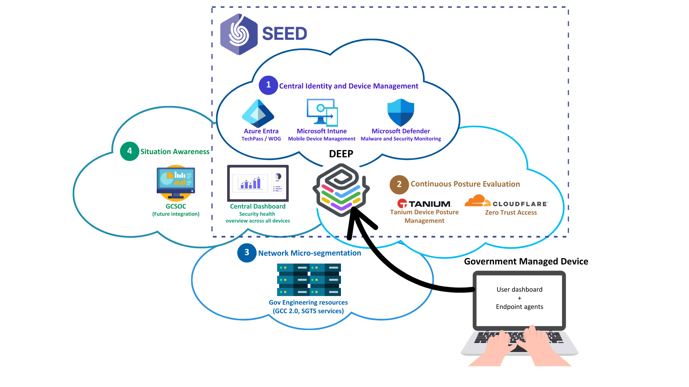
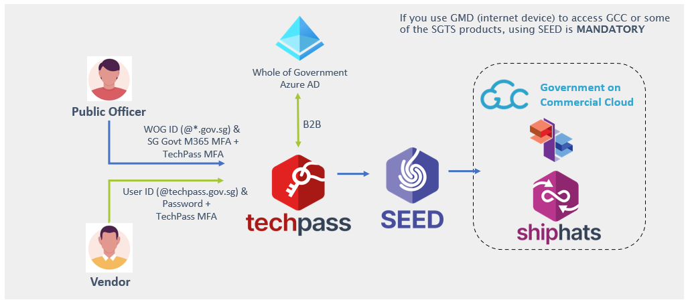

# Overview

**Security Suite for Engineering Endpoint Devices(SEED)** is the Singapore Government's implementation of Identity and Access Management (IAM) and zero trust framework to protect against unauthorised access to the Government's engineering resources, such as Government on Commercial Cloud (GCC) and the Singapore Tech Stack(SGTS).

Zero Trust replaces traditional Virtual Private Network (VPN) connections and network-based security policies with a standardised central identity provider. It offers enforcement of access policies allowing only authorised users to use devices compliant with device postures.

## Why do we need SEED?

- Detects and provides remediation steps for known malware.
- Detects if the endpoint meets the required security hardening baseline according to the corresponding Center of Internet Security (CIS) benchmark for the installed endpoint operating system.
- Detects if the endpoint’s operating system version and security patches are up-to-date.
- Prevents accessing the resources of GCC and the SGTS services if the above requirements are not satisfied.

## How does SEED work?

SEED comprises of three components:

- TechPass
- Cloudflare
- SEED Dashboard

<!-- tabs:start -->

### **TechPass**

This is the Identity Access Management(IAM) and Single Sign-On(SSO) solution for accessing SGTS and GCC services.

### **Cloudflare**

The security platform that enforces Zero Trust network access allowing faster and safer connections to the Internet and applications. This comprises of the following: - **Cloudflare WARP**: Replaces the traditional VPN clients. - **Cloudflare Gateway**: Blocks and protects from malicious content. - **Cloudflare Access**: Evaluates every request for user identity and device context.

### **SEED Dashboard**

Device management layer of SEED. It establishes a robust security baseline automatically​ and prevents insecure or compromised devices from accessing engineering resources.​ DEEP manages the following: - **Microsoft Intune**: Provides device and application management including remote application deployment and selective device wipe. - **Microsoft Defender Advanced Threat Prevention**: Enterprise class vulnerability management, threat detection and response security solution. - **Tanium**: Works with Cloudflare to ensure posture-based conditional access to the endpoint assets.

<!-- tabs:end -->

## What can SEED do on my device?

|SEED can do the following on your device|SEED cannot do the following on your device|
|---|---|
|- View the model number, serial number and operating system of the device. - View the names of the applications you have installed. - Identify your device by name. - Reset lost or stolen device to factory setting upon required consent and approval from device owner and manager-in-charge, respectively.|- View the browsing history. -Access your emails, contacts and calendar. - Access your documents.|

