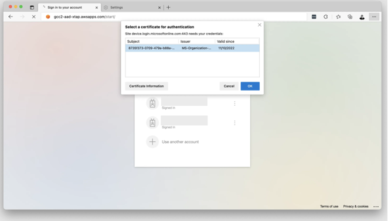

<!-- 
# [For Beta Users] Cross-Tenant Access Policy (XTAP) Settings

Turning on the XTAP settings would allow better coverage for endpoint device posture checking. It is enforced by Azure AD conditional access policies.

The SEED team have concluded prior experiments to ensure that the Require Compliant Device conditional access option works with Hive AAD devices on applications on TechPass Dev AAD through XTAP settings.

## Logging into an application with Require Compliant Device turned on

When logging into the application, a prompt box will be popped up to select the appropriate Intune Device Certificate. You may see multiple certs.

 1.	Select the cert with the following meta-data
    - Subject: IntuneMDMAgent-xxxxxxxx-xxxx-xxxx-xxxx-xxxxxxxxxxxx
    - Issuer: Microsoft Intune MDM Agent CA

> **Note**: You may have more than one cert of the above format. You may have to trial and error. However, as a good practice, certs should be cleaned up if no longer in use.

<kbd></kbd>

 2. Click Ok. 

 3. If the login in successful, that was the correct cert. If the login failed, repeat step 1 with another cert.

 -->