# Admin By Request (ABR) – User guide

## Overview

**Admin By Request (ABR)** is a privilege management tool that allows users to request temporary local administrator rights in a controlled, auditable, and secure way.

It helps reduce risks from malware, accidental system changes, and unauthorised software installation, while still allowing users to perform legitimate admin tasks.

ABR works together with the following controls:

- **Platform SSO** – Revokes permanent local admin rights
- **Admin By Request (ABR)** – Handles day-to-day admin elevation requests, unless access is pre-approved
- **Cloudflare Always-On** – Enforces secure, always-on network connectivity

> ⚠️ **Pilot notice**  
> Admin By Request (ABR) is currently in a pilot phase.
>
> - This implementation applies only to selected users  
> - Not all users will have Admin By Request enabled  
> - Platform SSO and admin elevation workflows described in this guide apply only to pilot users  
> - Users not in the pilot group will not see Admin By Request prompts or functionality  

## Pre-requisites

Before using Admin By Request, ensure the following requirements are met.

### Platform SSO

Platform SSO must be configured on your device before Admin By Request can be installed automatically and function correctly.

Refer to the Platform SSO setup guide.

### Full Disk Access

Turn on **Full Disk Access** in **Privacy & Security** for the following:

- **Admin By Request System Extension**
- **Admin By Request**

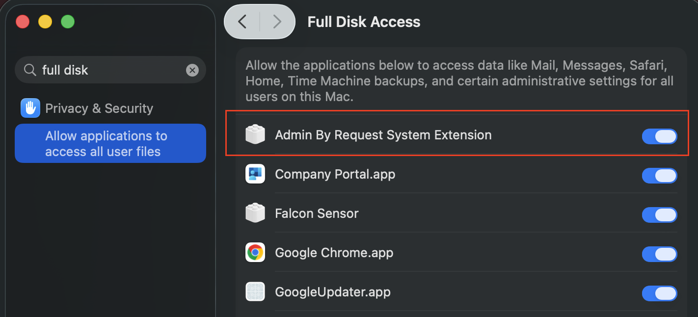

### Login Items & Extensions

Allow **Admin By Request ApS** under **Login Items & Extensions**.

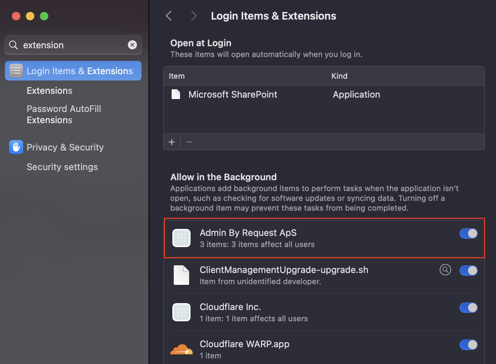

### Endpoint Security Extensions

Allow the extension under:

**Login Items & Extensions** → **Extensions** → **By Category** → **Endpoint Security Extensions**

Select **Admin By Request.app**.

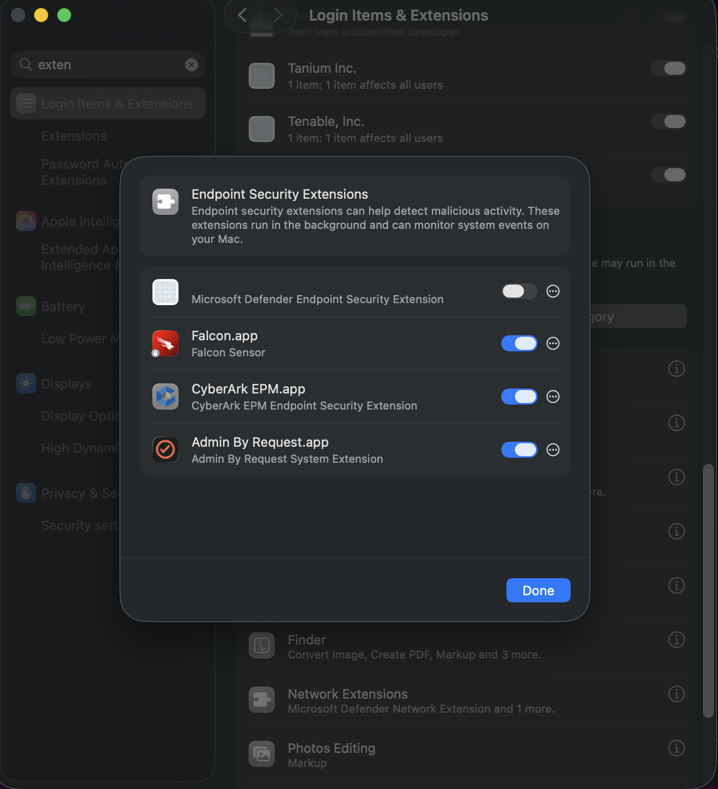

### Ensure ABR is working correctly

1. Select the **Admin By Request** icon in the menu bar.
2. Select **About Admin By Request**.
3. Confirm that the following statuses are **OK**:
   - **Operational Status**
   - **Cloud Connectivity**

If an error is shown, follow the steps in **What if Admin By Request is showing error?**.

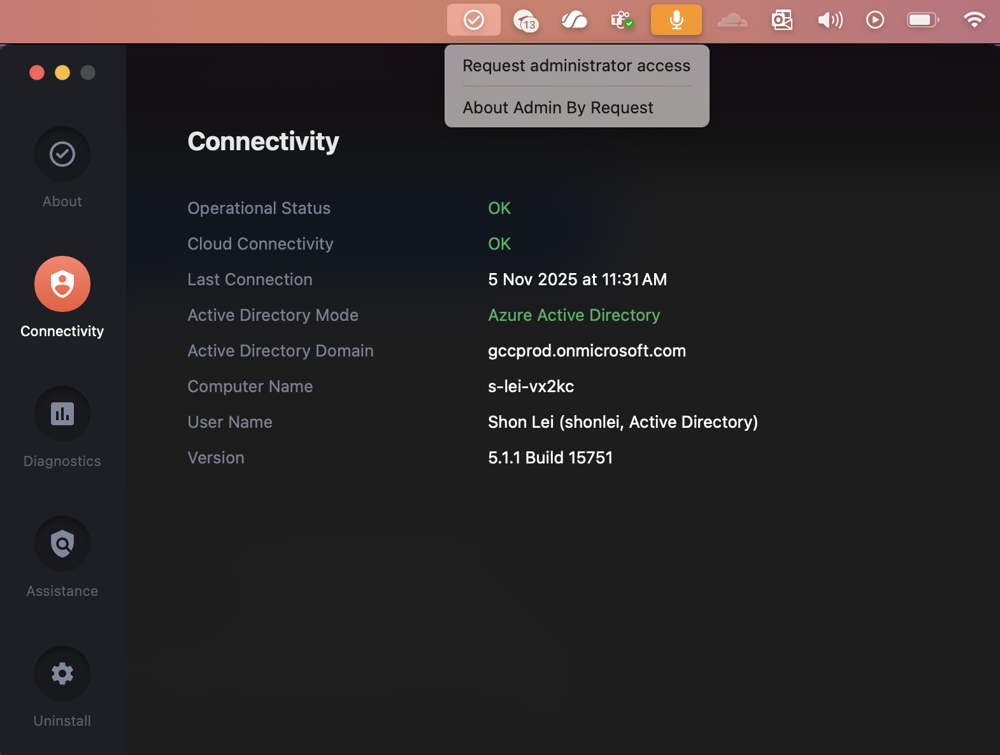

### Cloudflare Always-On

Ensure **Cloudflare Always-On** is enabled and connected before requesting admin access.

## User workflow

### Requesting admin access

1. Right-click the application you want to run, or double-click the `.pkg` file.
2. The **Admin By Request** prompt appears.

> **Note**  
> On Windows devices, right-click the application and select **Run as administrator**.

3. Enter the following details:
   - **Phone number**
   - **Email address**
   - **Reason for the request**  
     (The reason must be more than 5 characters.)
4. Complete MFA using your **tech.gov.sg** account.

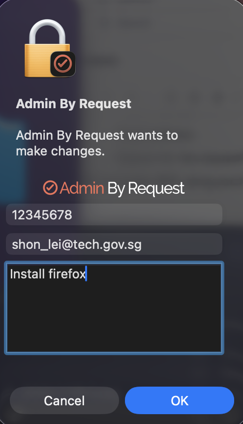

### Approval process (if required)

#### Approval required mode

1. Your request is sent to ABR portal approvers.
2. The approver receives a notification by email or via the dashboard.
3. Once approved, a temporary admin session is granted.
4. Complete MFA using your **TechPass** account.

#### Pre-approved mode

If you are in pre-approved mode, your request is automatically approved.

### Elevated admin session

1. Select the **Admin By Request** icon in the menu bar.
2. Select **Request administrator access**.
3. Enter:
   - **Phone number**
   - **Email address**
   - **Reason for the request**
4. Complete MFA using your **tech.gov.sg** account.

When approved:

- A timer starts counting down the allowed admin duration.
- An ABR icon with the remaining time appears in the menu bar.
- Temporary local administrator rights are granted.

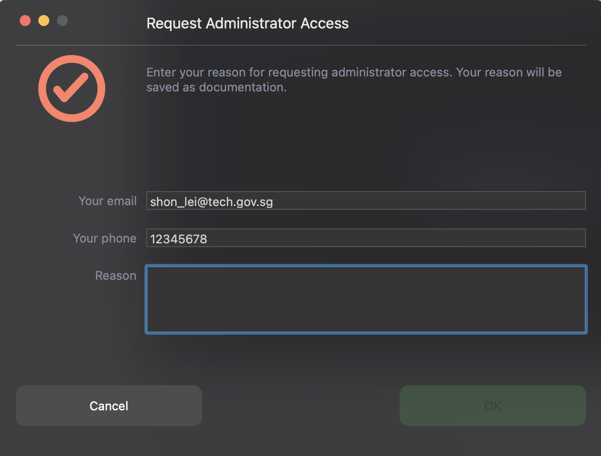

#### What you can do during an admin session

- Install software
- Update applications
- Run scripts or tools that require admin rights

#### What you cannot do

- Disable Admin By Request
- Extend the session beyond the policy limit
- Gain permanent administrator rights

### MFA flows

#### MFA flow 1

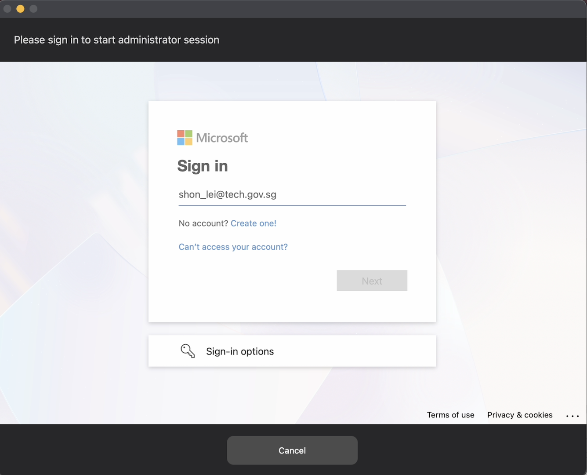

#### MFA flow 2

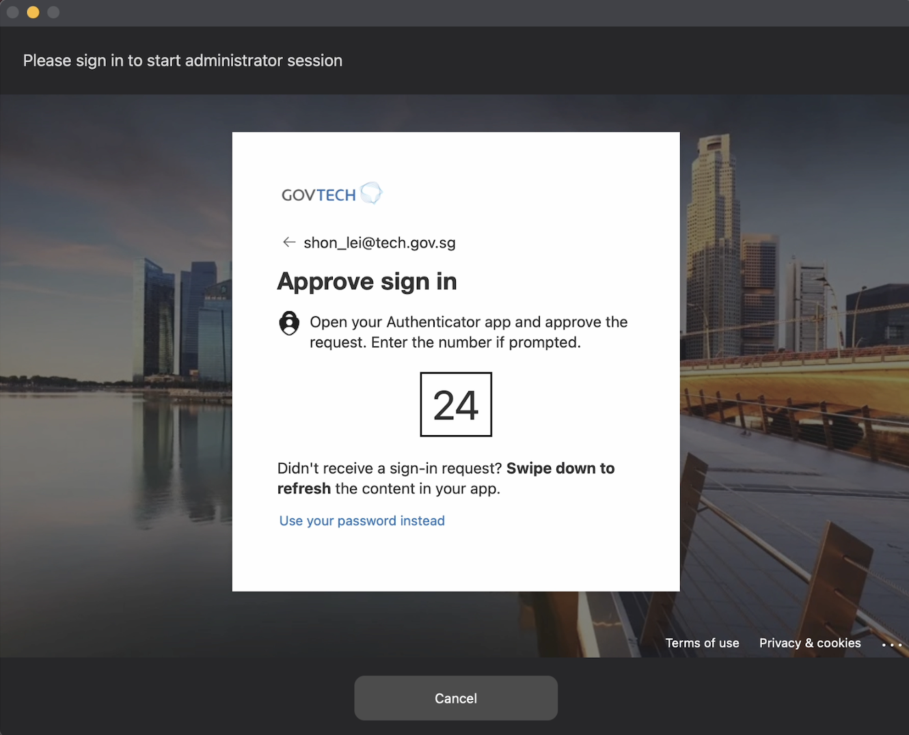

### Approval screens

#### Approved screen 1

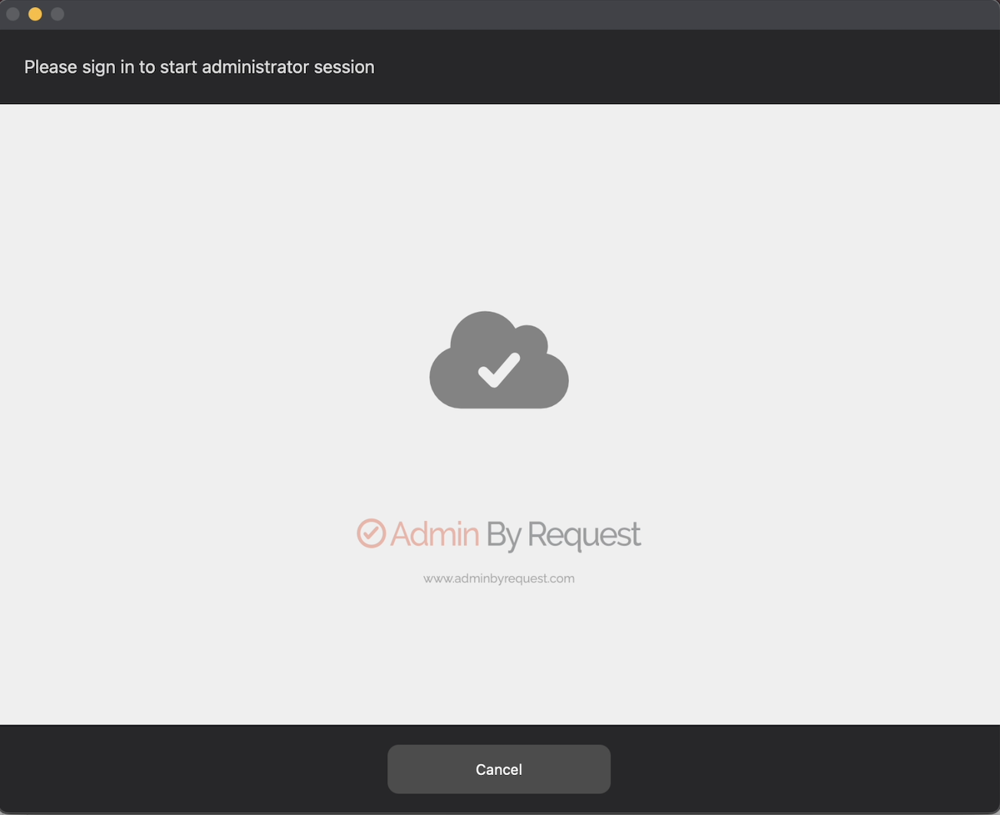

#### Approved screen 2

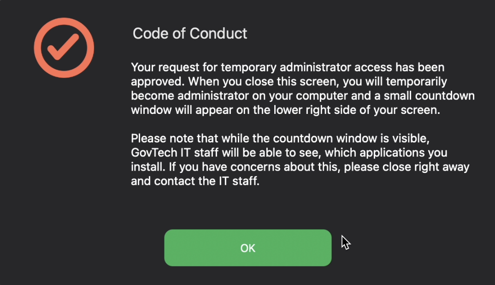

### Ending the session

The admin session ends when:

- The 15-minute timer expires, or
- You select **Finish** from the Admin By Request menu

After the session ends:

- Temporary admin rights are removed
- All elevated actions are logged in the ABR portal

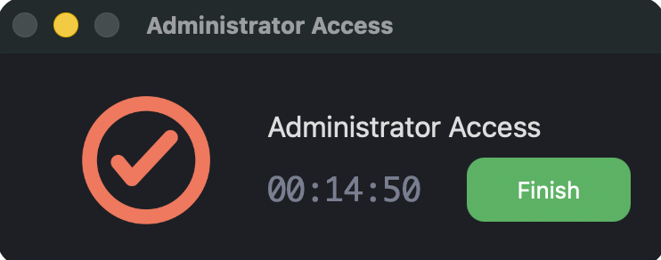

#### End session action

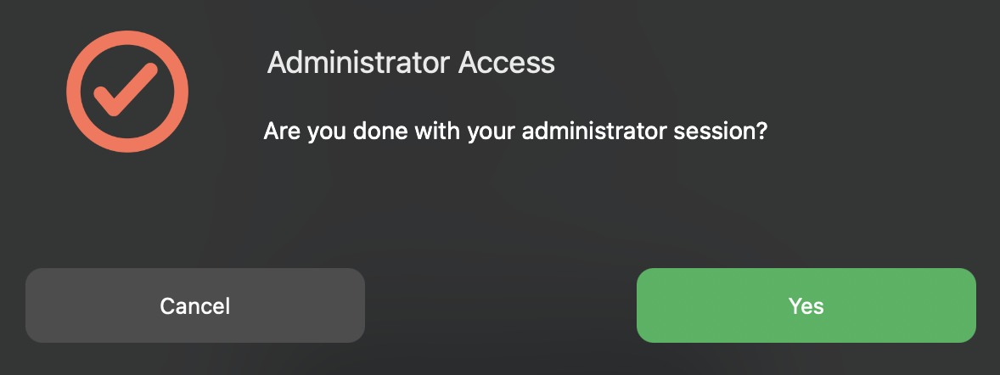

## Uninstall

Uninstallation requires a PIN.

Please approach the **SEED team** for assistance.

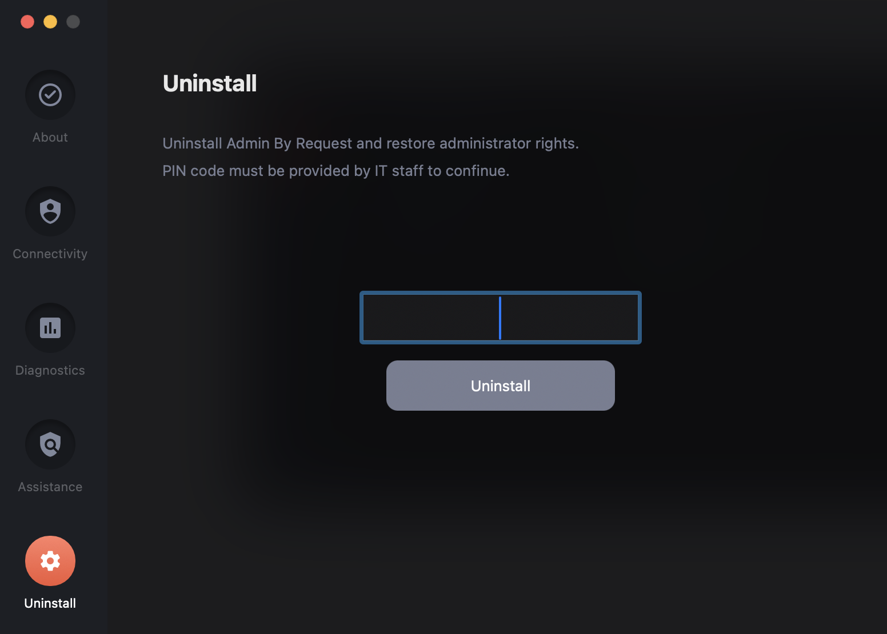

## FAQ

<strong>Is this permanent admin access?</strong>

No. Admin By Request only grants temporary, audited administrator rights.  
Admin access is removed automatically when the session ends.

<strong>Does Admin By Request work offline?</strong>

No. Admin By Request requires an active internet connection because MFA must be completed online.

<strong>Can users bypass Admin By Request?</strong>

No. Users cannot bypass Admin By Request if device permissions and allowed applications are configured correctly.

<strong>Can admins review what was done during an admin session?</strong>

Yes. Administrators can review elevated activities via the Audit Log, if command logging is enabled.

<strong>What if Admin By Request is showing error?</strong>

If **Cloud Connectivity** is shown as **Red** and **Active Directory Domain** is empty, Admin By Request is unable to communicate with Entra ID.

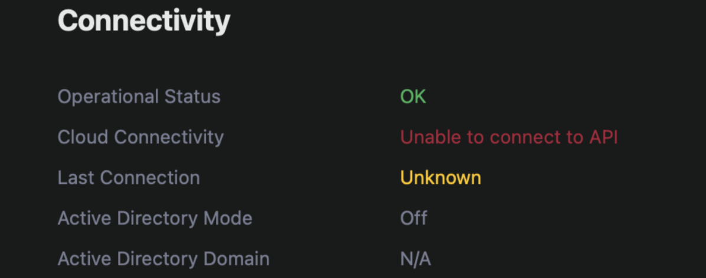

Check the following:

- **Company Portal.app** for device registration errors
- **Device Management Profile** in macOS Settings  
  Ensure that **ABR-FDA** and **ABR-System-Extension** profiles exist

If there is an Intune enrolment issue, required profiles may not be pushed to the device.

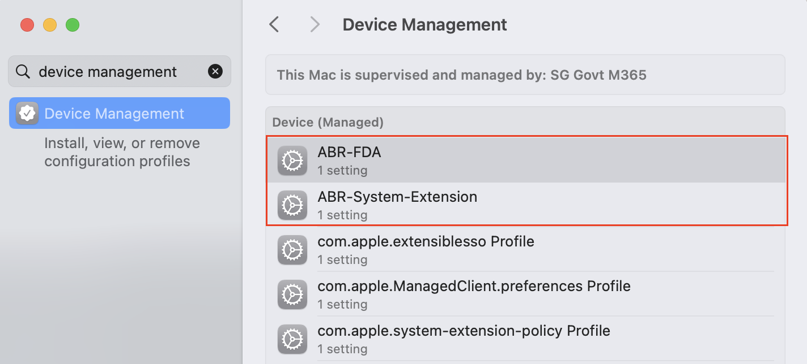

