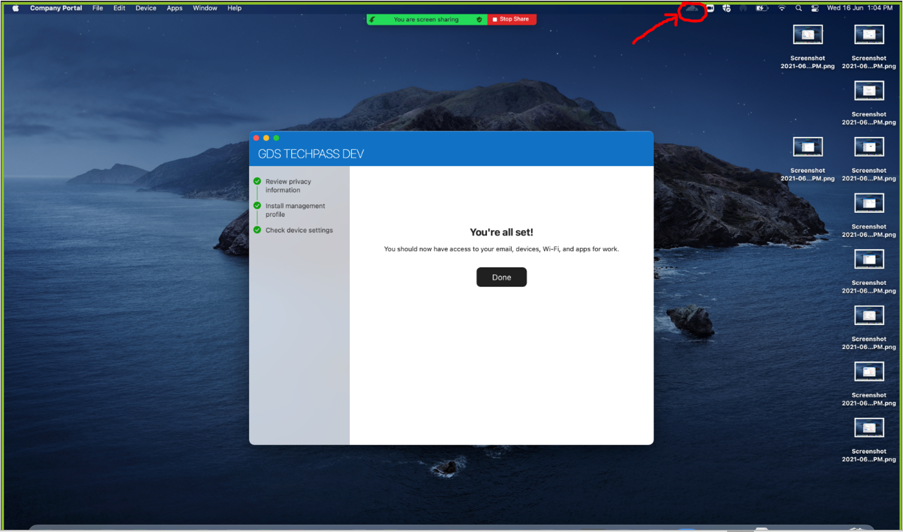

# Enroll Cloudflare WARP client (macOS)

**Prerequisites:**

- Disconnect from any other VPN that might be running as that could clash with Cloudflare.

- [Download and install Cloudflare WARP Client](https://install.appcenter.ms/orgs/cloudflare/apps/1.1.1.1-macos-1/distribution_groups/release) for macOS.

*To enroll Cloudflare WARP client:*

1. Open the Cloudflare WARP client from the menu bar on the top right corner of your desktop.

?> Tip: If it is not there, click **Command+Space** , search for **Cloudflare WARP** , and run the application.

You will see an information page, followed by a privacy policy.

3. Click **Next** and then **Accept** to accept the policy.

4. A browser will pop up asking you to sign in with one of 3 options. Select the one labelled **Azure AD – TechPass Prod**. If you encounter an error from Microsoft saying **&quot;User account \_\_\_ from identity provider \_\_\_ does not exist in tenant \_\_\_&quot;** , please navigate to [https://myaccount.microsoft.com](https://myaccount.microsoft.com/) in a new tab and sign out from your currently signed in account before reattempting from step 2.

5. When greeted with the Microsoft sign-in page, sign in using your WoG ID (i.e. [your\_name@tech.gov.sg](mailto:your_name@tech.gov.sg)) if you are a public officer, or your TechPass ID (i.e. [your\_name@techpass.gov.sg](mailto:your_name@techpass.gov.sg)) if you are a vendor.

6. Once you have successfully signed in, click on the Cloudflare WARP icon again and you should see the following screen. Note again that **you should not be connected to any other VPN while the WARP client is connected.**

**Connecting to other VPNs apart from WARP:**

- The WARP client connects your device to the Cloudflare network, which functions like a VPN.
- If you need to connect to another VPN, please **disconnect from WARP** AND **quit the WARP client** before doing so.
- Quitting the WARP client is needed because by default the WARP client will attempt to **automatically reconnect every hour,** which will affect your existing VPN connection.
