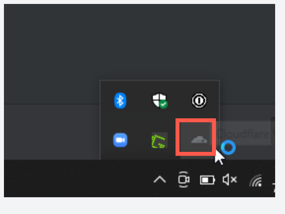
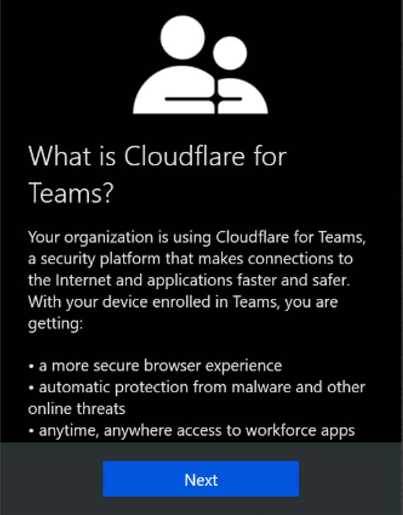
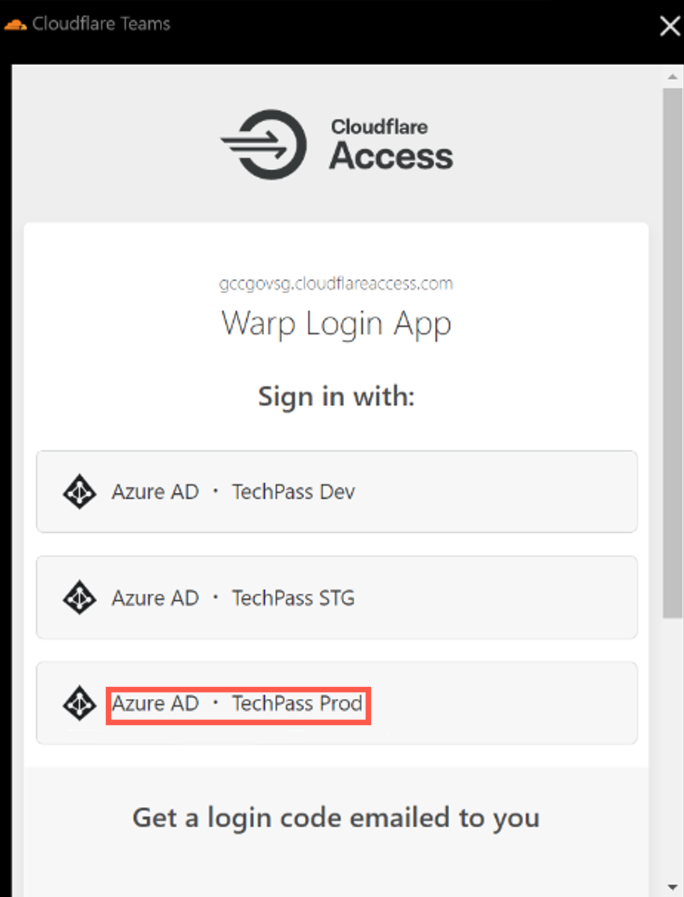
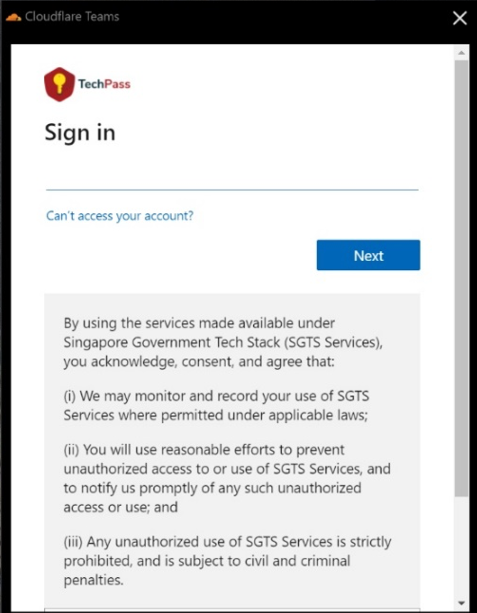
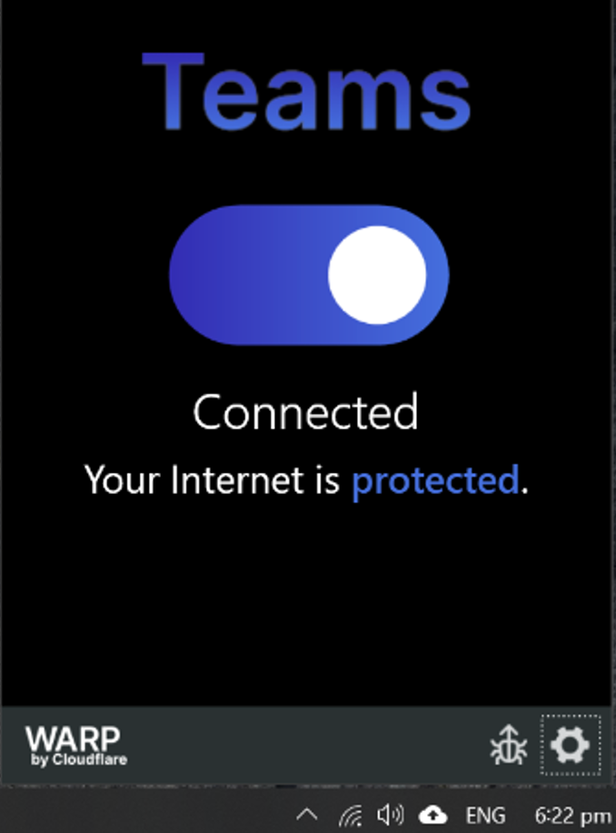

<!--# Cloudflare WARP Client Enrolment (Windows)

**Prerequisites**

1. Disconnect from any other VPN that might be running as it could clash with Cloudflare.
2. [Download and install Cloudflare WARP client](https://install.appcenter.ms/orgs/cloudflare/apps/1.1.1.1-windows-1/distribution_groups/release) for Windows.

*To enrol Cloudflare WARP client:*

1. Go to the **Start** menu and search for **Cloudflare WARP** , and run it.

?> Tip: You may also find the Cloudflare WARP client icon in the **icons tray** at the right corner of your taskbar.

You will see an information page, followed by a privacy policy.

2. Click **Next** and accept the policy.

You will be prompted to sign in with one of 3 options.

3. Select the one labelled **Azure AD – TechPass Prod**.

5. If you are a public officer, sign in using your WOG ID, that is *<your_name>@tech.gov.sg*.

6. If you are a vendor, sign in using your TechPass ID, that is *<your_name@techpass.gov.sg*.

6. Once you have successfully signed in, click the Cloudflare WARP icon again. You should see the following screen below. Note again that **you should not be connected to any other VPN while the WARP client is connected**.

**Connecting to other VPNs apart from WARP:**

- The WARP client connects your device to the Cloudflare network, which functions like a VPN.
- If you need to connect to another VPN, please **disconnect from WARP** AND **exit the WARP client** before doing so.
- Exiting the WARP client is needed because by default the WARP client will attempt to **automatically reconnect every hour,** which will affect your existing VPN connection.
