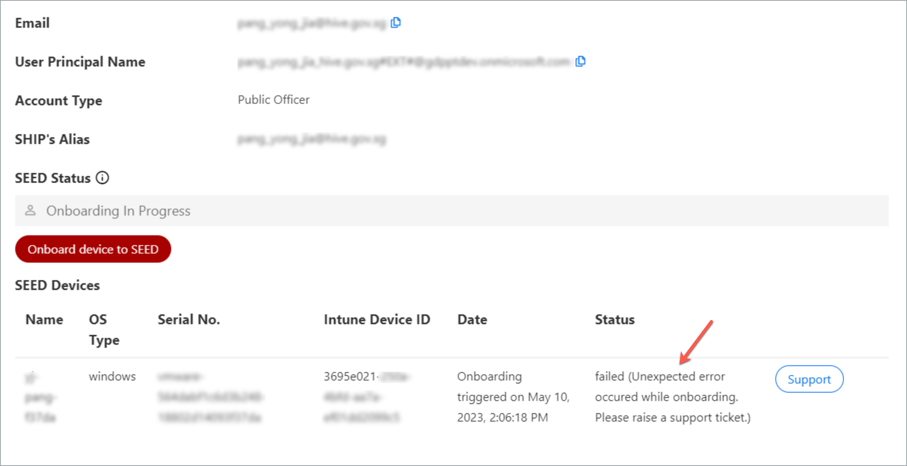

# Onboarding FAQ

  
Can I onboard my GSIB device to SEED?

  No, you can't onboard your GSIB device to SEED. SEED is an MDM solution only for an Internet Device, which is not a GSIB device.

  

  

  
What should I do if profile installation fails while installing the management profile?

<!--<kbd></kbd>-->

1. Ensure you received an email from us confirming the licence required for SEED onboarding has been assigned to you. If yes, proceed to step 2.
2. Go to the **Apple** menu > **System Preferences** > **Profiles**.
3. If **Management Profile** is already an existing profile, select it and remove it by clicking the minus icon at the lower-left corner.
4. If you are unable to remove Management Profile, uninstall **Company Portal**.
5. Reinstall [Company Portal](https://go.microsoft.com/fwlink/?linkid=853070).
6. [Onboard your device to SEED](onboard-device/onboard-device-to-seed).

  
Microsoft Defender does not get automatically installed after enrolling to Company Portal?

  This can happen if Defender or any other antivirus solution previously installed on the device was not completely removed before onboarding to SEED.

  To confirm this, [Verify if Microsoft Defender is configured correctly on your device][verify-defender-configuration].

  

  

  

  
While onboarding to Microsoft Intune, I get an error <b>Could not download the identity profile from the Encrypted Profile Service. The credentials within the Device Enrolment profile may have expired</b>.

  One of the possible reasons could be that your device was earlier onboarded to Microsoft Intune by a different user and was not offboarded properly during the pre-onboarding steps.

  To confirm if that is the case, [create a support request][raise-support-request] with your device serial number.

  The SEED team can verify if your device was previously enrolled to Microsoft Intune under a different user. If this is confirmed, choose on the following to offboard it from Microsoft Intune and then retry onboarding your device to SEED.

  - If you are a Windows user, refer to [SEED offboarding steps][seed-offboarding-steps].

  - If you are a macOS user, go to **System Preferences**  and locate the old Management Profile. Refer to [SEED offboarding steps][seed-offboarding-steps].

  

  

  

  
What should I do if my device does not get renamed automatically after onboarding to SEED?

  This can happen if Defender or any other antivirus already installed on the device was not completely removed before onboarding to SEED. To confirm this, [Verify if Microsoft Defender is configured correctly on your device][verify-defender-configuration].

  

  

  
While enabling Full Disk Access(FDA), I can't find <b>TaniumClient</b>. What should I do?

  1. Open the **Terminal** application and run the command: ``sudo chmod 755 /Library/Tanium/TaniumClient``.
  2. Go to the **Apple** menu > **System Preferences** > **Security & Privacy**.
  3. Click the **Privacy** tab.
  4. From the left pane, choose **Full Disk Access**.
  5. Click the lock icon at the lower left and use your Touch ID or enter your password to unlock.
  6. Click the plus icon on the **Full Disk Access** pane.
  7. Go to **Macintosh HD** > **Library** > **TaniumClient** and select the application file **TaniumClient**.
  8. Ensure the checkbox beside **TaniumClient** is selected.

While enabling Full Disk Access(FDA), I can't find <b>Microsoft Intune Agent</b> and <b>Microsoft Defender for Endpoint</b>. What should I do?

1. Go to the **Apple** menu > **System Preferences** > **Security & Privacy**.
2. Click the **Privacy** tab.
3. From the left pane, choose **Full Disk Access**.
4. Click the lock icon at the lower left and use your Touch ID or enter your password to unlock.
5. Click the plus icon on the Full Disk Access pane and do the following as required:
  - To add **Microsoft Intune Agent**, go to **Macintosh HD** >  **Library** > **Intune** and open **Microsoft Intune Agent.app**.
  - To add **Microsoft Defender for Endpoint**, go to **Application** > select **Microsoft Defender for Endpoint** and click **Open**.

While enabling Full Disk Access(FDA), I can't find <strong>Microsoft Defenders Endpoint Security Extension</strong>. Can I proceed with my onboarding?

Yes, you may proceed with your SEED onboarding and the Microsoft Defenders Endpoint Security Extension should be available within four hours. If it is still not available after four hours, please create a [Support Request](raise-an-incident-support-request) as it is required to ensure the completeness of your onboarding.

When enabling FileVault or Full Disk Access, I am unable to unlock Security & Privacy preferences using my current password.

This is because a new password policy has been enforced and you are required to reset your password.

1. Go to the **Apple** menu and choose **Lock Screen** or press **Command+Control+Q**.
2. Enter your current password and press **Return**.
3. You will be prompted to reset your password.

How do I reset the password for my macOS device?

*To reset password while enabling FileVault or FDA* :
1. Go to the **Apple** menu > **Lock Screen** or use keyboard shortcut **Command+Control+Q** .
2. Enter your password and press **return**. You will be prompted to reset password.
3. Reset your password and make sure it meets the following requirements:

  - should contain at least 12 characters
  - should not be the same as the previous three passwords
  - same character cannot be used consecutively.
  - cannot have three sequential characters
  - should contain at least one number and one alphabetic character
  

After onboarding to SEED, I did not receive the successfully onboarded email. What should I do?

Possible reasons could be:

- Defender or any other antivirus solution previously installed on the device was not completely removed before onboarding to SEED.
- Tanium and Cloudflare did not get installed while onboarding to SEED.

Before raising a support request, confirm the following:

- [Verify if Microsoft Defender is configured correctly on your device][verify-defender-configuration].

- Check if Tanium and Cloudflare are installed. These applications will be automatically installed while enrolling your device to SEED. If they are not installed, [create a support request][raise-support-request].

While enrolling my device to SEED, I get an error <b>Couldn’t add your device. Wait a few minutes, then try again or contact your company support</b>. What should I do?

As suggested wait for few minutes, retry enrolling your device to Microsoft Intune and click **Approve** in the management profile.

While approving the management profiles, I get a message <b>Profiles cannot be approved while using remote or automated input method</b>. What should I do?

 Upgrade to the [latest macOS version][upgrade-macos] and ensure there is enough disk space available on your Mac device before retrying.

What should I do when I get an error <b>You can’t use this version of the application Company Portal with this version of OS X.</b> 

 Upgrade to the [latest macOS version][upgrade-macos].

 

 

How to confirm if I have successfully onboarded my Internet Device to SEED? 

When you complete onboarding your device to SEED, within the next two hours, you should receive the successfully onboarded email in your inbox (organisational email address).

If you don't receive this email after two hours, please submit an [incident request](https://go.gov.sg/seed-techpass-support).

     

  
After resetting my macOS password, I am unable to log in using the new password, why?

This may occur if your new password does not meet the following password requirements:

  - should contain at least 12 characters.
  - should not be the same as the previous three passwords.
  - same character cannot be used consecutively.
  - cannot have three sequential characters.
  - should contain at least one number and one alphabetic character.

Following are the three options available to reset your password:

  

Reset password using Apple ID

 Refer to [Reset your Mac login password uisng Apple ID](https://support.apple.com/en-gb/guide/mac-help/mh35902/mac) for step-by-step instructions.
 
  

  

Reset password using recovery key

  **To reset password using recovery key**

  1. Click the question mark next to the password field in the login window.

  ?> If you don't see a question mark, press and hold the power button until your Mac shuts down, then press the power button to restart your Mac. Alternatively, enter any password three times.

  2. Click  **If you forgot your password, you can reset it using your Recovery Key**.
  3. Enter the recovery key. Make sure to use uppercase letters and to enter the hyphens.
  4. Reset your password.

  

  

  
Reset password using recovery mode

  If you have do not have an Apple ID or a recovery key, depending on the chip on your Mac device, start your Mac in recovery mode to reset password.

<!-- tabs:start -->

#### **M1 chip**
  1. Restart or shutdown the device by pressing the power button until the screen is black and any lights (including in the Touch Bar) are off.
  1. Press and hold the power button on your Mac until the **Loading startup options** appears. After a few seconds you’ll see two icons: **Macintosh HD** and **Options**.
  1. Click **Options** and choose the user account for which you know the password and click **Next**.
  1. Enter the password to continue.
  1. Go to **Applications** > **Utilities** > **Terminal**.
  1. Enter `resetpassword` and press `return`. The **Reset Password** assistant will be displayed.
  1. Select **My password doesn’t work when logging in** and click **Next**.
  1. If prompted, select the user account for which you need to change password.
  1. Type the old password and new password in the respective fields.
  1. Type the new password in **Verify password** and specify a **Password hint**.
  1. Click **Next**.
  1. Restart your device and in the login screen, choose your user account and type your new password.

  > **Notes**:
  >
  >1. If you are still unable to reset your password, repeat steps 1-6.
  >2. Select **My keyboard isn't working when typing my password to log in** and click **Next**.
  >3. Disable FileVault on the volume **Macintosh HD**.
  >4. Restart your device and in the login screen, choose your user account and type your new password.

#### **Intel chip**

  1. Restart the device by pressing the power button while holding down the `Command + R` keys.
  1. Release the keys when you see the load bar.
  1. Go to **Applications** > **Utilities** > **Terminal**.
  1. Enter `resetpassword` and press `return`. The **Reset Password** assistant will be displayed.
  1. Select **My password doesn’t work when logging in** and click **Next**.
  1. If prompted, select the user account for which you need to change password.
  1. Type the old password and new password in the respective fields.
  1. Type the new password in **Verify password** and specify a **Password hint**.
  1. Click **Next**.
  1. Restart your device and in the login screen, choose your user account and type your new password.

  > **Notes**:
  >
  >1. If you are still unable to reset your password, repeat steps 1-4.
  >2. Select **My keyboard isn't working when typing my password to log in** and click **Next**.
  >3. Disable FileVault on the volume **Macintosh HD**.
  >4. Restart your device and in the login screen, choose your user account and type your new password.

<!-- tabs:end -->

     

While I register my Intune Device ID on the TechPass portal, what should I do if my onboarding fails due to one of the following reasons?

As a prerequisite, ensure the device you are onboarding to SEED has a stable internet connectivity until you see the **Onboarded** Status on the TechPass portal.

| Reason for failed onboarding | Action required |
| ---|---|
| Unexpected Error| [Create a support request](https://go.gov.sg/seed-techpass-support). |
| Software Misconfiguration Error | [Create a support request](https://go.gov.sg/seed-techpass-support).|
| Endpoint Error |  1. Ensure the device you are onboarding to SEED has a stable internet connectivity until you see the **Onboarded** Status on the TechPass portal. 2. Go to the [TechPass portal](https://portal.techpass.gov.sg/). 3. At the top right, go to your user name and click **My Account**. Your profile details are displayed. 4. Go to the **SEED Devices** section and click **Retry**.  5. If the error persists, [Create a support request](https://go.gov.sg/seed-techpass-support). |
| Software Installation Error | 1. Restart the device you are onboarding to SEED. 2. After 10-15 minutes, go to the [TechPass portal](https://portal.techpass.gov.sg/). 3. At the top right, go to your user name and click **My Account**. Your profile details are displayed. 4. Go to the **SEED Devices** section and click **Retry**.  5. If the error persists, [Create a support request](https://go.gov.sg/seed-techpass-support).|
| Internal Error | 1. Restart the device you are onboarding to SEED. 2. After 10-15minutes, go to the [TechPass portal](https://portal.techpass.gov.sg/). 3. At the top right, go to your user name and click **My Account**. Your profile details are displayed. 4. Go to the **SEED Devices** section and click **Retry**.  5. If the error persists, [Create a support request](https://go.gov.sg/seed-techpass-support).|
| Device that is trying to onboard is a DWP device. Please onboard with a non-DWP device.| You can't onboard DWP device to SEED. You can onboard only an Internet Device to SEED. |

   

   

[verify-defender-configuration]: verify-microsoft-defender-is-configured-correctly-for-your-os.md
[raise-support-request]: raise-an-incident-support-request.md
[seed-offboarding-steps]: offboard-device/offboard-device-from-seed.md
[upgrade-macos]: https://support.apple.com/downloads/macos
