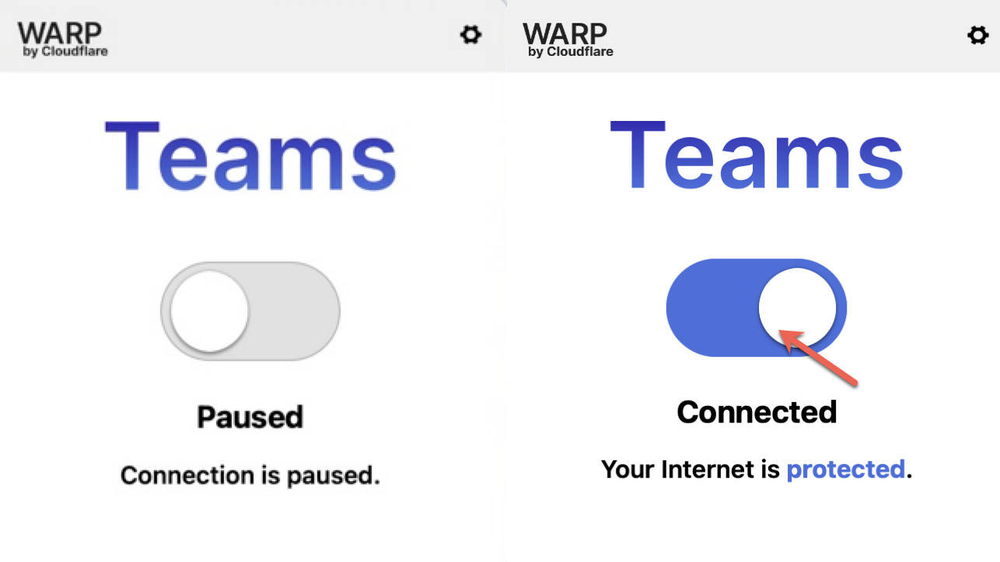

# GCC 1.0 Connectivity FAQ

How can I access GCC 1.0 if I am experiencing connectivity issues with GlobalProtect VPN?

Starting from 1st October 2023, GCC 1.0 no longer requires GlobalProtect VPN for access. To connect, disconnect from GlobalProtect VPN and enable your Cloudflare WARP connection.

