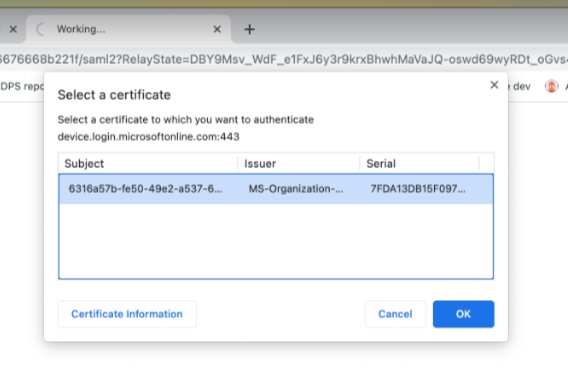
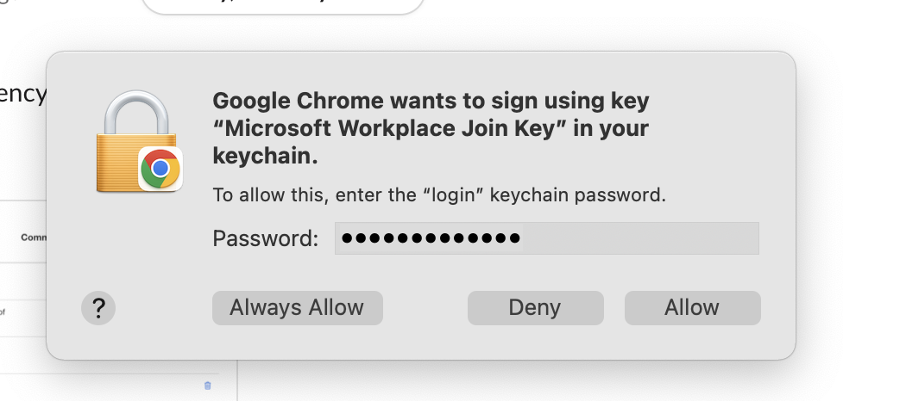
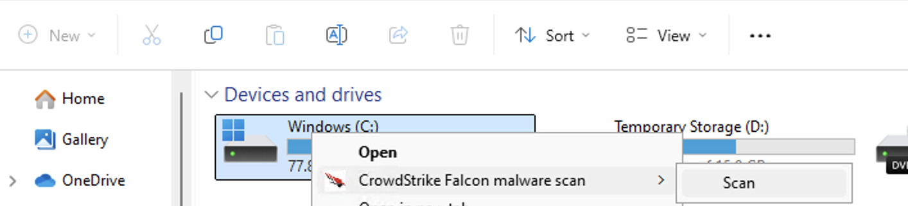
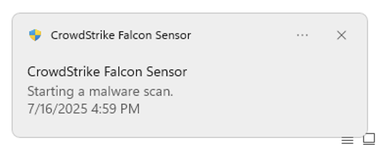
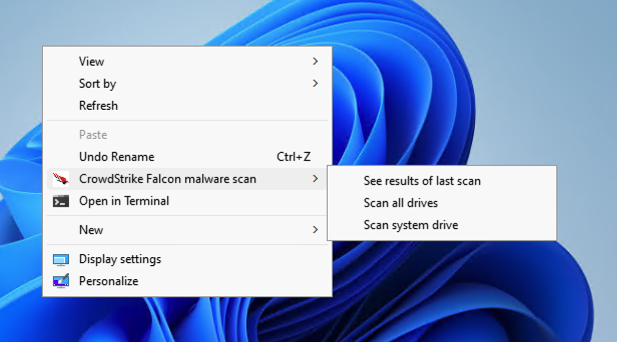
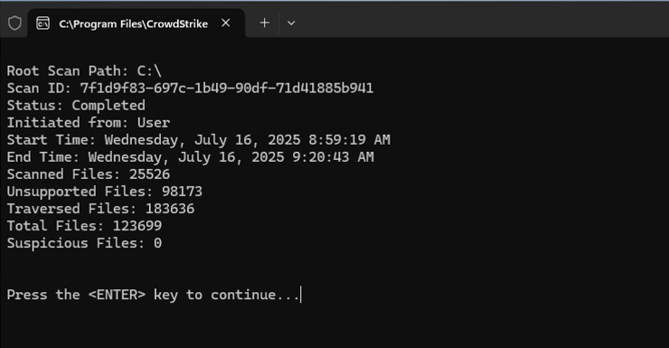

# General FAQ

## 🖥 Device usage and compliance

  
What type of data can I store on a Government Managed Device (GMD)?

  GMDs are intended to facilitate development work for accessing GCC 2.0 and SGTS securely.  
  Do not store production or live data on GMDs.

  
Can I install unlicensed software or tools on my Government Managed Device (GMD)?

  Installing unlicensed software is strictly prohibited.  
  Use your organisation’s process to request legitimate software.  
  Refer to <a href="https://docs.developer.tech.gov.sg/docs/security-suite-for-engineering-endpoint-devices/additional-resources/terms-and-policies">Terms and policies</a> for details.

  
Why am I unable to access certain websites?

  If you are experiencing access issues, use <a href="https://radar.cloudflare.com/security-and-attacks"> Cloudflare Radar </a> to investigate.  
  Enter the domain you are trying to access and view the network/security report.

  
Can I bring and use my Government Managed Device (GMD) overseas?

  You should assess the risk and seek approval from your Reporting Officer (RO) before bringing your device overseas.

  
What should I do if I lose my Government Managed Device (GMD)?

  1. Notify your manager and operations manager to approve data deletion.  
  2. <a href="https://go.gov.sg/seed-techpass-support"> Raise a support request </a> to notify the SEED team.  
  3. Mention any sensitive data to prioritise remote wiping.  
  4. Attach manager approvals to the request.

  
What happens when the security of a Government Managed Device (GMD) is compromised?

  SEED will contact the user with the next steps. Affected user to cooperate with security analysts for investigation, containment and recovery.

  
What happens when a remote wipe is performed on a Government Managed Device (GMD)?

  Remote wipe erases all data on the device.  
  It is only performed in cases of theft, loss, or a confirmed security compromise.

  
Is remote wipe applicable only to public sector agency devices?

  No. Remote wipe can be performed on any lost or compromised GMD to prevent data breaches.

  
Why am I prompted to turn on System Integrity Protection (SIP) on my macOS device?

  This is a SEED policy requirement.  
  SIP enhances macOS security by preventing unauthorised modifications to protected system files and folders.

  
Why do I need to turn on FileVault encryption?

  FileVault encryption protects your device and ensures compliance with SEED policies.

  
Why does my device slow down after onboarding to Microsoft Intune?

  SEED uses Microsoft Defender for Endpoint.  
  Other antivirus software may cause performance issues.  
  Disable or uninstall any non-Microsoft antivirus software.

  
Why am I prompted to select the device certificate when accessing some websites?

  Due to the device compliance check policy, during the Entra ID authentication, you will be prompted the select the device certificate which will be checked for the valid MDM certificate on your machine. 
  Afterwards, you will be given access to your application if your device is compliant.

  
What password should you key in if you are prompted to select the certificate?

  Select the device certificate when prompted and click OK.
  
  
  
  Type in your local mac password and click on “Always Allow”.
  
  
  
  You might be prompted to enter the password multiple times (1-3 times), make sure to click on “Always Allow”.
  Note: Selecting of certificate is not required if the MacOS is joined to Entra (Registered with Platform SSO)

## 🔁 Device records and inactivity

  
What should I do if my device has been inactive for 180 days?

  If you no longer require the device for SEED access, please offboard it.  
  If you still require access, email enquiries_seed@tech.gov.sg for assistance.

  
How do I check if my device record has been deleted?

  Log in to the <a href="https://dashboard.seed.tech.gov.sg/"> SEED Dashboard </a> to check your device records.

  
What should I do if my device record has been deleted even though it is still active?

  Email enquiries_seed@tech.gov.sg for assistance.

  
Why is my device not showing on the SEED Dashboard?

  Your TechPass account may not be linked to your SEED device due to an onboarding or account termination issue.  
  Offboard and re-onboard your device, or <a href="https://go.gov.sg/seed-techpass-support"> raise a support request </a>.

  
Why did I receive an email indicating limited access to SEED-protected resources after previously onboarding successfully?

  SEED may have detected device configuration issues (e.g. unhealthy Microsoft Defender).  
  Offboard the device if no longer needed, or <a href="https://go.gov.sg/seed-techpass-support"> raise a support request </a>.

  
Why did I receive the successfully onboarded email again?

  This may happen if configuration services were temporarily misconfigured and restored.

  
Do I need to re-onboard my device after returning from a long leave?

  If your GMD has not been logged into for 90 consecutive days, it may be marked inactive and removed from Intune.  
  This does not wipe your device, but SEED will no longer be able to monitor or manage it.

  
Will I receive any notification if the MDM certificate is about to expire?

  No, you will not receive any notification when your MDM certificate is expiring.

## 🔑 Passwords and reset

  
Do I need to change my SEED onboarding password after one year?

  Yes. The password requirements are:
  - At least 12 characters
  - Cannot reuse the previous 3 passwords
  - Cannot contain the same character consecutively
  - Cannot have three sequential characters
  - Must contain at least one number and one alphabetic character

  
How do I reset my password using the macOS <b>Utilities</b> menu?

  Refer to the following image:  
  
  

## 🛡️ CrowdStrike

  
Why was my device blocked due to a malware alert in CrowdStrike?

  Your device will be blocked if you have malware alerts on CrowdStrike.  
  No action is required from you. The SEED team will review your ticket, and your device will be unblocked after the assessment is completed.  
  Please <a href="https://go.gov.sg/seed-techpass-support"> raise a support request </a> if you are not unblocked automatically.

  
[Windows only] How do I perform a malware scan using CrowdStrike?

  Right-click the drive → Click **Show more options** → Click **CrowdStrike Falcon malware scan** → Click **Scan**.  
  A pop-up window will appear at the lower-right corner.
  
  

  You will see a pop up window on the right hand corner.
  
  
  

  
[Windows only] How do I check the results of a CrowdStrike malware scan?

  Go to your Desktop → Right-click and select **Show more options** → Click **CrowdStrike Falcon malware scan** → Click **See results of last scan**.  

  
  
  You should see the status as **Completed**.

  
  

  
[Mac only] Can I perform an on-demand CrowdStrike Falcon malware scan?

  No. Falcon On-Demand Scan is not applicable for macOS.  
  <a href="/assets/falcon-on-demand-mac.pdf" download>Download the Falcon On-Demand Scan guide for Mac (PDF)</a>
for more information.

