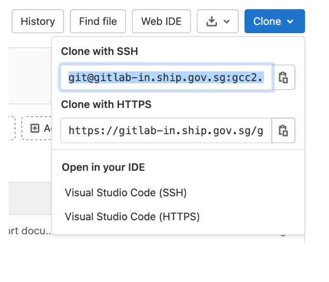
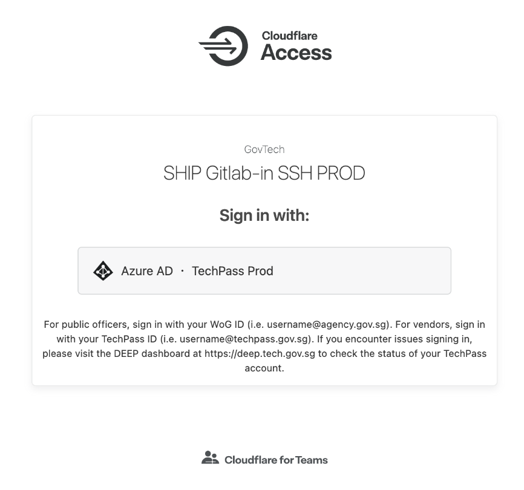
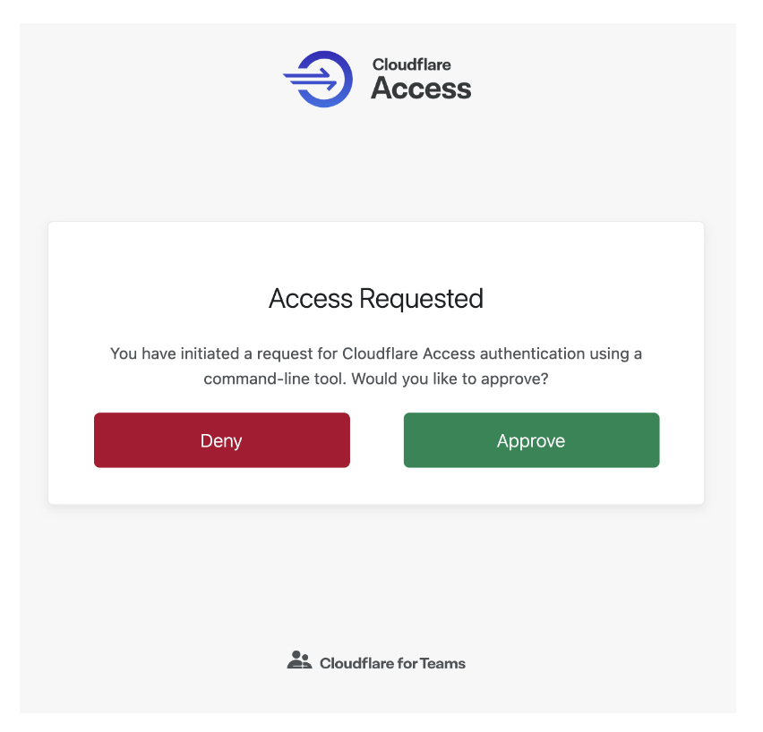
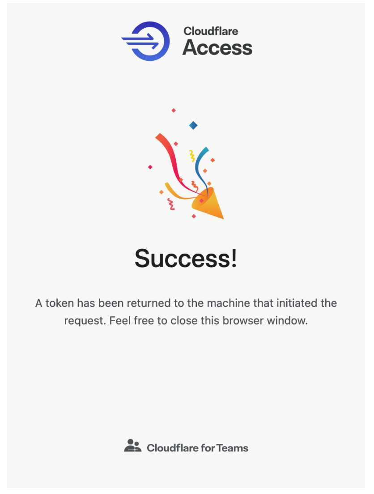

# How to clone GitLab repository using SSH with Cloudflare Access

**Prerequisites**

- If you are using an internet device which is a non-GSIB or non-DWP device, [onboard it to SEED](onboard-device/onboard-device-to-seed).
- [Verify if you have an existing SSH key pair](https://gitlab-in.ship.gov.sg/help/user/ssh.md#see-if-you-have-an-existing-ssh-key-pair). If it is available, [add the SSH key in Gitlab](https://gitlab-in.ship.gov.sg/-/profile/keys).
- If you don't have an SSH key pair, [generate SSH key pair](https://gitlab-in.ship.gov.sg/help/user/ssh.md#generate-an-ssh-key-pair) and then add it in GitLab.
- You should know how to setup and use ssh together with Git.

> **Note**:
> Refer to [SSH key pairs](https://gitlab-in.ship.gov.sg/help/user/ssh) for additional information.

**To clone GitLab repository using SSH with Cloudflare Access**

<!-- tabs:start -->

## **macOS**

1. Open **Terminal** and use the following command to install `cloudflared` via Homebrew.

```

$ brew install cloudflare/cloudflare/cloudflared

```
> **Note**:
> you don't need to wrap your SSH commands in any unique way. You just need to make a one-time change to your SSH configuration.

1. To make a one-time change to your SSH configuration file, use `vim ~/.ssh/config`.
1. Append the following lines:

```
Host gitlab-in-ssh.ship.gov.sg
  ProxyCommand /usr/local/bin/cloudflared access ssh --hostname %h
  IdentityFile <PATH TO YOUR SSH PRIVATE KEY> #omit this line if you're using the default id_rsa ssh key
```

> **Note**:
> If your macOS device has M1 chip, then the location of `cloudflared` could be `/opt/homebrew/bin/cloudflared`.

1. Test the SSH flow by attempting to clone the project.

```
$ git clone git@gitlab-in-ssh.ship.gov.sg:gcc2.0/seed/cloudflare-support.git

```

> **Note**:
> If you're copying the clone url from GitLab Web Interface, change the GitLab hostname from `gitlab-in.ship.gov.sg` to `gitlab-in-ssh.ship.gov.sg`.



`cloudflared` will prompt you to log in with TechPass. Authenticate your login. If the authentication is successful, the following messages will be displayed.







The token is saved in your `~/.cloudflared` directory, and the git clone command clones the code repository.


## **Windows**

1. Download `cloudflared` from the following URL:
  - [32-bit](https://github.com/cloudflare/cloudflared/releases/latest/download/cloudflared-windows-386.exe)
  - [64-bit](https://github.com/cloudflare/cloudflared/releases/latest/download/cloudflared-windows-amd64.exe)

1. Save the .exe file in a desired location and rename it as `cloudflared.exe`.

> **Note**:
> you don't need to wrap your SSH commands in any unique way. You just need to make a one-time change to your SSH configuration.

1. To make a one-time change to your SSH configuration file, open your ssh config file `$HOME/.ssh/config`.

> **Note**:
> If this file does not exist, create it.


1. Append the following lines:

```
Host bitbucket-ssh.ship.gov.sg
  ProxyCommand c:\path\to\cloudflared.exe access ssh --hostname %h
  IdentityFile <PATH TO YOUR SSH PRIVATE KEY>
```
1. Test the SSH flow by attempting to clone the project.

```
$ git clone git@gitlab-in-ssh.ship.gov.sg:gcc2.0/seed/cloudflare-support.git

```

> **Note**:
> If you're copying the clone url from GitLab Web Interface, change the GitLab hostname from `gitlab-in.ship.gov.sg` to `gitlab-in-ssh.ship.gov.sg`.


`cloudflared` will prompt you to log in with TechPass. Authenticate your login. If the authentication is successful, the following messages will be displayed.


The token is saved in your `~/.cloudflared` directory, and the git clone command clones the code repository.
<!-- tabs:end -->
