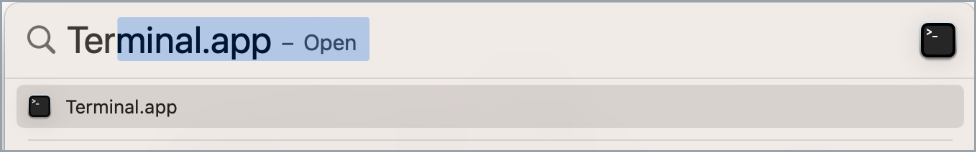
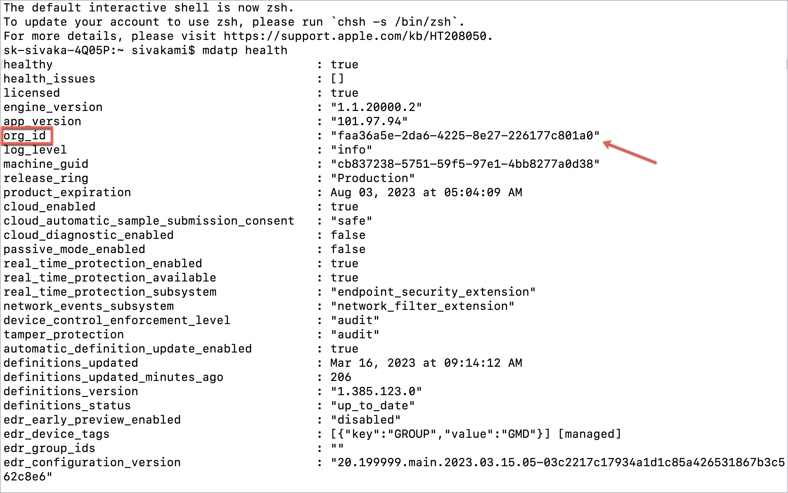
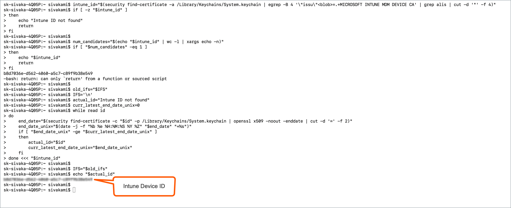

# Offboard macOS device using a script

 This document guides you to offboard your macOS device onboarded to SEED.

## Audience

- Users who need to offboard their macOS device from SEED.

## Prerequisites

- You must have an active TechPass account.
- Your device must have been onboarded to SEED.
- [Optional] We recommend you to have your Intune Device ID ready.

### Get Intune Device ID

Complete one of the following methods to get your Intune Device ID:

?> **Tip**<br>Click the triangle to view more details about each method.

<details>
<summary>Method 1: Get Intune Device ID from your GMD</summary>


1. On your GMD, open your **Terminal** and run the following commands:

```
intune_id="$(security find-certificate -a /Library/Keychains/System.keychain | egrep -B 4 '\"issu\"<blob>=.+MICROSOFT INTUNE MDM DEVICE CA' | grep alis | cut -d '"' -f 4)"
if [ -z "$intune_id" ]
then
    echo "Intune ID not found"
    return
fi

num_candidates="$(echo "$intune_id" | wc -l | xargs echo -n)"
if [ "$num_candidates" -eq 1 ]
then
    echo "$intune_id"
    return
fi

old_ifs="$IFS"
IFS='\n'
actual_id="Intune ID not found"
curr_latest_end_date_unix=0
while read id
do
    end_date="$(security find-certificate -c "$id" -p /Library/Keychains/System.keychain | openssl x509 -noout -enddate | cut -d '=' -f 2)"
    end_date_unix="$(date -j -f "%b %e %H:%M:%S %Y %Z" "$end_date" "+%s")"
    if [ "$end_date_unix" -ge "$curr_latest_end_date_unix" ]
    then
        actual_id="$id"
        curr_latest_end_date_unix="$end_date_unix"
    fi
done <<< "$intune_id"

IFS="$old_ifs"
echo "$actual_id"
```
2. Take note of the Intune Device ID that is displayed on the **Terminal** window.

</details>

<details>
<summary>Method 2: Get Intune Device ID from TechPass portal</summary>

1. On your non-SE GSIB device, go to the [TechPass portal](https://portal.techpass.gov.sg/secure/account/profile).
2. On the TechPass portal, at the top right, go to your user name and click **My Account**. Your **Profile** details are displayed.
3. Take note of the **Intune Device ID** from the **Profile** page.


</details>


<details>
<summary>Method 3: Submit an incident request to get Intune Device ID.</summary>

?> **Note**<br>Use this method only if you can't log in to your GMD or TechPass portal.

- Submit an [incident request](https://go.gov.sg/seed-techpass-support) to get your Intune Device ID.

</details>


!> **Note**<br>If you have any issues with the offboarding steps, see the [Offboarding FAQs](/faqs/seed-offboarding-faqs) before submitting an [incident request](https://go.gov.sg/seed-techpass-support) with TechPass and SEED support.


## Phase A: Offboard device from SEED components

1. Go to **Terminal** and run `mdatp health`.

<!--


-->

2. Take note of the value displayed for **org_id**.



3. Refer to the following table and identify your **Defender organisation** and download the respective offboarding package.

  | org_id  | Defender organisation | Offboarding package |
  | ------------- |:-------------:|:-------------:|
  | faa36a5e-2da6-4225-8e27-226177c801a0      | WOG     | [Download offboarding package](https://k3uwa66lu3tj6uxft46666ynhe0uvzor.lambda-url.ap-southeast-1.on.aws/local_wog_mac)    |
  | 49237d71-42ac-425a-a803-881b92cc18ce  | TechPass    | [Download offboarding package](https://k3uwa66lu3tj6uxft46666ynhe0uvzor.lambda-url.ap-southeast-1.on.aws/local_tp_mac)     |
  | 6389e966-e334-461d-86ce-0fed12484620 | Hive | Contact [Hive support](mailto:GDS_DEN@hive.gov.sg) to get the offboarding package. |


!> **Important**<br>- If your **Defender organisation** is **Hive**, please skip the remaining steps in this document. You need to get the offboarding package from the Hive support and unenrol your device from Defender. See the [offboarding FAQs](offboard-device/seed-offboarding-faqs.md) to know how to unenrol your device from Defender using the Hive offboarding package.<br><br>- If your **Defender organisation** is either **WOG** or **TechPass**, you need to use your TechPass to download the offboarding package and proceed with the remaining steps.<br><br>- If your **Defender organisation** is **none of the above**, contact the IT support of the organisation that provided you with the device.

4. Go to the folder where you downloaded the ZIP file and extract the files. You should see the following two files.


?> **Note**: The file names vary with the organisation.

5. On your **Terminal**, go to the folder where you extracted the files. For example, if they are in the **Downloads** > **Offboarding_local_wog_mac** folder, go to that folder.


6. Copy the below and run it on the same **Terminal**.

    ```
    sudo chmod +x local_mac_offboarding.sh
    ```

7. When prompted for a **Password**, enter your device password.
8. Copy and run the following command on your **Terminal**.

    ```
    sudo ./local_mac_offboarding.sh
    ```

When you see the following success message on your **Terminal**, you are automatically directed to the **SEED Offboarding: Device Record Removal** form to submit the Intune Device ID.


!>**Important note**<br> Make sure you complete the steps in Phase B immediately after Phase A. If not, your device update policy may reinstall the latest version of the deleted SEED components.


## Phase B: Submit Intune Device ID to remove device record

### Prerequisites

- Successful completion of [Phase A: Offboard device from SEED components](#phase-a-offboard-device-from-seed-components).
- **Intune Device ID**. Generally, when you successfully offboard your device from the SEED components, the Intune Device ID is automatically displayed on the **SEED Offboarding: Device Record Removal** form. If it is not displayed, see [Get Intune Device ID](#get-intune-device-id).
- [Optional]If you had submitted an incident request with the TechPass and SEED support team to offboard your device from the SEED components, please have the reference number ready as we may need this information.

### To submit Intune Device ID

1. Ensure your **Intune Device ID** is displayed on the form. If it is not displayed, provide it.
2. Enter your organisational email address in **Organisational Email Address** and click **Verify**.
3. Enter the OTP you receive at this email address.  
4. Indicate if you had any issues while completing **Phase A**.
5. [Optional] If you had issues completing **Phase A**, we encourage you to provide the **Support Ticket Number**.
6. Click **Submit**. When this request is processed successfully, we send a notification via email.


?> **Additional information**<br>- We require up to 30 minutes to process your server-side offboarding request.<br>- If you are still waiting to receive an email after 30 minutes, please submit a [TechPass and SEED support request](https://go.gov.sg/seed-techpass-support).


<!--
[Get Intune Device ID](../snippets/snippets-get-intune-device-id.md ':include')



-->


