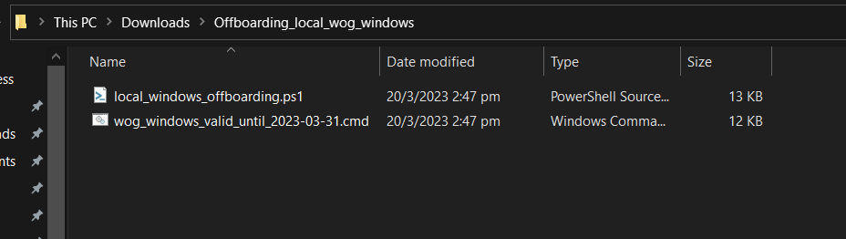

# Offboard Windows device using a script
 
 This document guides you to offboard your Windows device onboarded to SEED.

## Audience

- Users who need to offboard their mWindows device from SEED.

## Prerequisites

- You must have an active TechPass account.
- Your device must have been onboarded to SEED.
- [Optional] We recommend you to have your Intune device ID ready. 

## Phase A: Offboard device from SEED components

[Get Intune Device ID](../snippets/snippets-get-intune-device-id.md ':include')

!> **Note**<br>If you have any issues with the offboarding steps, see the [Offboarding FAQ](/faqs/seed-offboarding-faqs) before submitting an [incident request](https://go.gov.sg/techpass-sr) with TechPass support.

1. Go to the **Start** menu and enter **Powershell**.
2. Right-click on the search result for **PowerShell** and select **Run as Administrator**


3. On **Powershell**, run the following command:

```
$reg64 = [Microsoft.Win32.RegistryKey]::OpenBaseKey([Microsoft.Win32.RegistryHive]::LocalMachine, [Microsoft.Win32.RegistryView]::Registry64)
$OrgID =  $reg64.OpenSubKey("SOFTWARE\MICROSOFT\Windows Advanced Threat Protection\Status").GetValue("OrgID")
echo $OrgID
``` 
to find if your organisation is WOG or TechPass.

4. Take note of the value displayed for **org_id**.


5. Refer to the following table and find your Defender organisation.

  | org_id  | Organisation |
  | ------------- |:-------------:|
  | faa36a5e-2da6-4225-8e27-226177c801a0      | WOG     |
  | 49237d71-42ac-425a-a803-881b92cc18ce  | TechPass    | 

!> **Important**<br> If your Defender organisation is neither **WOG** nor **TechPass**, contact the IT support of the organisation that provided you with the device.

6. Download the offboarding script, a ZIP file, for your Defender organisation.

  | Organisation  | SEED offboarding script |
  | ------------- |:-------------:|
  | WOG      | [Download offboarding script](https://k3uwa66lu3tj6uxft46666ynhe0uvzor.lambda-url.ap-southeast-1.on.aws/local_wog_windows)    |
  | TechPass      | [Download offboarding script](https://k3uwa66lu3tj6uxft46666ynhe0uvzor.lambda-url.ap-southeast-1.on.aws/local_tp_windows)    |
  
7. Go to the folder where you downloaded the ZIP file and extract the files. You should see the following two files. 



?> **Note**: The file names vary with the organisation.

8. Right-click on the unzipped folder and select **Show more options** > **Copy as path**. The folder path is now saved to your clipboard.

9. On **Powershell**, run the following command to go to the folder which has the extracted files:

    ```cd {Path from clipboard}```

    For example:

    ```cd "C:\Users\testUser\Downloads\Offboarding_local_tp_windows"```

    

10. To run the script, enter the following command:

    ```
    powershell.exe -ExecutionPolicy Bypass .\local_windows_offboarding.ps1
    ```

When you see the following success message on your **Powershell**, you are automatically directed to the **SEED offboarding: Request to remove device record** form to submit the Intune Device ID. 


!>**Important note**<br> Make sure you complete the steps in Phase B immediately after Phase A. If not, your device update policy may reinstall the latest version of the deleted SEED components.

## Phase B: Submit Intune Device ID to remove device record

### Prerequisites

- Successful completion of [Phase A: Offboard device from SEED components](#phase-a-offboard-device-from-seed-components).
- **Intune Device ID**. Generally, when you successfully offboard your device from the SEED components, the Intune Device ID is automatically displayed on the **SEED Offboarding: Device Record Removal** form. If it is not displayed, see [Get Intune Device ID](#get-intune-device-id).
- [Optional]If you have submitted an incident request with the TechPass support team to offboard your device from the SEED components, please have the reference number ready as we may need this information.

### To submit Intune Device ID

1. Ensure your **Intune Device ID** is displayed on the form. If it is not displayed, provide it.
2. Enter your organisational email address in **Organisational Email Address** and click **Verify**.
3. Enter the OTP you receive at this email address.  
4. Indicate if you had any issues while completing **Phase A**.
5. [Optional] If you had issues completing **Phase A**, we encourage you to provide the **Support Ticket Number**.
6. Click **Submit**. When this request is processed successfully, we send a notification via email.

?> **Additional information**<br>- We require up to 30 minutes to process your server-side offboarding request.<br>- If you are still waiting to receive an email after 30 minutes, please submit a [TechPass support request](https://go.gov.sg/techpass-sr). 
 
  