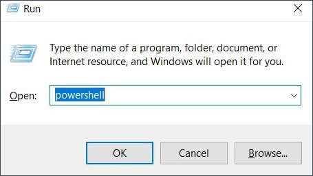

# Offboard Windows device using a script


[Step 1: Offboard device from SEED components](#step-1-offboard-device-from-seed-components)

[Step 2: Submit Intune Device ID](#step-2-submit-intune-device-id)

## Step 1: Offboard device from SEED components

!> **Important note**<br>If you are unable to complete the following steps, see the FAQs. If you still experience any issues, please submit an [incident request](https://go.gov.sg/techpass-sr).  

1. Press ```Win+R``` and enter **Powershell**.



2. On **Powershell**, run  the follwoing commands:
```
$reg64 = [Microsoft.Win32.RegistryKey]::OpenBaseKey([Microsoft.Win32.RegistryHive]::LocalMachine, [Microsoft.Win32.RegistryView]::Registry64)
$OrgID =  $reg64.OpenSubKey("SOFTWARE\MICROSOFT\Windows Advanced Threat Protection\Status").GetValue("OrgID")
echo $OrgID
``` 
to find if your organisation is WOG or TechPass.

3. Take note of the value displayed for **org_id**.


4. Refer to the following table and find your Defender's organisation.

  | org_id  | Organisation |
  | ------------- |:-------------:|
  | faa36a5e-2da6-4225-8e27-226177c801a0      | WOG     |
  | 49237d71-42ac-425a-a803-881b92cc18ce  | TechPass    | 

!> **Important**<br> If your Defender organisation is neither **WOG** nor **TechPass**, contact the IT support of the organisation that provided you the device.

5. Download the offboarding script, a ZIP file, for your Defender organisation.

  | Organisation  | SEED offboarding script |
  | ------------- |:-------------:|
  | WOG      | [Download offboarding script](https://k3uwa66lu3tj6uxft46666ynhe0uvzor.lambda-url.ap-southeast-1.on.aws/local_wog_windows)    |
  | TechPass      | [Download offboarding script](https://k3uwa66lu3tj6uxft46666ynhe0uvzor.lambda-url.ap-southeast-1.on.aws/local_tp_windows)    |
  
6. Go to the folder where it was downloaded and extract the files from the ZIP file. You should see the following two files. 


?> **Note**: The file names vary with the organisation.

7. Right-click on the unzipped folder and select **Show more options**, **Copy as path**. The folder path is now saved to your clipboard.

8. Go to **Start** and type **cmd**.

9. Right-click on **Command Prompt** and select **Run as administrator**.

9. If prompted, enter your Windows password.

10. Run the following commands to go to the folder which has the extracted files:

    ```cd {Path from clipboard}```

    For example:

    ```cd "C:\Users\testUser\Downloads\Offboarding_local_tp_windows"```

    

11. To run the script, use the **Command Prompt** session from **step 6** and enter the following command:

    ```
    powershell.exe -ExecutionPolicy Bypass .\local_windows_offboarding.ps1
    ```

When you see the following success message on your **Powershell**, you are automatically directed to the **SEED offboarding: Request to remove device record** form to submit the Intune Device ID. 

!>**Important note**<br> Make sure you complete Step 2 immediately after Step 1. If not, your device update policy can push the latest version of the deleted SEED components.

## Step 2: Submit Intune Device ID

### Prerequisites

1. Successful completion of [Step 1: Offboard device from SEED components](#step-1-offboard-device-from-seed-components).
2. **Intune Device ID**. Generally, when you successfully offboard your device from the SEED components, the Intune Device ID is  automatically displayed on the **SEED Offboarding: Device Record Removal** form.
?>**Note**<br>- If Intune Device ID is not displayed, complete the appropriate step:<br>&nbsp;&nbsp;&nbsp;&nbsp;&nbsp;- Go to the [TechPass portal](https://portal.techpass.gov.sg/secure/account/profile) and get the Intune Device ID from your account profile.<br>&nbsp;&nbsp;&nbsp;&nbsp;&nbsp;- If you can't access the TechPass portal, please submit an [incident request](https://go.gov.sg/techpass-sr) to get your Intune Device ID before proceeding further.
3. [Optional]If you had submitted an incident request with TechPass support team to offboard your device from the SEED components, please have the reference number ready as we may need this information.
### To submit Intune Device ID
1. Ensure your **Intune Device ID** is displayed on the form. If it is not displayed, see the [prerequisites](#prerequisites) section.
2. Enter your organisational email address in **Organisational Email Address** and click **Verify**.
3. Enter the OTP you receive at this email address.  
4. Indicate if you had any issues while completing [Step 1: Offboard device from SEED components](#step-1-offboard-device-from-seed-components).
5. [Optional] If you had issues completing Step 1, provide the  **Support Ticket Number**.
6. Click **Submit**. When this request is processed successfully, we send a notification via email.

?> **Additional information**<br>- We need 30 minutes to process your ticket.<br>- If you do not receive any email after 30 minutes, please submit a [TechPass support request](https://go.gov.sg/techpass-sr). 
 
      
