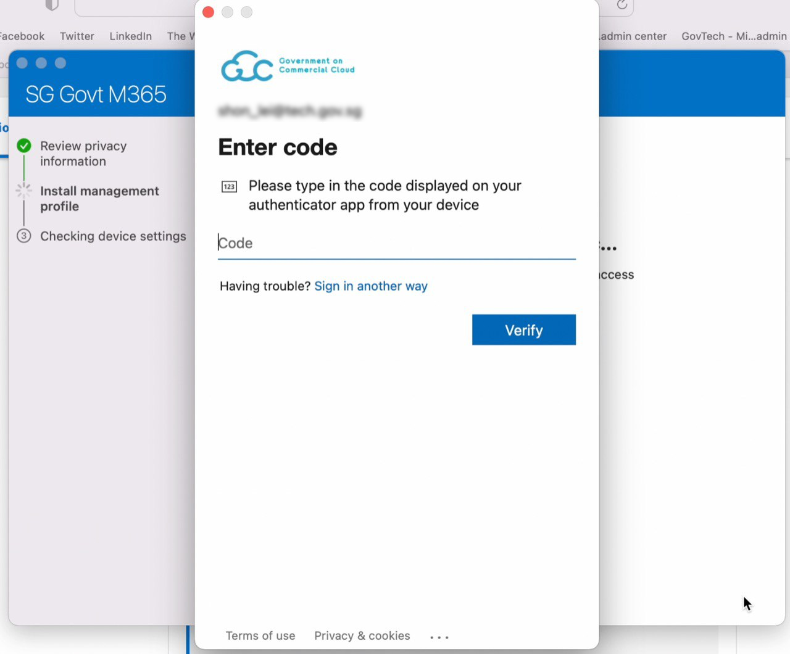

# Onboard device to SEED

This page tells you how to onboard your device to SEED. Before onboarding, make sure that you have completed the [prerequisites for SEED onboarding](prerequisites-for-onboarding).

<!-- tabs:start -->

### **macOS**

<div class="warn">
<ul>
<li>Based on your device settings, while onboarding, you may be prompted to restart your device a couple of times and reset device password.</li>
<li>For a smooth onboarding journey, make sure to link your Apple ID to your device.</li>
<li>Keep your recovery keys ready in case you face issues in resetting your password or logging in to your device.</li>
</ul>
</div>

**To onboard your macOS device**:

<details>
  <summary>a. Set up Microsoft Intune to get the required applications and device configuration</summary><br>

  1. Download and install [**Company Portal**](https://go.microsoft.com/fwlink/?linkid=853070).

  2. Open the **Company Portal** application and click **Sign in** to log in using your TechPass credentials.

  <kbd></kbd>

  3. Approve your TechPass login using the authenticator app that was used to set up TechPass MFA. However, if you are a public officer, approve your WOG login first by entering the verification code displayed for your SG Govt M365 profile on the authenticator app before approving your Techpass login.

  <kbd></kbd>

  ?> The above page is displayed only for public officers. Refer to [TechPass documentation](https://docs.developer.tech.gov.sg/docs/techpass-user-guide/#/) for more information.

  4. Once you have signed in, click **Begin**.

  <kbd></kbd>

  5. Review privacy information. Then click **Continue**.

  <kbd></kbd>

  6. When prompted to authenticate your WOG account, enter the verification code displayed for your SG Govt M365 profile on the authenticator app.

  <kbd></kbd>

  7. On the **Install management profile** page, click **Download profile**.

  <kbd></kbd>

  8. Follow the on-screen instructions to allow Microsoft Intune to manage your device. The **Profiles** page is displayed.

  <kbd></kbd>

  >**Tip**:
   >- If **Profiles** page is not displayed, go to the **Apple** menu > **System Preferences** > **Profiles**.
   >- If **Management Profile** is not displayed, then from the left side menu, select **Management Profile**.

  9. Click **Install** to get the required configuration profiles.

  - If you are a public officer, the profiles will be installed only after you register the Microsoft Intune device ID on the TechPass portal. Intune device ID will be generated only when you complete the device enrolment in Intune. After you complete all the steps in **step a**, follow the instructions listed under **step b. Register the Microsoft Intune device ID for your macOS device**.

  <kbd></kbd>

  If you are a vendor or a contractor, the required configuration profiles will be installed as shown below. If profile installation fails, refer to [Common onboarding issues for macOS users](faqs/common-issues-while-onboarding-using-macos).

  <kbd></kbd>

  9. Open the **Company Portal** application again.

  10. You will see the success message. Click **Done**.

  <kbd></kbd>


</details>

<details>
<summary>b. Register the Microsoft Intune device ID for your macOS device</summary>

This step is applicable only for public officers to get the required applications and device configurations on their device.

?> If you are a public officer; your TechPass ID will be your official email address such as *your_name<span>@</span>agency.gov.sg* or *your_name<span>@</span>tech.gov.sg*. Ignore this step if your TechPass ID format is *your_name<span>@</span>techpass.gov.sg*.

**To get the Intune device ID**:

1. Open **Terminal** and run the following commands:

```
intune_id="$(security find-certificate -a /Library/Keychains/System.keychain | egrep -B 4 '\"issu\"<blob>=.+MICROSOFT INTUNE MDM DEVICE CA' | grep alis | cut -d '"' -f 4)"
if [ -z "$intune_id" ]
then
    echo "\nIntune ID not found\n"
else
    echo "\n$intune_id\n"
fi
```
2. Take note of the Intune device ID that will be displayed on the Terminal window.
3. Using your GSIB device, go to your profile page on the [TechPass portal](https://portal.techpass.gov.sg/secure/account/profile).
4. Click **Onboard device to SEED** and follow the on-screen instructions to submit this Intune device ID. Intune installs the required softwares and configurations to complete your device onboarding.

If your onboarding is successful, within an hour, you will receive a successfully onboarded email to  your organisational email address.

5. To verify if the required profiles are installed correctly, go to **System Preferences** > **Profiles**. You should be able to see the profiles listed as shown here.

<kbd></kbd>

</details>


>**Notes:**
>- If you do not receive the successfully onboarded to SEED email, [check if Microsoft Defender is configured correctly](verify-microsoft-defender-is-configured-correctly-for-your-os) and also check if Tanium and Cloudflare are installed. If Tanium or Cloudflare is not installed, [raise a support request](raise-an-incident-support-request).
>- Shortly after this email, you will receive a desktop notification informing you that your device has been renamed and will automatically restart in the next five minutes. When you log in again, you will be prompted to reset your password. This is to enforce a strong password policy.
>- If you had reset your password while onboarding, you will not be prompted to reset password when your device automatically restarts.
>- Refer to [Best practices](best-practices) to know about the supported browsers.   


### **Windows**

?>  Based on your Windows settings, you may be prompted to restart or reset your password while onboarding.

**To onboard your Windows device**:


<details>
  <summary>a. Enrol your device in Microsoft Intune</summary><br>

1. Click **Start** icon on the taskbar.

2. Go to **Settings** > **Accounts** > **Access work or school** and click **Connect** plus sign to add your work or school account.

<kbd></kbd>

3. Approve your TechPass login using the authenticator app that was used to set up TechPass MFA. If you are a public officer onboarding your device to SEED, authorise your WOG account by entering the verification code displayed for your SG Govt M365 profile on the authenticator app before approving your Techpass login.

<kbd></kbd>

?> The above page is displayed only for public officers and you may refer to [TechPass documentation](https://docs.developer.tech.gov.sg/docs/techpass-user-guide/#/) for more information.

<kbd></kbd>

5. Your account is added and listed as a connection. This account has the **Info** and **Disconnect** options as shown below. Click on the **Info** option and verify that you see something like the following.

?> Vendors will see **TechPass** instead of **SG Govt M365**.

<kbd></kbd>

>**Notes**:
>-Your device is now enrolled in Microsoft Intune.
>-If you are a vendor or contractor, Tanium and Cloudflare WARP are installed on your device. Microsoft Intune Management Extension sends you a desktop notification about once the installation is complete.
>-If you are a public officer, Tanium and Cloudflare WARP will be installed after you register your device ID on the TechPass portal. Refer to **step b. Register the Microsoft Intune device ID for your Windows device** for more information.


<details><summary>b. Register the Microsoft Intune device ID for your Windows device</summary>

This step is applicable only for public officers to get the required applications and device configurations on their device.

?> If you are a public officer; your TechPass ID will be your official email address such as *your_name<span>@</span>agency.gov.sg* or *your_name<span>@</span>tech.gov.sg*. Ignore this step if your TechPass ID format is *your_name<span>@</span>techpass.gov.sg*.

**To get the Intune device ID**:

1. Open **PowerShell** and run the following commands:
```
$rootKey = [Microsoft.Win32.RegistryKey]::OpenBaseKey(
    [Microsoft.Win32.RegistryHive]::LocalMachine,
    [Microsoft.Win32.RegistryView]::Registry64
)
$enrollmentsKey = $rootKey.OpenSubKey("Software\Microsoft\Enrollments")
$intune_id = "Intune ID not found"
foreach ($name in $enrollmentsKey.GetSubKeyNames()) {
    $enrollmentIdKey = $enrollmentsKey.OpenSubKey($name)
    if ($enrollmentIdKey.GetValue("ProviderID") -ieq "MS DM Server") {
        $intune_id = $enrollmentIdKey.OpenSubKey("DMClient\MS DM Server").GetValue("EntDMID", "Intune ID not found")
        break
    }
}
Write-Output $intune_id
```
2. Take note of the Intune device ID that will be displayed on the Powershell window.
3. Using your GSIB device, go to your profile page on the [TechPass portal](https://portal.techpass.gov.sg/secure/account/profile).
4. Click **Onboard device to SEED** and follow the on-screen instructions to submit this Intune device ID.  Intune installs the required softwares and configurations to complete your device onboarding.

  If your onboarding is successful, within an hour, you will receive a successfully onboarded email to your organisational email address.

5. Shortly after this email, when you receive a desktop notification informing about the device name change and about the device being restarted, do the following:

    i. Save your current work and restart your device.

    ii. If prompted to specify your password, enter it.

5. To verify if the required profiles are installed correctly, go to **Settings** > **Apps** > **Apps & features** and ensure that Tanium and Cloudflare WARP are listed.

</details>

>**Notes**:
>- If you do not receive the successfully onboarded to SEED email, [check if Microsoft Defender is configured correctly](verify-microsoft-defender-is-configured-correctly-for-your-os) and also check if Tanium and Cloudflare are installed. If Tanium or Cloudflare is not installed, [raise a support request](raise-an-incident-support-request).
>- Refer to [Best practices](best-practices) to know about the supported browsers.


<!-- tabs:end -->

### Next steps
- [Complete the post onboarding instructions](post-onboarding-instructions)
