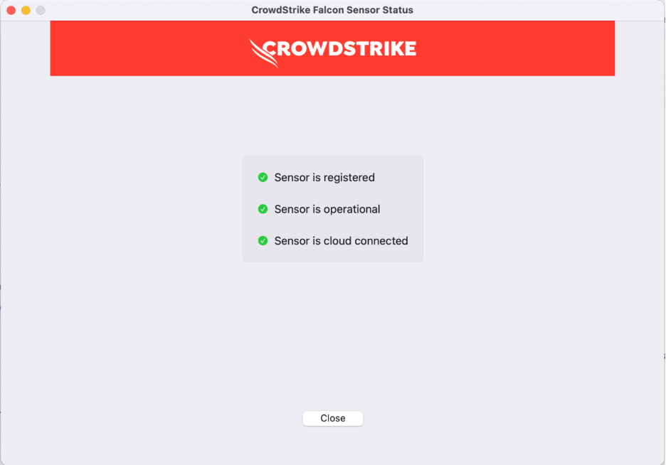
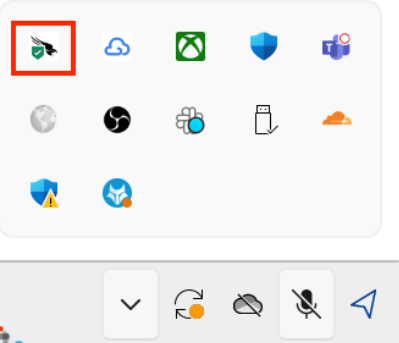
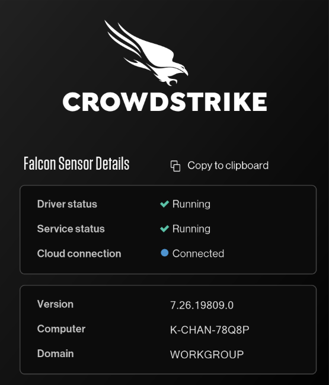

# Onboard to SEED as a public officer

This document provides a step-by-step guide to help public officers through the onboarding process for the Secure Engineering Environment for Developers (SEED). Before proceeding, make sure you meet the prerequisites outlined below.

## Prerequisites

Before proceeding with the SEED (Secure Engineering Environment for Developers) onboarding process as a public officer, ensure you meet the following prerequisites:

- Your TechPass login ID must match your work email, typically associated with a WOG (Whole-of-Government) account. For example, john_doe@moe.gov.sg or john_doe_from.cognizant@tech.gov.sg.
- Remove all existing [conflicting software and MDM (Company Account)](https://docs.developer.tech.gov.sg/docs/security-suite-for-engineering-endpoint-devices/onboard-device/seed-prerequisites?id=uninstall-existing-software) from your device before you start to onboarding to SEED.

<!-- tabs:start -->

#### **macOS**
During the process, you may encounter prompts to restart your device and reset your device's password. It is important to have your recovery keys ready in case you encounter any issues during the password reset or device login.


<div style="position:relative;padding-bottom:56.25%;padding-top:30px;height:0;overflow:hidden;">
<iframe style="position:absolute;top:0;left:0;width:100%;height:100%;" src="https://www.youtube.com/embed/ytu6oOP6TYA" title="YouTube video player" frameborder="0" allow="accelerometer; autoplay; clipboard-write; encrypted-media; gyroscope; picture-in-picture; web-share" allowfullscreen="true"></iframe>
</div>

### Step 1: Configure Microsoft Intune

<details>
  <summary>Configure Microsoft Intune to obtain applications and device settingss.</summary>

  - Go to [Microsoft Intune documentation](https://learn.microsoft.com/en-us/mem/intune/user-help/enroll-your-device-in-intune-macos-cp) and follow the instructions provided on the page to complete the following:

   a. Download and install Company Portal.

   b. Enrol your Mac device.

  
</details>

### Step 2: Register Microsoft Intune Device ID

<details>
  <summary style="font-size:18px">Register Microsoft Intune Device ID for your macOS device.</summary><br>

1. Open **Terminal** and run the following commands:

```
intune_id="$(security find-certificate -a /Library/Keychains/System.keychain | egrep -B 4 '\"issu\"<blob>=.+MICROSOFT INTUNE MDM DEVICE CA' | grep alis | cut -d '"' -f 4)"
if [ -z "$intune_id" ]
then
    echo "Intune ID not found"
    return
fi

num_candidates="$(echo "$intune_id" | wc -l | xargs echo -n)"
if [ "$num_candidates" -eq 1 ]
then
    echo "$intune_id"
    return
fi

old_ifs="$IFS"
IFS='\n'
actual_id="Intune ID not found"
curr_latest_end_date_unix=0
while read id
do
    end_date="$(security find-certificate -c "$id" -p /Library/Keychains/System.keychain | openssl x509 -noout -enddate | cut -d '=' -f 2)"
    end_date_unix="$(date -j -f "%b %e %H:%M:%S %Y %Z" "$end_date" "+%s")"
    if [ "$end_date_unix" -ge "$curr_latest_end_date_unix" ]
    then
        actual_id="$id"
        curr_latest_end_date_unix="$end_date_unix"
    fi
done <<< "$intune_id"

IFS="$old_ifs"
echo "$actual_id"
```
2. Record the Intune Device ID displayed in the Terminal window.

3. For **non-SE GSIB?/COMET devices**: Log in to the [TechPass portal](https://portal.techpass.gov.sg/secure/account/profile).

   For **SE GSIB** devices: [raise a service request](https://go.gov.sg/seed-techpass-support) to register your Intune Device ID and skip the remaining steps. An email confirming successful onboarding will be sent to you within two hours.

4. On the TechPass portal, go to your user name at the top right and select **My Account**. Your **Profile** details will be displayed.


6. Click **Onboard device to SEED** and follow the on-screen instructions to submit your Intune Device ID.

  

  You will receive the following confirmation message:

  

  Your Internet Device record is listed under **SEED Devices** and includes the following details:

    - Device name
    - Operating system of the device
    - Serial number
    - Intune Device ID
    - Date and time when the onboarding was trigerred or when the device was successfully onboarded
    - Onboarding status

  

6. Ensure the device you are onboarding is connected to the Internet for Intune to install the required software and configurations.

7. After 30-60 minutes, check your inbox (organisational email address) for any emails regarding your onboarding status.


8. Choose the appropriate step:

   a. If you have received a email confirming successful onboarding, skip the rest of the steps in this section and proceed to [Step 3: Verify installation](#step-3-verify-installation).

   b. If you did not receive the email or if you **have received** a **failed onboarding email**, complete the following step on [TechPass portal](https://portal.techpass.gov.sg/).

9. Refer to the following table to know about the possible onboarding status and the action required by you.

| Status | Description | Action required |
|---| ---| ---|
| **Triggered, waiting for software installation (step 1 of 2)**| Your SEED onboarding has been triggered on the device and is waiting for the software installation to be completed. | 1. On your non-SE GSIB/COMET device, go to the [TechPass portal](https://portal.techpass.gov.sg/).<br><br>2. At the top right, select your user name and click **My Account**. Your profile details are displayed.<br><br>3. Navigate to the **SEED Devices** section and click the refresh icon. If the software installation is successful, the status changes to **Software installed, waiting for backend onboarding (step 2 of 2)**.|
| **Software installed, waiting for backend onboarding (step 2 of 2)**| Required software has been installed on the device and waiting for backend onboarding.  | 1. On your non-SE GSIB/COMET device,access the [TechPass portal](https://portal.techpass.gov.sg/).<br><br>2. At the top right, select your user name and click **My Account**. Your profile details are displayed.<br><br>3. Navigate to the **SEED Devices** section and click the refresh icon. If the backend onboarding is successful, the status will change to **Onboarded**. |
| **Onboarded** | Your SEED onboarding is successful. | Proceed to step 10 in this section.  |
| **Failed** **(*Reason for failure*)** | Your SEED onboarding has failed due to the error displayed. | 1. On your non-SE GSIB/COMET device, access the [TechPass portal](https://portal.techpass.gov.sg/).<br><br>2. At the top right, select your user name and click **My Account**. Your profile details are displayed.<br><br>3. Navigate to the **SEED Devices** section. The action required to resolve this failure is mentioned in the parentheses.<br><br>4. Complete the suggested action. | 

10. Check your inbox (organisational email address) to see if you have received the successfully onboarded email.

?> If you do not receive this email after two hours, [raise a service request](https://go.gov.sg/seed-techpass-support).

 

</details>

### Step 3: Verify installation

<details>
  <summary style="font-size:18px">Verify the installation of the required profiles</summary><br>


   1. Go to **Apple menu > System Settings > General > Device Management**.

   2. You should be able to see the following profiles:

   - Credential Profile  
   - Custom Preferences Profile – com.cloudflare.warp  
   - Custom Preferences Profile – com.google.Chrome  
   - Falcon Profile  
   - Intune MDM Agent SCEP Profile  
   - Intune MDM Agent PPPC Profile  
   - Management Profile  
   - Passcode Profile  
   - Privacy Preferences Policy Profile  
   - com.apple.system-extension-policy Profile  
</details>

<details>
  <summary style="font-size:18px">Turn on Cloudflare WARP</summary><br>

After onboarding your macOS Internet Device to SEED, you need to activate Cloudflare WARP.

**Activation steps**:

1. Open **Cloudflare WARP** client from the menu bar.

  
  
  You will see the information page, followed by the privacy policy.

2. Click **Next**, **Accept** to agree to Cloudflare’s privacy policy.

  

3. When prompted to sign in, select **Azure AD – TechPass Prod**.

  
  
  If you encounter an error stating that your user account is not found in the respective tenant, follow these instructions:

  - Open a new browser tab
  - Visit https://myaccount.microsoft.com
  - Sign out of your current account
  - Retry the action

4. Sign in using your TechPass credentials.

  

5. After successfully signing in, click **Open Cloudflare WARP app** to establish your WARP connection.

Once connected, you should see WARP Zero Trust in the connected state.
  
  

6. Open Cloudflare WARP **Settings**, and ensure **Gateway with WARP** is selected. WARP is now active, safeguarding your Internet connection.


At any time, users can sign in to Company Portal app, click the three dots and choose **Check status** to check for policy or profile updates. It may take a while to complete the synchronisation. When completed, the screen will show the timestamp of the last successful sync.
</details>


<details>
  <summary style="font-size:18px">Verify CrowdStrike is configured</summary><br>

1. Open **Finder** → **Applications** → **Falcon.app**.

2. Ensure the **CrowdStrike Falcon Sensor** is **registered**, **operational**, and **cloud connected**.  

   

3. If any of the above statuses indicate an error:  
   - Click **Configure Settings** and follow the steps as prompted.
</details>

#### **Windows**


Based on your Windows settings, you may be prompted to restart or reset your password while onboarding.

<div style="position:relative;padding-bottom:56.25%;padding-top:30px;height:0;overflow:hidden;">
<iframe style="position:absolute;top:0;left:0;width:100%;height:100%;" src="https://www.youtube.com/embed/PAyKoRZ7WSk" title="YouTube video player" frameborder="0" allow="accelerometer; autoplay; clipboard-write; encrypted-media; gyroscope; picture-in-picture; web-share" allowfullscreen="true"></iframe>
</div>

### Step 1: Create your personal local administrator account

<details>
  <summary style="font-size:18px">Create your personal local administrator account.</summary><br>

  > **Note**: Do not use the default administrator account for onboarding.


1. Search for **Computer Management**.
2. Navigate to **Local Users and Groups**, and click on **Users**.
3. Click **New User**.
4. Fill in **User Name**, **Password**, and **Confirm Password**. Ensure that **User must change password at next logon** is unchecked. Once done, click **Create**.
5. Double-click on the user you created and add the user as a member of the **Administrators** group.

   </details>


### Step 2: Set up Microsoft Intune 

<details>
  <summary style="font-size:18px"> Set up Microsoft Intune to get the required applications and device configurations.</summary><br>

1. Click **Start** icon on the taskbar.

2. Go to **Settings** > **Accounts** > **Access work or school** and click **Connect** to add your WOG account.

  

3. Authorise your WOG account by entering the verification code displayed for your SG Govt M365 profile on the authenticator app before approving your TechPass login.

  

  Your account is added and listed as a connection. This account has **Info** and **Disconnect** options as shown below. 

  

4. Select the **Info** option and verify that a similar result to the following is displayed.

  


</details>

### Step 3: Register Microsoft Intune Device ID


<details>
  <summary style="font-size:18px">Register the Microsoft Intune Device ID for your Windows device.</summary>

1. Open **PowerShell** and run the following commands:
```
$rootKey = [Microsoft.Win32.RegistryKey]::OpenBaseKey(
    [Microsoft.Win32.RegistryHive]::LocalMachine,
    [Microsoft.Win32.RegistryView]::Registry64
)
$enrollmentsKey = $rootKey.OpenSubKey("Software\Microsoft\Enrollments")
$intune_id = "Intune ID not found"
foreach ($name in $enrollmentsKey.GetSubKeyNames()) {
    $enrollmentIdKey = $enrollmentsKey.OpenSubKey($name)
    if ($enrollmentIdKey.GetValue("ProviderID") -ieq "MS DM Server") {
        $intune_id = $enrollmentIdKey.OpenSubKey("DMClient\MS DM Server").GetValue("EntDMID", "Intune ID not found")
        break
    }
}
Write-Output $intune_id
```
2. Take note of the Intune Device ID that is displayed on the Powershell window.
3. On the TechPass portal, at the top right, go to your user name and click **My Account**. Your **Profile** details are displayed. 
4. Click **Onboard device to SEED** and follow the on-screen instructions to submit this Intune Device ID.

  

  You will receive the following confirmation message.

  

  Your Internet Device record is listed under the **SEED Devices** with the following details:

    - Device name
    - Operating system of the device
    - Serial number
    - Intune Device ID
    - Date and time when the onboarding was trigerred or when the device was successfully onboarded
    - Onboarding status

  

5. Ensure the device you are onboarding is connected to the Internet so that Intune is able to install the required software and configurations.

6. After 30-60 minutes, check your inbox (organisational email address) to see if you have received any email regarding your onboarding status.

7. Choose the appropriate step:

   a. If you have received a successfully onboarded email, skip rest of the steps in this section and proceed to [Step 3: Verify installation](#step-3-verify-installation).

    b. If you have **not yet received** the **successfully onboarded email** or if you **have received** a **failed onboarding email**, complete the following step on [TechPass portal](https://portal.techpass.gov.sg/).

8. Refer to the following table to know about the possible onboarding status and the action required by you.

| Status | Description | Action required |
|---| ---| ---|
| **triggered, waiting for software installation (step 1 of 2)**| Your SEED onboarding has been triggered on the device and is waiting for the software installation to be completed. | 1. On your non-SE GSIB/COMET device, go to the [TechPass portal](https://portal.techpass.gov.sg/).<br><br>3. At the top right, go to your user name and click **My Account**. Your profile details are displayed.<br><br>4. Go to the **SEED Devices** section and click the refresh icon. If the software installation is successful, the status changes to **software installed, waiting for backend onboarding (step 2 of 2)**.|
| **software installed, waiting for backend onboarding (step 2 of 2)**| Required software has been installed on the device and waiting for backend onboarding.  | 1. On your non-SE GSIB/COMT device, go to the [TechPass portal](https://portal.techpass.gov.sg/).<br><br>3. At the top right, go to your user name and click **My Account**. Your profile details are displayed.<br><br>4. Go to the **SEED Devices** section and click the refresh icon. If the backend onboarding is successful, the status changes to **onboarded**. |
| **onboarded** | Your SEED onboarding is successful. | Go to step 10 in this section.  |
| **failed(*Reason for failure*)** | Your SEED onboarding failed due to the  error mentioned within the parentheses. | 1. On your non-SE /COMET device, go to the [TechPass portal](https://portal.techpass.gov.sg/).<br><br>3. At the top right, go to your user name and click **My Account**. Your profile details are displayed.<br><br>4. Go to the **SEED Devices** section. Action required to resolve this failure is generally mentioned in the parentheses.<br><br>5. Complete the suggested action. | 


9. Check your inbox (organisational email address) to see if you have received the successfully onboarded email.

?> If you do not receive this email after two hours, [raise a service request](https://go.gov.sg/seed-techpass-support).


</details>


### Step 4: Verify installation

<details>
  <summary style="font-size:18px">Verify the installation</summary><br>

1. Go to the Internet Device onboarded to SEED, open **Settings** > **Apps** > **Apps & features**.  
2. Ensure that **Cloudflare WARP** and **Tanium** are listed.  

     
   

   You may receive a desktop notification that your device has been renamed according to convention, and that a timed restart will occur in 5 minutes. This is completely expected, and you should save any existing work to prevent data loss. Alternatively, you can also opt to manually restart your device, after receiving the desktop notification, to speed up the process. As the naming convention is required for administrative purposes, please refrain from renaming your device thereafter.

</details>

<details>
  <summary style="font-size:18px">Turn on Cloudflare WARP</summary><br>

After onboarding your macOS Internet Device to SEED, you need to activate Cloudflare WARP.

**Activation steps**:

1. Open **Cloudflare WARP** client from the menu bar.

  
  
  You will see the information page, followed by the privacy policy.

2. Click **Next**, **Accept** to agree to Cloudflare’s privacy policy.

  

3. When prompted to sign in, select **Azure AD – TechPass Prod**.

  
  
  If you encounter an error stating that your user account is not found in the respective tenant, follow these instructions:

  - Open a new browser tab
  - Visit https://myaccount.microsoft.com
  - Sign out of your current account
  - Retry the action

4. Sign in using your TechPass credentials.

  

5. After successfully signing in, click **Open Cloudflare WARP app** to establish your WARP connection.

Once connected, you should see WARP Zero Trust in the connected state.
  
  

6. Open Cloudflare WARP **Settings**, and ensure **Gateway with WARP** is selected. WARP is now active, safeguarding your Internet connection.


At any time, users can sign in to Company Portal app, click the three dots and choose **Check status** to check for policy or profile updates. It may take a while to complete the synchronisation. When completed, the screen will show the timestamp of the last successful sync.
</details>


<details>
  <summary style="font-size:18px">Verify CrowdStrike is configured</summary><br>

1. In the **Taskbar**, click the **CrowdStrike** icon.  
2. Confirm that the **CrowdStrike Falcon Sensor** is:  
   - **Running**  
   - **Service is active**  
   - **Cloud connected**  

     
   

3. If any of the above statuses indicate an error:  
   - Go to **Start** → **Settings** → **Accounts** → **Access work or school**.  
   - Click the **Info** button next to your **TechPass** account.  
   - Select **Sync**.  
   - Restart your computer.

</details>

<!-- tabs:end -->
