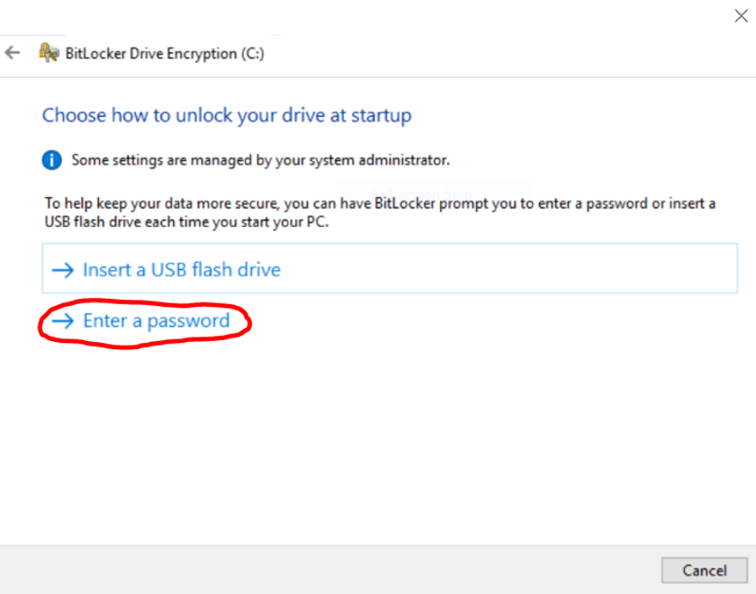
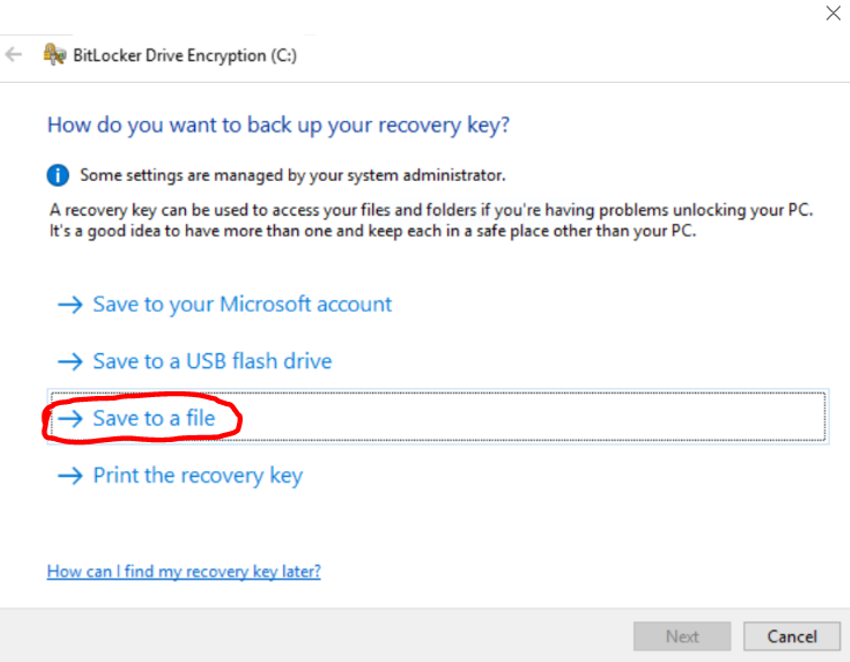
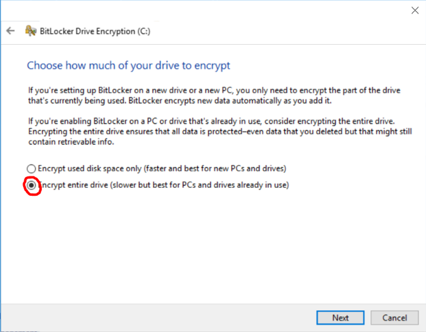
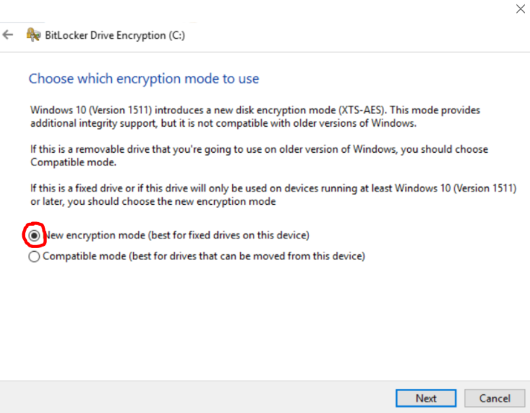

# SEED prerequisites 

Before you begin the process of onboarding your Internet Device to SEED, you need meet the necessary prerequisites. These prerequisites are vital for a successful onboarding experience. 

## Supported browsers and operating systems

Supported browsers:

 - Google Chrome
 - Microsoft Edge
 - Mozilla Firefox. If you are using Mozilla Firefox, you need to [configure Firefox to trust the root certificate store of your system](https://support.mozilla.org/en-US/kb/setting-certificate-authorities-firefox).
 - Safari

Supported operating system:


| **Operating system** | **Version supported** |
|---|---|
| **macOS 15**        | 15.6 <br> **Note**: If you encounter issues accessing SGTS or GCC services after the update, please ensure that [FDA is enabled](https://docs.developer.tech.gov.sg/docs/security-suite-for-engineering-endpoint-devices/post-onboarding-instructions/macos-latest?id=ensure-full-disk-access-fda-is-enabled-for-seed-components) and reboot your device. <br> Do **not** install unsupported versions of macOS unless explicitly communicated via email by the SEED team. |
| **macOS 14**        | 14.7.6 |
| **macOS 13**        | 13.7.6 |
| **Windows 10**      | 1507 (LTSC only, build 10240, minimally revision 21073) <br> 1607 (LTSC only, build 14393, minimally revision 8246) <br> 1809 (LTSC only, build 17763, minimally revision 7558) <br> 21H2 (LTSC only, build 19044, minimally revision 6093) <br> 22H2 (build 19045, minimally revision 6093) |
| **Windows 11**      | 22H2 (build 22621, minimally revision 5624) <br> 23H2 (build 22631, minimally revision 5624) <br> 24H2 (build 26100, minimally revision 4652) |


> **Note**:
> Admin privilege is required to onboard to SEED.

## How to check your operating system version  

<details>
  <summary>macOS</summary>

1. Open Spotlight using **Cmd + Space**  
2. Search for **About this mac.app**  
3. Look for the line that says **macOS** (as highlighted below). This will show your macOS version.

   
</details>

<details>
  <summary>Windows</summary>

1. Click on the **Start** icon and select **Settings**  
     
2. Open **System Settings**  
     
3. Select **System**  
     
4. Under **Windows Specifications**, look at:  
   - **Edition** – Ensure it is **Windows 10/11** and either **Enterprise** or **Pro** edition  
   - **OS Build** – Check the **build number** and **revision number**. The build number must be valid, and the revision number should be **greater than or equal** to the required version.  

   **Example:**  
   If the build number is **19045**, your revision number should be at least **5487**. If your build number is not listed in the table of valid builds, update your device or change to a supported version.  

     
</details>

## Request SEED provisioning

You can request SEED provisioning through one of the following methods:

- Contact your reporting officer or project manager to request TechPass and SEED provisioning via the [TechBiz portal](http://portal.techbiz.suite.gov.sg/).
- If you have access to the [TechPass portal](https://portal.techpass.gov.sg/), you can sign up for TechPass and SEED provisioning simultaneously. For detailed information, refer to [TechPass documentation](https://docs.developer.tech.gov.sg/docs/techpass-user-guide/onboard-to-techpass).
- If you already have an active TechPass account and can access the TechPass portal, you can initiate the [SEED provisioning request](https://docs.developer.tech.gov.sg/docs/techpass-user-guide/request-for-seed-provisioning) from your TechPass account profile.
- If you are a SE GSIB user with an active TechPass account, you can raise a [service request](https://go.gov.sg/seed-techpass-support) for SEED provisioning.

> **Note**: You need to use a non-SE GSIB device to access [TechBiz portal](http://portal.techbiz.suite.gov.sg/) and [TechPass portal](https://portal.techpass.gov.sg/).

## Successful completion of SEED provisioning

Once SEED provisioning is successfully completed, the following steps are as follows:

- You will receive the SEED onboarding email within the next three business days.
- Keep in mind that this email remains valid for 30 days.
- Prior to proceeding with onboarding your internet device to SEED, ensure that you have successfully activated your TechPass account.
- If your SEED onboarding email has expired, consider the following options:
  - If you originally requested SEED provisioning via your reporting officer or project manager, reach out to them again to receive a new SEED onboarding invitation email.
  - If you signed up for SEED via the TechPass portal, you can log in to the TechPass portal to [request a new SEED onboarding invitation email](https://docs.developer.tech.gov.sg/docs/techpass-user-guide/request-for-seed-provisioning).


## Uninstall existing software

Before proceeding with SEED onboarding, it is required to uninstall any relevant software solutions from your device:

- Any existing MDM (Mobile Device Management) software
- Tanium client or any other unified endpoint management and security platform
- Cloudflare WARP or any other software used for privacy and secured connections
- Defender or any other antivirus solution

Follow the steps below to check for and remove any existing software on your device, depending on your operating system:

### macOS

<details>
  <summary>a. Verify if your device is already managed by any MDM software</summary>

  Complete the following steps to find if your device is already managed by an MDM solution. 
  
  1. Navigate to the **Apple** menu > **System Settings** > **Privacy and Security** > **Profiles** on the right. You may need to scroll down.

  2. Click **Management Profile**. If you see a similar page, it indicates that you already have MDM software installed.

      
     
 3. Choose the appropriate step:
 
    - If you have verified that your Internet Device is not currently managed by any MDM, proceed to step **c.Remove Tanium Client** to check for and remove Tanium Client if it is installed.

    - If your Internet Device is managed by an MDM software, go to **Settings** on the **Management Profile** to identify the current MDM software.

    

?><br>- If you see Microsoft Intune in the settings, it indicates that your MDM is **Microsoft Intune**. Proceed to **step b. Unenrol from Microsoft Intune**<br>- For devices managed by other MDM software, please contact your organization's IT administrator to unenrol your device.

</details>
<details>
  <summary>b. Unenrol from Microsoft Intune</summary>

Complete the following steps to remove your device from Intune. 

?> To find if your device is enrolled with Intune, refer to step **a. Verify if your device is already managed by any MDM software**.

  1. Sign in to the **Company Portal** app.
    
  2. Go to **Devices** and click the three dots beside the device you want to unenrol.
  3. Choose **Remove**.
    
  4. When prompted to confirm the removal, select **Remove**.
  5. Click your profile icon and **Sign out** of the **Company Portal**.

</details>

<details>
  <summary>c. Remove Tanium Client</summary>

Complete the following steps to find if Tanium Client is available on your device and remove it.

  1. Open **Terminal** and run the following command:

   ```
  sudo ls /Library/Tanium/TaniumClient
   ```
  2. Enter your macOS password when prompted.

  3. If you see confirmation, as shown in the image below, that Tanium Client is installed on your device, proceed to step 4. If not, continue to **step d. Remove the Cloudflare WARP client**.
    

  4. Run the following commands in **Terminal**:

     ```
     sudo launchctl unload /Library/LaunchDaemons/com.tanium.taniumclient.plist

     sudo launchctl remove com.tanium.taniumclient > /dev/null 2 >&1

     sudo rm /Library/LaunchDaemons/com.tanium.taniumclient.plist

     sudo rm /Library/LaunchDaemons/com.tanium.trace.recorder.plist

     sudo rm -rf /Library/Tanium/

     sudo rm /var/db/receipts/com.tanium.taniumclient.TaniumClient.pkg.bom

     sudo rm /var/db/receipts/com.tanium.taniumclient.TaniumClient.pkg.plist

     sudo rm /var/db/receipts/com.tanium.tanium.client.bom

     sudo rm /var/db/receipts/com.tanium.tanium.client.plist

    ```
  5. Enter your macOS password when prompted. Once the commands are successfully executed, Tanium Client is removed from your device.

</details>
<details>
  <summary>d. Remove Cloudflare WARP Client</summary>

Complete the following steps to find if Cloudflare WARP client is available on your device and remove it.  

  1. Click the **Finder** icon in the **Dock**.
  2. Choose **Applications**.
  3. Search for **Cloudflare WARP.app**.
  4. If available, open **Terminal** and run the following command:
    ```
    sudo /bin/sh /Applications/Cloudflare\ WARP.app/Contents/Resources/uninstall.sh
    ```

  5. When prompted, enter your macOS password.

</details>
<details><summary>e. Remove Defender or the current antivirus solution</summary>

If your device is already enroled with Defender or any other antivirus solution, it has to be completely unenroled from it before you proceed to onboard the device to SEED.

Complete the following steps to determine if Defender is your current antivirus solution and remove it from your device.

?> **Note**: If you have another antivirus solution, please contact your administrator to remove it.


1. Open **Terminal** and run `mdatp health.   
2. Choose the appropriate step:
  
   a. If you get a `mdatp: command not found` error, it means you do not have Defender installed on your device. You can skip the remaining steps in this section.

   b. Take note of the value displayed for **org_id**.
  
3. Identify the organisation corresponding to this **org_id** from the following table. This is the organisation that is linked to your Defender or antivirus solution on your device.

  | org_id  | Defender organisation | Offboarding package |
  | ------------- |:-------------:|:-------------:|
  | faa36a5e-2da6-4225-8e27-226177c801a0      | WOG     | [Download offboarding package](https://ekgxtc4rxln5a7bxhanhw4d4cm0mmzsf.lambda-url.ap-southeast-1.on.aws/local_wog_mac)    |
  | 49237d71-42ac-425a-a803-881b92cc18ce  | TechPass    | [Download offboarding package](https://ekgxtc4rxln5a7bxhanhw4d4cm0mmzsf.lambda-url.ap-southeast-1.on.aws/local_tp_mac)     |
  | 6389e966-e334-461d-86ce-0fed12484620 | Hive | Contact [Hive support](mailto:GDS_DEN@hive.gov.sg) to get the offboarding package. |


?> **Important** 
> - If your **Defender organization** is **Hive**, skip the remaining steps in this document. Obtain the offboarding package from Hive support and unenrol your device from Defender. Refer to [Offboarding FAQ](/faqs/onboarding-faq.md) for instructions on how to unenrol your device from Defender using the Hive offboarding package.
> - If your **Defender organization** is either **WOG** or **TechPass**, it suggests that this device may have already been onboarded to SEED under a different TechPass profile. Therefore, you need to offboard this device before proceeding further.
> - If your **Defender organization** is **none of the above**, please contact the IT support of the organization that provided you with the device.

4. Log in with your TechPass to download the offboarding package.
5. Go to the folder where you downloaded the ZIP file and extract the files. You should see the following two files.

  

> **Note**: The file names vary with the organisation.

6. On your **Terminal**, run the following command:

```
sudo mdatp config tamper-protection enforcement-level --value audit
```

7. On **Terminal**, go to the folder where you extracted the files. For example, if they are in the **Downloads** > **Offboarding_local_wog_mac** folder, go to that folder.

  

8. Copy the below and run it in the same **Terminal**.

    ```
    sudo chmod +x local_mac_offboarding.sh
    ```

9. When prompted for a **password**, enter your device password.
10. Copy and run the following command in your **Terminal**.

    ```
    sudo ./local_mac_offboarding.sh
    ```

  When the following success message appears in **Terminal**, ou will be automatically redirected to a form to submit the Intune Device ID.

  

11. Ensure your **Intune Device ID** is displayed on the form. If it is not displayed, provide it. Refer to [Get Intune Device ID](/offboard-device/mac-os) for assistance. 
12. Enter your organisational email address in the **Organisational Email Address** field and click **Verify**.
13. Enter the OTP you receive at this email address.  
14. Click **Submit**. Once this request is processed successfully, we will send a notification via email.

  

</details>

### Windows

<details>
  <summary style="font-size:18px">a. Remove existing MDM software</summary>

Complete the following steps to find if your device is managed by an MDM solution and remove it.  

  1. Click the **Start** icon on the taskbar.
  2. Go to **Settings** > **Accounts**.
  3. From the left menu, choose **Access work or school**.

?> If your device is managed by an MDM software, your username in your organisation's domain will be displayed under **Work or school account**.

  4. Click **Work or school account** and then select **Disconnect**.


</details>

<details>
  <summary style="font-size:18px">b. Remove Tanium Client</summary>

Complete the following steps to find if Tanium client is available on your device and remove it.  

  1. Click **Start** icon on the taskbar.
  2. Go to **Settings** > **Apps** and search for **Tanium Client**.
  3. If available, choose it and then click **Uninstall**.

</details>

<details>
  <summary style="font-size:18px">c. Remove Cloudflare WARP Client</summary>

Complete the following steps to find if Cloudflare WARP client is available on your device and remove it.

  1. Click the **Start** icon on the taskbar.
  2. Go to **Settings** > **Apps** and search for **Cloudflare WARP**.
  3. If available, select it and then click **Uninstall**.

</details>

<details><summary style="font-size:18px">d. Remove current antivirus solution on the device</summary>

If your device is already enrolled with Defender or any other antivirus solution, it has to be completely unenrolled from it before you proceed to onboard the device to SEED.

Complete the following steps to find if Defender is your current antivirus solution and remove it from your device.

1. Go to the **Start** menu and search for **Powershell**.
2. Right-click on the search result for **PowerShell** and select **Run as Administrator**.

  

3. On **Powershell**, run the following command:

```
$reg64 = [Microsoft.Win32.RegistryKey]::OpenBaseKey([Microsoft.Win32.RegistryHive]::LocalMachine, [Microsoft.Win32.RegistryView]::Registry64)
$OrgID =  $reg64.OpenSubKey("SOFTWARE\MICROSOFT\Windows Advanced Threat Protection\Status").GetValue("OrgID")
echo $OrgID
```

4. Take note of the value displayed for **OrgID**.

  

?> Note: If you do not receive any response, it means you do not have Defender installed on your device. You can skip the steps in this section.

5. Refer to the following table and identify your **Defender organisation** and download the offboarding package.

  | OrgID | Defender organisation | Offboarding package |
  | ------------- |:-------------:|:-------------:|
  | faa36a5e-2da6-4225-8e27-226177c801a0      | WOG     | [Download offboarding script](https://ekgxtc4rxln5a7bxhanhw4d4cm0mmzsf.lambda-url.ap-southeast-1.on.aws/local_wog_windows) |
  | 49237d71-42ac-425a-a803-881b92cc18ce  | TechPass    | [Download offboarding script](https://ekgxtc4rxln5a7bxhanhw4d4cm0mmzsf.lambda-url.ap-southeast-1.on.aws/local_tp_windows)    |
  | 6389e966-e334-461d-86ce-0fed12484620 | Hive | Contact [Hive support](mailto:GDS_DEN@hive.gov.sg) to get the offboarding package. |

  ?> **Important**
  > - If your **Defender organisation** is **Hive**, please skip the remaining steps in this document. You need to get the offboarding package from the Hive support and unenrol your device from Defender. See  [Offboarding FAQ](/faqs/offboarding-faq.md) to know how to unenrol your device from Defender using the Hive offboarding package.
  > - If your **Defender organisation** is either **WOG** or **TechPass**, it indicates that this device may already have been onboarded to SEED under a different TechPass profile. You need to offboard this device first before proceeding further. Refer to [macOS offboarding guide](/offboard-device/macos-offboarding-guide.md) or [Windows offboarding guide](/offboard-device/windows-offboarding-guide.md).
  > - If your **Defender organisation** is **none of the above**, contact the IT support of the organisation that provided you with the device.

6. Go to the folder where you downloaded the ZIP file and extract the files. You should see the following two files.

  

?> **Note**: The file names vary with the organisation.

7. Right-click the unzipped folder to select **Show more options** > **Copy as path**. The folder path is now saved to your clipboard.

8. On **Powershell**, run the following command to go to the folder which has the extracted files:

    ```
    cd {Path from clipboard}
    ```

    For example:

    ```
    cd "C:\Users\testUser\Downloads\Offboarding_local_tp_windows"

    ```

    

10. To run the script, enter the following command:

    ```
    powershell.exe -ExecutionPolicy Bypass .\local_windows_offboarding.ps1

    ```

  When you see the following success message on your **Powershell**, you are automatically directed to a form to submit the Intune Device ID.

  

11. Ensure your **Intune Device ID** is displayed on the form. If it is not displayed, provide it. See [Get Intune Device ID](https://docs.developer.tech.gov.sg/docs/security-suite-for-engineering-endpoint-devices/offboard-device/mac-os-using-script?id=get-intune-device-id). 
12. Enter your organisational email address in **Organisational Email Address** and click **Verify**.
13. Enter the OTP you receive at this email address.  
14. Click **Submit**. When this request is processed successfully, we send a notification via email.

  

</details>

<!-- tabs:end -->

## Ensure System Integrity Protection(SIP) is enabled for macOS

1. Open **Terminal** and run the command `csrutil status`.
2. If the result says it is currently disabled, run the command `csrutil enable`.
3. Restart your device.

## Encrypt your hard disk drive to protect your data at rest

<!-- tabs:start -->

#### **macOS**

1. Go to the **Apple** menu > **System Preferences** > **Security & Privacy**.

2. Click the **FileVault** tab.

3. If you see **Turn on FileVault**, click the lock icon, and then use your Touch ID or enter your password to unlock.

4. Click **Turn on FileVault**.

5. When prompted to specify how you would like to unlock your device if you forget your device password,  select **Create a recovery key and do not use my iCloud account**.

  

6. Save the **recovery key on a different device**.

#### **Windows**

1. Click the **Start** icon on the taskbar and type **Manage BitLocker** in the Windows search bar, and choose to open it. Check if BitLocker is turned on for your OSDisk. A padlock on the drive indicates that BitLocker is turned on .
2. If BitLocker is not turned on, select **Turn on BitLocker**.
3. When asked to choose how to unlock your drive at start up, select **Enter a password**.
  

4. To backup the recovery key for your computer, insert a thumb drive or any other form of removable storage device into the USB port of your computer.
5. When asked how you would like to back up your recovery key, select **Save to a file**, save the file in the inserted removable storage device and click **Next**.

Remove the external storage device and transfer this file to a safe location other than your computer.

  

6. When asked how much of your drive to be encrypted, select **Encrypt entire drive(slower but best for PCs and drives already in use)** and click **Next**.

  

7. When asked which encryption mode to use, select **New encryption mode(best for fixed drives on this device)** and click **Next**.

  

8. The device encryption page is displayed. <!--Click **Start encrypting**.-->

>**Note**: Depending on your system settings, you may be prompted to restart your computer before the encryption can start. If you are prompted to do so, restart your device, then return to the **Manage BitLocker** window to verify if encryption has started. A padlock icon on the hard drives in your Windows File Explorer indicates that the hard drive has been encrypted.

<!-- tabs:end -->
