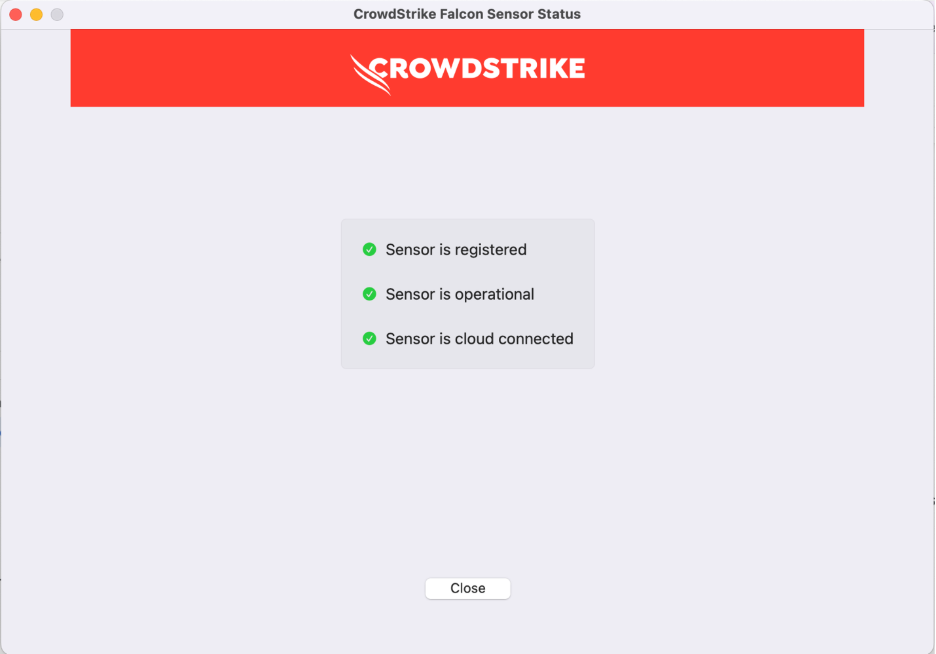
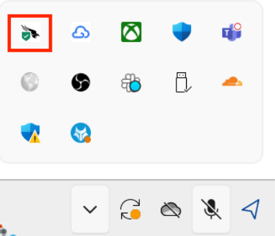
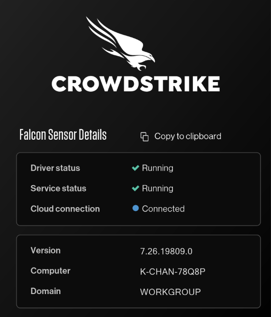

# Onboard to SEED as a vendor

This document provides a step-by-step guide to help vendors through the onboarding process for the Secure Engineering Environment for Developers (SEED). Before proceeding, make sure you meet the prerequisites outlined below.

## Prerequisites

Before proceeding with the onboarding process, vendors must meet the following prerequisites to ensure a seamless experience:

- Your TechPass login ID must end with **techpass.gov.sg**. For example, john_doe@techpass.gov.sg.

## macOS

During the process, you may encounter prompts to restart your device and reset your device's password. It is important to have your recovery keys ready in case you encounter any issues during the password reset or device login.

<iframe style="position:absolute;top:0;left:0;width:100%;height:100%;" src="https://www.youtube.com/embed/ytu6oOP6TYA" title="YouTube video player" frameborder="0" allow="accelerometer; autoplay; clipboard-write; encrypted-media; gyroscope; picture-in-picture; web-share" allowfullscreen="true"></iframe>

### Step 1: Set up Microsoft Intune

  
Set up Microsoft Intune to get the required applications and device configurations.
 

  1. Go to [Microsoft Intune documentation](https://learn.microsoft.com/en-us/mem/intune/user-help/enroll-your-device-in-intune-macos-cp) and follow the instructions on this page to complete the following:

   a. Download and install Company Portal.

   b. Enroll your Mac device. 

   
  2. Ensure that your device is connected to the Internet so that Intune is able to install the required SEED components and configurations. 
  3. Within the next two hours, check your inbox (organisational email address) to see if you have received the successfully onboarded email.
  4. If you do not receive this email after two hours, [raise a service request](https://go.gov.sg/seed-techpass-support). 

### Step 2: Verify installation

  
Verify the installation of the required profiles
 

   1. Go to **Apple menu > System Settings > General > Device Management**.

   2. You should be able to see the following profiles:

   - Credential Profile  
   - Custom Preferences Profile – com.cloudflare.warp  
   - Custom Preferences Profile – com.google.Chrome  
   - Falcon Profile  
   - Intune MDM Agent SCEP Profile  
   - Intune MDM Agent PPPC Profile  
   - Management Profile  
   - Passcode Profile  
   - Privacy Preferences Policy Profile  
   - com.apple.system-extension-policy Profile  

  
Verify CrowdStrike is configured
 

1. Open **Finder** → **Applications** → **Falcon.app**.

2. Ensure the **CrowdStrike Falcon Sensor** is **registered**, **operational**, and **cloud connected**.  

   

3. If any of the above statuses indicate an error:  
   - Click **Configure Settings** and follow the steps as prompted.

## Windows

Based on your Windows settings, you may be prompted to restart or reset your password while onboarding.

<iframe style="position:absolute;top:0;left:0;width:100%;height:100%;" src="https://www.youtube.com/embed/PAyKoRZ7WSk" title="YouTube video player" frameborder="0" allow="accelerometer; autoplay; clipboard-write; encrypted-media; gyroscope; picture-in-picture; web-share" allowfullscreen="true"></iframe>

### Step 1: Create your personal local administrator account

  
Create your personal local administrator account.
 

  > **Note**: Do not use the default administrator account for onboarding.

1. Search for **Computer Management**.
2. Navigate to **Local Users and Groups**, and click on **Users**.
3. Click **New User**.
4. Fill in **User Name**, **Password**, and **Confirm Password**. Ensure that **User must change password at next logon** is unchecked. Once done, click **Create**.
5. Double-click on the user you created and add the user as a member of the **Administrators** group.

### Step 2: Set up Microsoft Intune

  
Set up Microsoft Intune to get the required applications and device configurations.
 

1. Click the **Start** icon on the taskbar.
2. Go to **Settings** > **Accounts** > **Access work or school**, and click **Connect** to add your TechPass account.

   

3. Approve your TechPass login using the authenticator app used to set up TechPass MFA.

   

   Your account is added and listed as a connection. This account has **Info** and **Disconnect** options as shown below.

   

4. Select the **Info** option and verify that a similar result to the following is displayed. You will see **TechPass** instead of **SG Govt M365**.

   

### Step 3: Verify installation

  
Verify the installation
 

1. Go to the Internet Device onboarded to SEED, open **Settings** > **Apps** > **Apps & features**.  
2. Ensure that **Cloudflare WARP** and **Tanium** are listed.  

     
   

   You may receive a desktop notification that your device has been renamed according to convention, and that a timed restart will occur in 5 minutes. This is completely expected, and you should save any existing work to prevent data loss. Alternatively, you can also opt to manually restart your device, after receiving the desktop notification, to speed up the process. As the naming convention is required for administrative purposes, please refrain from renaming your device thereafter.

  
Verify CrowdStrike is configured
 

1. In the **Taskbar**, click the **CrowdStrike** icon.  
2. Confirm that the **CrowdStrike Falcon Sensor** is:  
   - **Running**  
   - **Service is active**  
   - **Cloud connected**  

     
   

3. If any of the above statuses indicate an error:  
   - Go to **Start** → **Settings** → **Accounts** → **Access work or school**.  
   - Click the **Info** button next to your **TechPass** account.  
   - Select **Sync**.  
   - Restart your computer.

