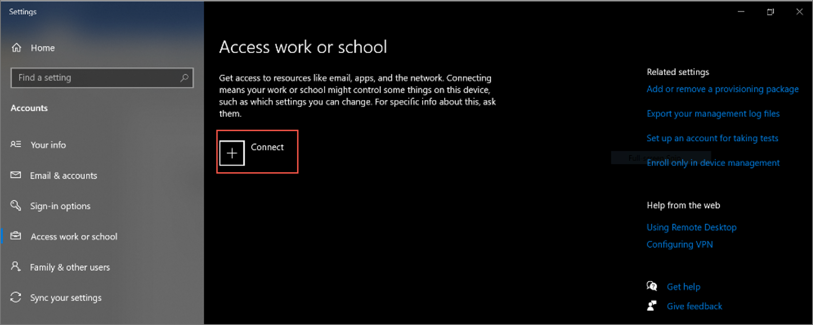
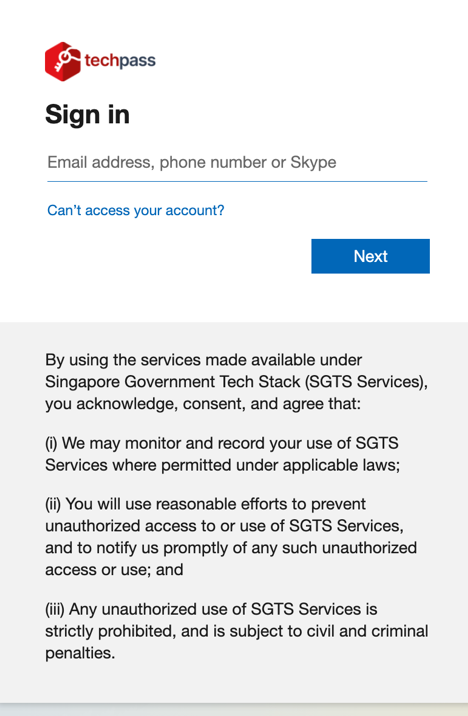
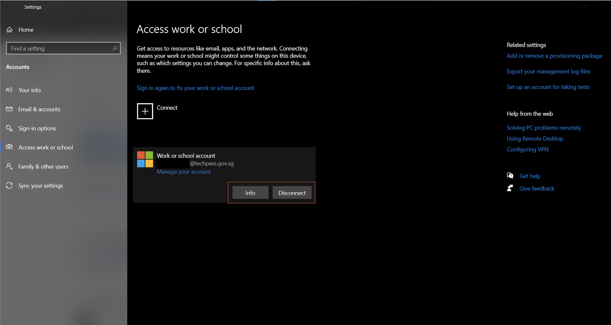
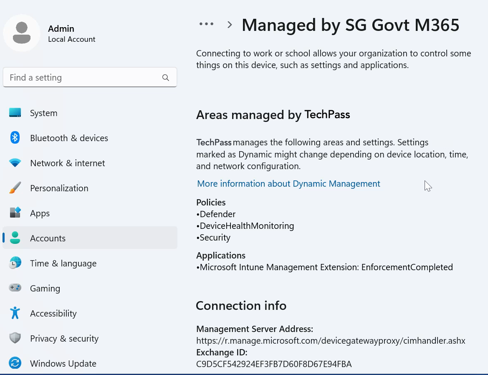
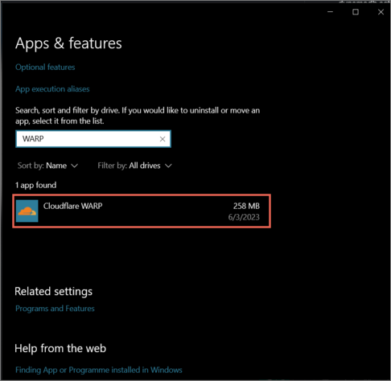
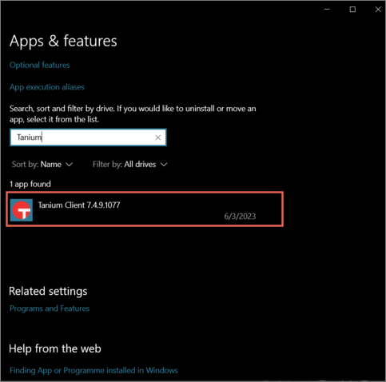

# Onboard Windows device to SEED as vendors

?> Based on your Windows settings, you may be prompted to restart or reset your password while onboarding.

<iframe style="position:absolute;top:0;left:0;width:100%;height:100%;" src="https://www.youtube.com/embed/Cvb7lppxFqs" title="YouTube video player" frameborder="0" allow="accelerometer; autoplay; clipboard-write; encrypted-media; gyroscope; picture-in-picture; web-share" allowfullscreen="true"></iframe>

## Step 1: Set up Microsoft Intune

  
Set up Microsoft Intune to get the required applications and device configurations.
 

1. Click **Start** icon on the taskbar.

2. Go to **Settings** > **Accounts** > **Access work or school** and click **Connect** to add your TechPass account.

  

3. Approve your TechPass login using the authenticator app that was used to set up TechPass MFA. 

  

  Your account is added and listed as a connection. This account has **Info** and **Disconnect** options as shown below. 

  

4. Select the **Info** option and verify that a similar result to the following is displayed. You will see **TechPass** instead of **SG Govt M365**.

  

## Step 2: Verify installation

  
Verify the installation.
 

1. Go to the Internet Device onboarded to SEED, open **Settings** > **Apps** > **Apps & features**. 
2. Ensure that Cloudflare WARP and Tanium are listed.

  

  
  
  ?> You may receive a desktop notification that your device has been renamed according to convention, and that a timed restart will occur in 5 minutes. This is completely expected, and you should save any existing work to prevent data loss. Alternatively, you can also opt to manually restart your device, after receiving the desktop notification, to speed up the process. As the naming convention is required for administrative purposes, please refrain from renaming your device thereafter.

