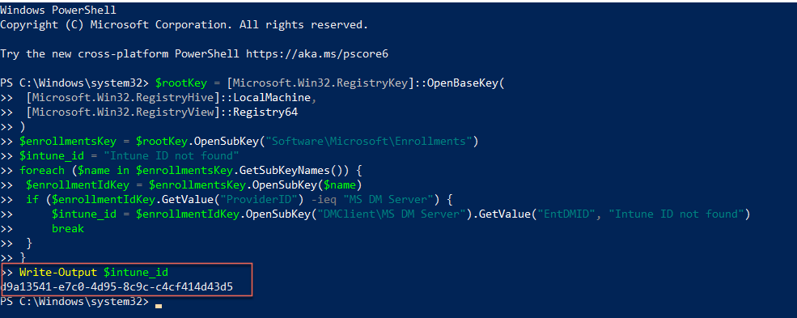

# Onboard Windows device to SEED as public officer

> **Note:** Based on your Windows settings, you may be prompted to restart or reset your password while onboarding.

<div style="position:relative;padding-bottom:56.25%;padding-top:30px;height:0;overflow:hidden;">
<iframe style="position:absolute;top:0;left:0;width:100%;height:100%;" src="https://www.youtube.com/embed/Cvb7lppxFqs" title="YouTube video player" frameborder="0" allow="accelerometer; autoplay; clipboard-write; encrypted-media; gyroscope; picture-in-picture; web-share" allowfullscreen="true"></iframe>
</div>

> **Note**: Please complete **Step 1** and **Step 2** within the same session.

## Step 1: Set up Microsoft Intune 

<details>
  <summary style="font-size:18px"> Set up Microsoft Intune to get the required applications and device configurations.</summary><br>

1. Click **Start** icon on the taskbar.

2. Go to **Settings** > **Accounts** > **Access work or school** and click **Connect** to add your WOG account.


3. Approve your TechPass login using the authenticator app that was used to set up TechPass MFA. Authorise your WOG account by entering the verification code displayed for your SG Govt M365 profile on the authenticator app before approving your Techpass login.


Your account is added and listed as a connection. This account has **Info** and **Disconnect** options as shown below. 


4. Select the **Info** option and verify that a similar result to the following is displayed.


## Step 2: Register Microsoft Intune Device ID

<details><summary style="font-size:18px">Register the Microsoft Intune Device ID for your Windows device.</summary>

1. Open **PowerShell** and run the following commands:
```
$rootKey = [Microsoft.Win32.RegistryKey]::OpenBaseKey(
    [Microsoft.Win32.RegistryHive]::LocalMachine,
    [Microsoft.Win32.RegistryView]::Registry64
)
$enrollmentsKey = $rootKey.OpenSubKey("Software\Microsoft\Enrollments")
$intune_id = "Intune ID not found"
foreach ($name in $enrollmentsKey.GetSubKeyNames()) {
    $enrollmentIdKey = $enrollmentsKey.OpenSubKey($name)
    if ($enrollmentIdKey.GetValue("ProviderID") -ieq "MS DM Server") {
        $intune_id = $enrollmentIdKey.OpenSubKey("DMClient\MS DM Server").GetValue("EntDMID", "Intune ID not found")
        break
    }
}
Write-Output $intune_id
```
2. Take note of the Intune Device ID that is displayed on the Powershell window.



!> If you only have a **SE GSIB** device, submit a [support request](https://go.gov.sg/techpass-sr) to register your Intune Device ID.

3. If you have a **non-SE GSIB** device, go to [TechPass portal](https://portal.techpass.gov.sg/secure/account/profile) > **My Account** > **Profile**.
4. Click **Onboard device to SEED** and follow the on-screen instructions to submit this Intune Device ID.
5. Ensure that your device is connected to the Internet so that Intune is able to install the required SEED components and configurations. 
6. Within the next 2 hours, check your inbox (organisational email address) to see if you have received the successfully onboarded email.
7. If you don't receive this email after two hours, submit an [incident request](https://go.gov.sg/techpass-sr). 
8. After receiving the email notification, a desktop notification will be sent to inform you of the device name change and snd requesting that you restart the device. Do the following:

  i. Save your current work and restart your device.

  ii. If prompted to specify your password, enter it.

## Step 3: Verify installation

<details>
  <summary style="font-size:18px">Verify the installation.</summary><br>

1. Go to the Internet Device onboarded to SEED, open **Settings** > **Apps** > **Apps & features**. Ensure that Tanium and Cloudflare WARP are listed.

</details>

**Next step**: Proceed to [Post onboarding steps](post-onboarding-instructions/post-onboarding-steps-and-verification).
