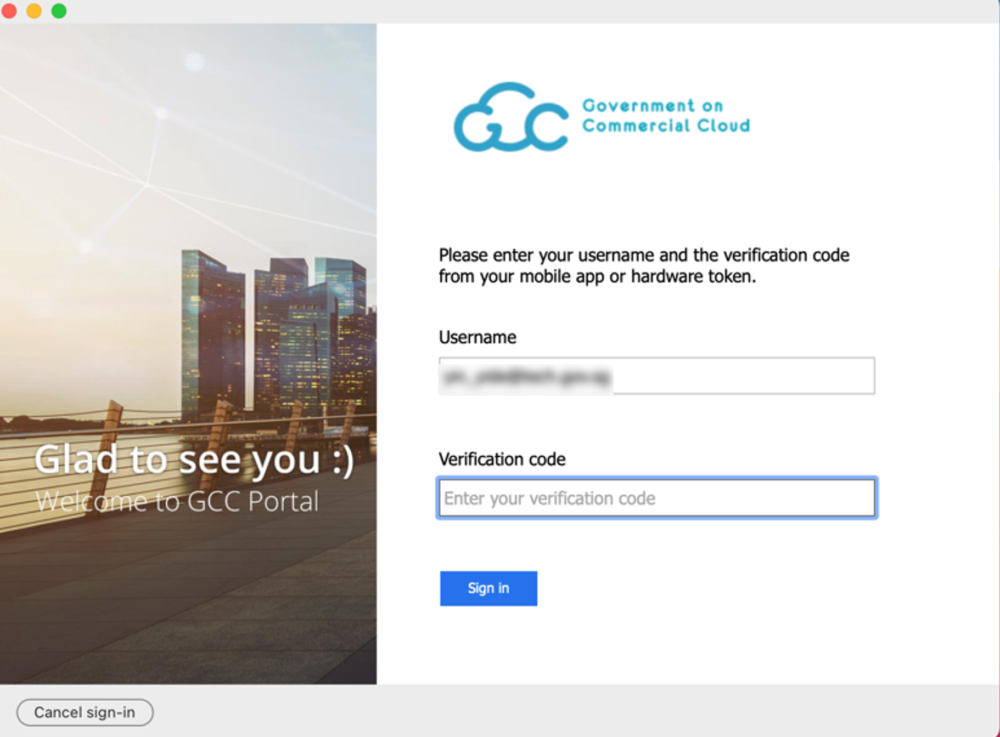
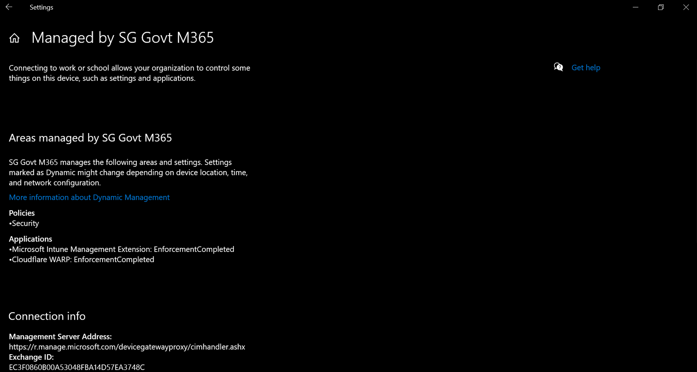
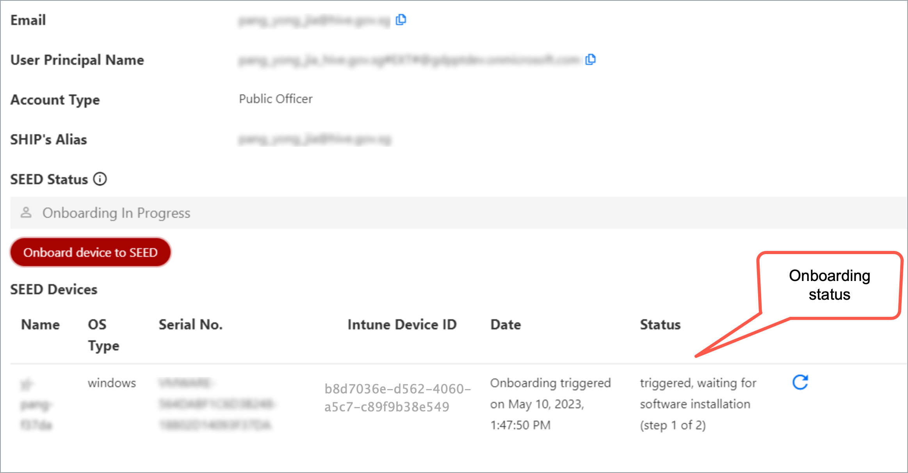

# Onboard Windows device to SEED as public officers

?> <br>- Based on your Windows settings, you may be prompted to restart or reset your password while onboarding.

<div style="position:relative;padding-bottom:56.25%;padding-top:30px;height:0;overflow:hidden;">
<iframe style="position:absolute;top:0;left:0;width:100%;height:100%;" src="https://www.youtube.com/embed/Cvb7lppxFqs" title="YouTube video player" frameborder="0" allow="accelerometer; autoplay; clipboard-write; encrypted-media; gyroscope; picture-in-picture; web-share" allowfullscreen="true"></iframe>
</div>


## Step 1: Set up Microsoft Intune 

<details>
  <summary style="font-size:18px"> Set up Microsoft Intune to get the required applications and device configurations.</summary><br>

1. Click **Start** icon on the taskbar.

2. Go to **Settings** > **Accounts** > **Access work or school** and click **Connect** to add your WOG account.


3. Authorise your WOG account by entering the verification code displayed for your SG Govt M365 profile on the authenticator app before approving your TechPass login.



Your account is added and listed as a connection. This account has **Info** and **Disconnect** options as shown below. 


4. Select the **Info** option and verify that a similar result to the following is displayed.




</details>

## Step 2: Register Microsoft Intune Device ID


<details>
  <summary style="font-size:18px">Register the Microsoft Intune Device ID for your Windows device.</summary>

1. Open **PowerShell** and run the following commands:
```
$rootKey = [Microsoft.Win32.RegistryKey]::OpenBaseKey(
    [Microsoft.Win32.RegistryHive]::LocalMachine,
    [Microsoft.Win32.RegistryView]::Registry64
)
$enrollmentsKey = $rootKey.OpenSubKey("Software\Microsoft\Enrollments")
$intune_id = "Intune ID not found"
foreach ($name in $enrollmentsKey.GetSubKeyNames()) {
    $enrollmentIdKey = $enrollmentsKey.OpenSubKey($name)
    if ($enrollmentIdKey.GetValue("ProviderID") -ieq "MS DM Server") {
        $intune_id = $enrollmentIdKey.OpenSubKey("DMClient\MS DM Server").GetValue("EntDMID", "Intune ID not found")
        break
    }
}
Write-Output $intune_id
```
2. Take note of the Intune Device ID that is displayed on the Powershell window.

3. Choose the appropriate method to register your Intune Device ID:

    a. If you only have a **SE GSIB** device, submit a [support request](https://go.gov.sg/seed-techpass-support) to register your Intune Device ID and skip rest of the steps. Within two hours, you should receive the successfully onboarded email.

    b. If you have a **non-SE GSIB** device,log in to the [TechPass portal](https://portal.techpass.gov.sg/secure/account/profile).

4. On the TechPass portal, at the top right, go to your user name and click **My Account**. Your **Profile** details are displayed. 
5. Click **Onboard device to SEED** and follow the on-screen instructions to submit this Intune Device ID.

  

  You will receive the following confirmation message.

  

  Your Internet Device record is listed under the **SEED Devices** with the following details:

    - Device name
    - Operating system of the device
    - Serial number
    - Intune Device ID
    - Date and time when the onboarding was trigerred or when the device was successfully onboarded
    - Onboarding status

  

6. Ensure the device you are onboarding is connected to the Internet so that Intune is able to install the required software and configurations.

7. After 30-60 minutes, check your inbox (organisational email address) to see if you have received any email regarding your onboarding status.

8. Choose the appropriate step:

   a. If you have received a successfully onboarded email, skip rest of the steps in this section and proceed to [Step 3: Verify installation](#step-3-verify-installation).

    b. If you have **not yet received** the **successfully onboarded email** or if you **have received** a **failed onboarding email**, complete the following step on [TechPass portal](https://portal.techpass.gov.sg/).

9. Refer to the following table to know about the possible onboarding status and the action required by you.

| Status | Description | Action required |
|---| ---| ---|
| **triggered, waiting for software installation (step 1 of 2)**| Your SEED onboarding has been triggered on the device and is waiting for the software installation to be completed. | 1. On your non-SE GSIB device, go to the [TechPass portal](https://portal.techpass.gov.sg/).<br><br>3. At the top right, go to your user name and click **My Account**. Your profile details are displayed.<br><br>4. Go to the **SEED Devices** section and click the refresh icon. If the software installation is successful, the status changes to **software installed, waiting for backend onboarding (step 2 of 2)**.|
| **software installed, waiting for backend onboarding (step 2 of 2)**| Required software has been installed on the device and waiting for backend onboarding.  | 1. On your non-SE GSIB device, go to the [TechPass portal](https://portal.techpass.gov.sg/).<br><br>3. At the top right, go to your user name and click **My Account**. Your profile details are displayed.<br><br>4. Go to the **SEED Devices** section and click the refresh icon. If the backend onboarding is successful, the status changes to **onboarded**. |
| **onboarded** | Your SEED onboarding is successful. | Go to step 10 in this section.  |
| **failed(*Reason for failure*)** | Your SEED onboarding failed due to the  error mentioned within the parentheses. | 1. On your non-SE GSIB device, go to the [TechPass portal](https://portal.techpass.gov.sg/).<br><br>3. At the top right, go to your user name and click **My Account**. Your profile details are displayed.<br><br>4. Go to the **SEED Devices** section. Action required to resolve this failure is generally mentioned in the parentheses.<br><br>5. Complete the suggested action. | 


10. Check your inbox (organisational email address) to see if you have received the successfully onboarded email.

?> If you don't receive this email after two hours, submit an [incident request](https://go.gov.sg/seed-techpass-support).


</details>


## Step 3: Verify installation

<details>
  <summary style="font-size:18px">Verify the installation.</summary><br>

1. Go to the Internet Device onboarded to SEED, open **Settings** > **Apps** > **Apps & features**. 
2. Ensure that Cloudflare WARP and Tanium are listed.


  
?> You may receive a desktop notification that your device has been renamed according to convention, and that a timed restart will occur in 5 minutes. This is completely expected, and you should save any existing work to prevent data loss. Alternatively, you can also opt to manually restart your device, after receiving the desktop notification, to speed up the process. As the naming convention is required for administrative purposes, please refrain from renaming your device thereafter.

</details>


