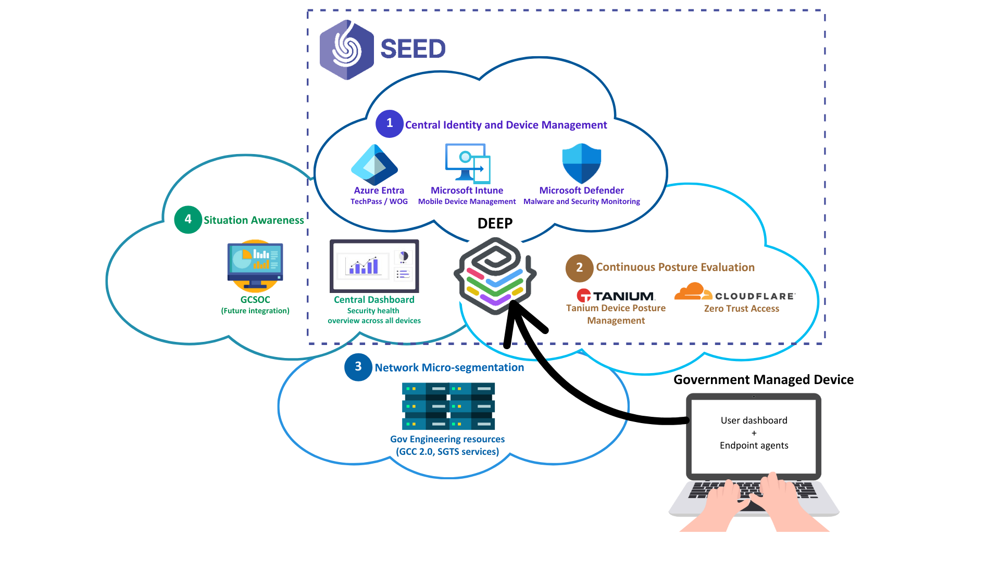

# Overview

**Security Suite for Engineering Endpoint Devices (SEED)** is Singapore Government's implementation for Identity and Access Management (IAM) and zero trust framework to secure access to the Government's engineering resources, such as Government on Commercial Cloud (GCC) and the Singapore Government Tech Stack (SGTS).

The zero trust framework replaces the traditional Virtual Private Network (VPN) technologies and centralises network-based security policies with a standardised central identity provider. It enforces access policies to only allow users to use devices with compliant with our security controls.

## Why do we need SEED?

- Blocks access to the resources of GCC and the SGTS services if the device is not compliant with our security controls.
- Detects if the endpoint meets the required security hardening baseline according to the corresponding Center of Internet Security (CIS) benchmark for the installed endpoint operating system.
- Detects if the endpoint’s operating system version and security patches are up-to-date.
- Detects and provides remediation steps for known malware so that the user can self help.

## How does SEED work?

SEED comprises of three components:

- TechPass
- Cloudflare
- Developers' Environment Endpoint Posture (DEEP)

<!-- tabs:start -->

### **TechPass**

This is the IAM and Single Sign-On (SSO) solution for accessing GCC and SGTS services.

### **Cloudflare**

The security platform that enforces zero zrust network access allowing faster and more secure connections to the Internet and applications. This comprises of the following: - **Cloudflare WARP**: An endpoint agent that connects you to the internet utilizing Cloudflare’s 1.1.1.1 DNS while simultaneously optimizing and securing (i.e. encrypting) your connection. It leverages massive network of servers across the globe to give you the fastest experience possible, even if your connection is slow, unlike the traditional VPN services. - **Cloudflare Gateway**: A Secure Web Gateway that blocks and protects you from access malicious content. - **Cloudflare Access**: Evaluates every request for user identity and device context.

### **DEEP**

Device management layer of SEED. It establishes a robust security baseline automatically​ and prevents insecure or compromised devices from accessing engineering resources.​ DEEP manages the following: - **Microsoft Intune**: Provides device and application management including remote application deployment and selective device wipe. - **Microsoft Defender Advanced Threat Prevention**: Enterprise class vulnerability management, threat detection and response security solution. - **Tanium**: Works with Cloudflare to ensure posture-based conditional access to the endpoint assets.

<!-- tabs:end -->

## What can SEED do on my device?

|SEED can do the following on your device|SEED cannot do the following on your device|
|---|---|
|- View the model number, serial number and operating system of the device. - View the names of the applications you have installed. - Identify your device by name. - Reset lost or stolen device to factory setting upon required consent and approval from device owner and manager-in-charge, respectively.|- View the browsing history. -Access your emails, contacts and calendar. - Access your documents.|

