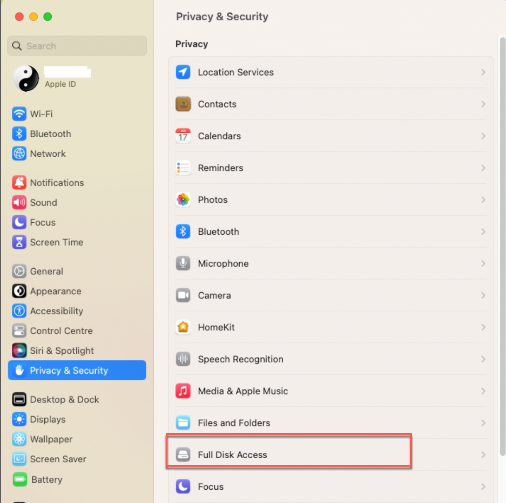
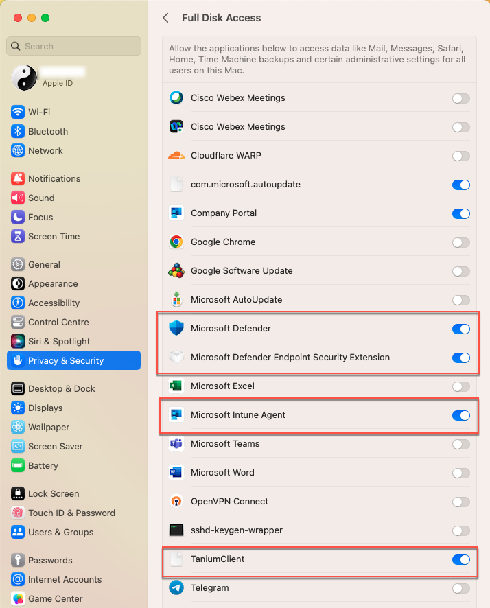

# SEED post onboarding instructions for macOS 13(Ventura)

  After you onboard your Internet Device to SEED: 

  - [Ensure Full Disk Access(FDA) is enabled for SEED components](#ensure-full-disk-accessfda-is-enabled-for-seed-components)
  - [Turn on Cloudflare WARP for macOS](#turn-on-cloudflare-warp-for-macos)

## Ensure Full Disk Access(FDA) is enabled for SEED components

  After onboarding, ensure FDA is enabled for the following SEED components:

  - Tanium Client
  - Microsoft Intune Agent
  - Microsoft Defender
  - Microsoft Defender ATP Security Extension 

### To verify FDA is enabled for the SEED components

  1. Go to the **Apple** menu > **System Settings**.  
  2. On the left pane, select **Privacy & Security**.
  3. When prompted to unlock this settings, use your Touch ID or enter your device password.

  ?> **Note** If you were not prompted to reset device password while onboarding, you will be prompted now. See FAQ for password policy.

  4. On the **Privacy & Security** pane, choose **Full Disk Access**.

  <kbd></kbd>

  5. Ensure the following applications are listed and enabled.

       - Tanium Client
       - Microsoft Intune Agent
       - Microsoft Defender
       - Microsoft Defender Endpoint Security Extension

  <kbd></kbd>

 ?> **Note** If a SEED component is missing, see [Common onboarding issues for macOS users](faqs/common-onboarding-issues) to resolve it. 

## Turn on Cloudflare WARP for macOS

After you onboard your macOS Internet Device to SEED, you need to turn on Cloudflare WARP.

### To turn on Cloudflare WARP for macOS

[turn on Cloudflare WARP for macOS](../snippets/snippets-turn-on-cloudflare-warp-for-macos.md ':include')
