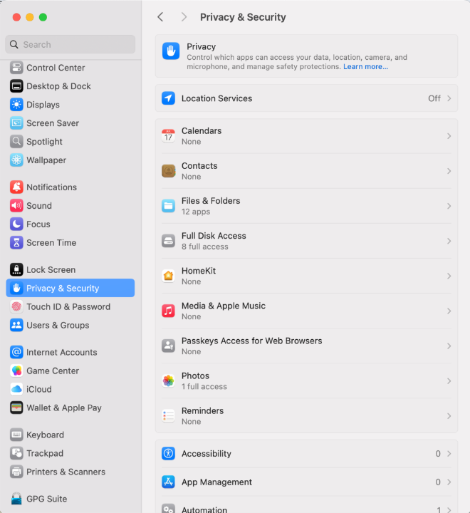
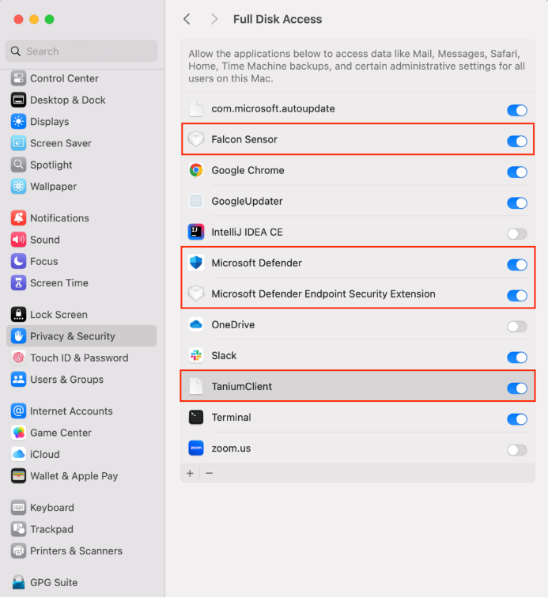

# macOS post onboarding guide

After onboarding your Internet Device to SEED, follow these instructions:

- [Ensure Full Disk Access(FDA) is enabled for SEED components](#ensure-full-disk-accessfda-is-enabled-for-seed-components)
- [Turn on Cloudflare WARP for macOS](#turn-on-cloudflare-warp-for-macos)

## Ensure Full Disk Access (FDA) is enabled for SEED components

After onboarding, ensure FDA is enabled for the following SEED components:

- Tanium Client
- Microsoft Intune Agent
- Falcon agent 

**Verification steps**:

1. Go to the **Apple** menu > **System Settings**.  
2. On the left pane, select **Privacy & Security**.
3. If prompted, unlock the setting using your Touch ID or enter your device password.

> **Note**: If you were not prompted to reset device password during onboarding, you will be prompted now. Refer to the FAQ for password policy.

4. On the **Privacy & Security** pane, choose **Full Disk Access**.
  

5. Ensure the following applications are listed and enabled:

    - Tanium Client
    - Microsoft Intune Agent
    - Falcon agent 

  

  >**Note**: If a SEED component is missing, refer to [Onboarding FAQ](/faqs/onboarding-faq).

   
## Turn on Cloudflare WARP

After onboarding your macOS Internet Device to SEED, you need to activate Cloudflare WARP.

**Activation steps**:

1. Open **Cloudflare WARP** client from the menu bar.

  
  
  You will see the information page, followed by the privacy policy.

2. Click **Next**, **Accept** to agree to Cloudflare’s privacy policy.

  

3. When prompted to sign in, select **Azure AD – TechPass Prod**.

  
  
  If you encounter an error stating that your user account is not found in the respective tenant, follow these instructions:

  - Open a new browser tab
  - Visit https://myaccount.microsoft.com
  - Sign out of your current account
  - Retry the action

4. Sign in using your TechPass credentials.

  

5. After successfully signing in, click **Open Cloudflare WARP app** to establish your WARP connection.

Once connected, you should see WARP Zero Trust in the connected state.
  
  

6. Open Cloudflare WARP **Settings**, and ensure **Gateway with WARP** is selected. WARP is now active, safeguarding your Internet connection.

At any time, users can sign in to Company Portal app, click the three dots and choose **Check status** to check for policy or profile updates. It may take a while to complete the synchronisation. When completed, the screen will show the timestamp of the last successful sync.
