# Step 0: Prerequisites for onboarding to SEED

<!-- This page is linked in the TechPass portal-Register Intune Device ID, so please do not rename this file. -->

## Audience

- Users who want to onboard their Internet Device to SEED.

## Prerequisites

Before you proceed to onboard your device to SEED, note the following prerequisites and recommendations:

!> You **can't onboard** the following to SEED:<br>- Virtual machines<br>- Mobile phones and Tablets (Android and iOS)<br>- GoMAX devices.<br>- SE-GSIB or Non-SE GSIB device.
<br>- More than one Internet Device.

- Ensure you have an active [TechPass account](https://docs.developer.tech.gov.sg/docs/techpass-user-guide/onboard-to-techpass).
- Ensure you have a valid SEED onboarding email. For more information on how to request or sign up for SEED provisioning, see [SEED provisioning](#request-seed-provisioning).
- Ensure you have Administrator permission on the device.
- Ensure the device is running on one of the following operating systems:
    - Windows 10 and 11 Pro or Enterprise versions.
    - macOS 11 (macOS Big Sur), macOS 12 (macOS Monterey) and macOS 13 (Ventura) versions. 
- Supported browsers: Google Chrome, Microsoft Edge, Mozilla Firefox. If you are using Mozilla Firefox, you need to [configure Firefox to trust the root certificate store of your system](https://support.mozilla.org/en-US/kb/setting-certificate-authorities-firefox).       
- [Remove existing software on your device](#remove-existing-software-on-your-device) such as any existing MDM software, Tanium client or any other unified endpoint management and security platform.
- If your device is running on macOS, ensure [System Integrity protection(SIP) is enabled](#ensure-system-integrity-protectionsip-is-enabled-for-macos).
- [Encrypt hard disk drive to protect the data at rest](#encrypt-your-hard-disk-drive-to-protect-your-data-at-rest). 
- If your organisation uses a firewall or other policies to restrict Internet traffic, you may need to make few changes to allow WARP to connect. To know more about these changes, visit [Cloudflare Docs](https://developers.cloudflare.com/cloudflare-one/connections/connect-devices/warp/deployment/firewall/). 

## Request SEED provisioning

You can request for SEED provisioning in one of the following ways as applicable:

  - All users can contact their reporting officer or project manager to request for TechPass and SEED provisioning via [TechBiz portal](http://portal.techbiz.suite.gov.sg/).
  - If you can access [TechPass portal](https://portal.techpass.gov.sg/), you can sign up for TechPass and SEED together. For more information, see [TechPass documentation](https://docs.developer.tech.gov.sg/docs/techpass-user-guide/onboard-to-techpass).
  - If you already have an active TechPass account, and can access the TechPass portal, [request for SEED provisioning](https://docs.developer.tech.gov.sg/docs/techpass-user-guide/request-for-seed-provisioning) from your TechPass account profile.
  - If you are a SE-GSIB user, and have an active TechPass account, submit a [service request](https://go.gov.sg/seed-techpass-support) for SEED provisioning.
  
  ?> When SEED is successfully provisioned:<br>- We'll send the SEED onboarding email within the next three business days.<br>- This email is valid only for 30 days.<br>- Ensure that you successfully activate your TechPass account before proceeding to onboard your Internet Device to SEED.<br>- If your SEED onboarding email has expired, follow one of the below options:<br>&nbsp;&nbsp;&nbsp;&nbsp;&nbsp;&nbsp;&nbsp;&nbsp;&nbsp;&nbsp;&nbsp;&nbsp;-If you had requested your reporting officer or project manager for SEED provisioning, contact them again to get another SEED onboarding invitation email.<br>&nbsp;&nbsp;&nbsp;&nbsp;&nbsp;&nbsp;&nbsp;&nbsp;&nbsp;&nbsp;&nbsp;&nbsp;-If you had signed up for SEED via the TechPass portal, you may log in to the TechPass portal to [request for SEED onboarding invitation email](https://docs.developer.tech.gov.sg/docs/techpass-user-guide/request-for-seed-provisioning).


## Remove existing software on your device

Before onboarding to SEED, you need to remove the following software solutions from your device if applicable:

- Existing MDM software.
- Tanium client or any other unified endpoint management and security platform.
- Cloudflare WARP or any other software used for privacy and secured connections.
- Defender or any other antivirus solution.

<!-- tabs:start -->

#### **macOS**

<details>
  <summary style="font-size:18px">a. Verify if your device is already managed by any MDM software</summary>

  Complete the following steps to find if your device is already managed by an MDM solution. 
  
  1. Choose the appropriate step based on your macOS version.
    
      a. If your macOS version is macOS 11 (macOS Big Sur) or macOS 12 (macOS Monterey), go to the **Apple** menu > **System Preferences** > **Profiles**.

      b. If your macOS version is macOS 13 (Ventura), go to the **Apple** menu > **System Settings** > **Privacy and Security** > **Profiles** on the right.(You may need to scroll down.)

  2. Click **Management Profile**.
     
      a. If your macOS version is macOS 11 (macOS Big Sur) or macOS 12 (macOS Monterey), and see a page similar to the following, it indicates you already have an MDM software.

  <kbd>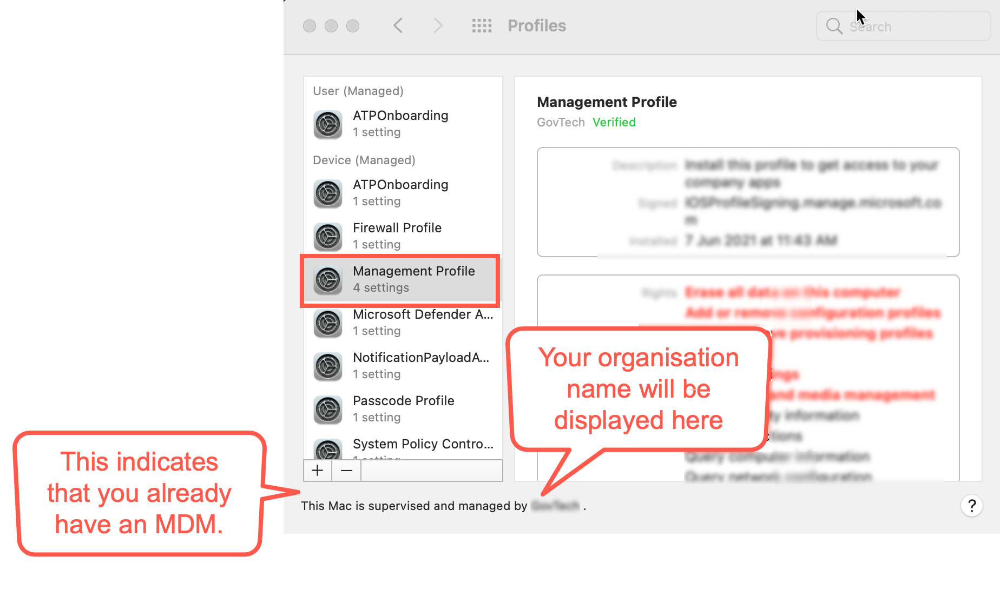</kbd>

      b. If your macOS version is macOS 13 (Ventura) and see a similar page, it indicates you already have an MDM software.

    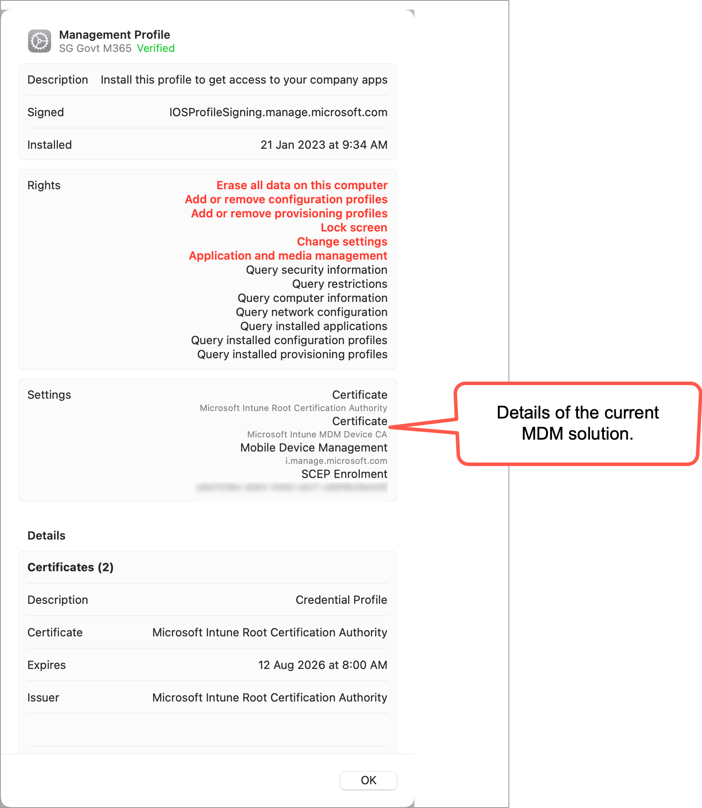
     
 3. Choose the appropriate step:
 
    a. When you confirm that your Internet Device is not managed by any MDM currently, proceed to step **c.Remove Tanium Client** to find if you have Tanium Client and remove it.

    b. If your Internet Device is managed by an MDM, on the **Management Profile**, go to **Settings** to identify the current MDM software.
  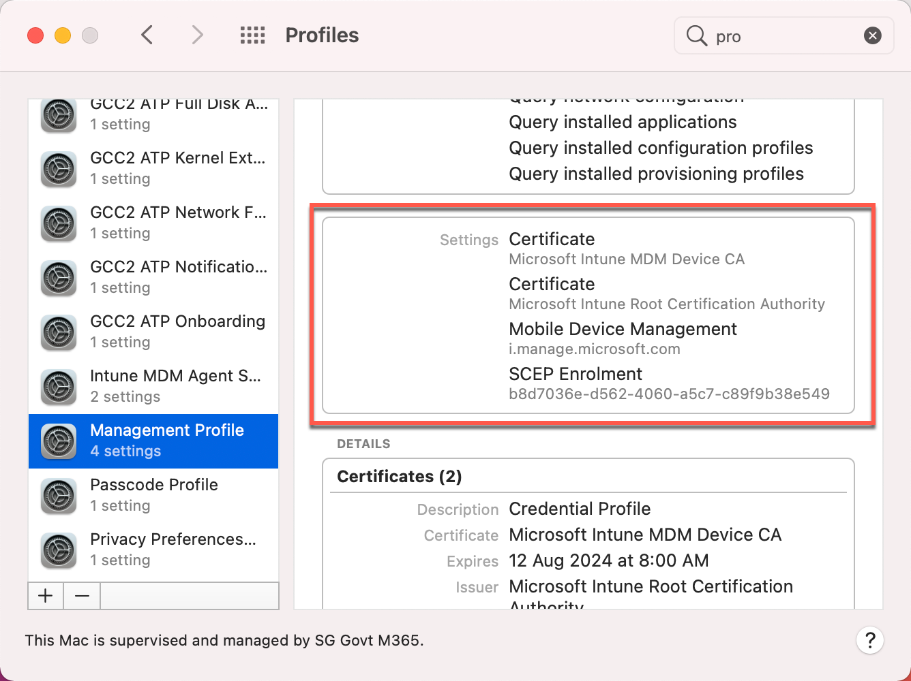

?><br>- If you see Microsoft Intune in the settings, it indicates that **Microsoft Intune** is your MDM. Proceed to the next **step b. Unenrol from Microsoft Intune**<br>- To unenrol your device from MDM software other than Microsoft Intune, contact your organisation's IT administrator.

</details>
<details>
  <summary style="font-size:18px">b. Unenrol from Microsoft Intune</summary>

Complete the following steps to remove your device from Intune. 

?> To find if your device is enrolled with Intune, see step **a. Verify if your device is already managed by any MDM software**.

  1. Sign in to the **Company Portal** app.
  <kbd>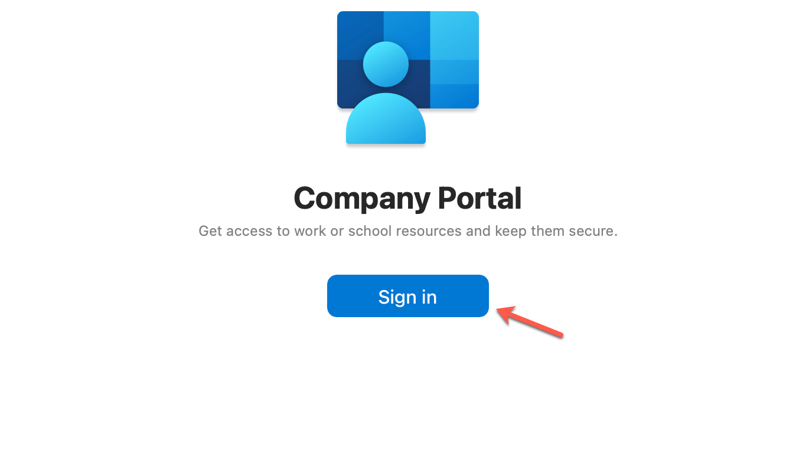</kbd>
  4. Go to **Devices** and click the three dots beside the device you want to unenrol.
  5. Choose **Remove**.
  <kbd>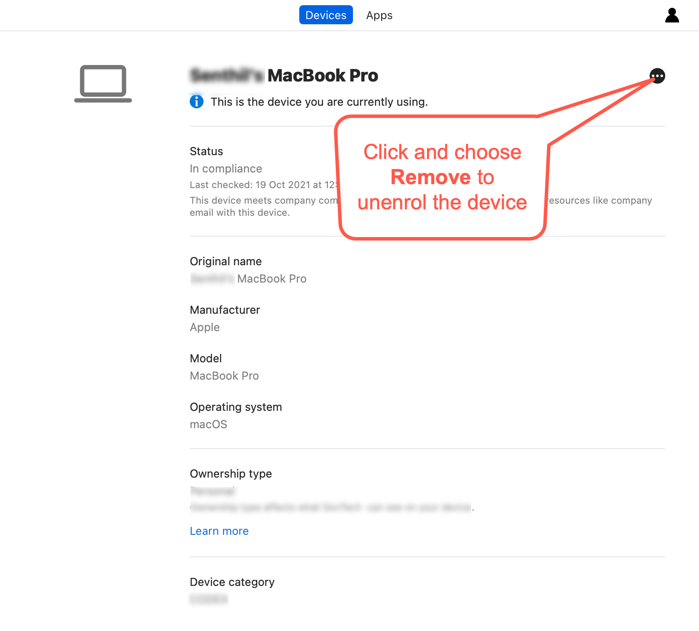</kbd>
  6. When prompted to confirm the removal, select **Remove**.
  7. Click your profile icon and **Sign out** of the **Company Portal**.

</details>

<details>
  <summary style="font-size:18px">c. Remove Tanium Client</summary>

Complete the following steps to find if Tanium Client is available on your device and remove it.

  1. Open **Terminal** and run the following command:

   ```
  sudo ls /Library/Tanium/TaniumClient
   ```
  2. When prompted for password, enter your macOS password.

  3. If you see the below on your **Terminal**, it indicates that Tanium Client is installed on your device and go to step 4. If not, proceed to step d. **Remove Cloudflare WARP client**.

   <kbd></kbd>

  4. Run the following commands in **Terminal**.

     ```
     sudo launchctl unload /Library/LaunchDaemons/com.tanium.taniumclient.plist

     sudo launchctl remove com.tanium.taniumclient > /dev/null 2 >&1

     sudo rm /Library/LaunchDaemons/com.tanium.taniumclient.plist

     sudo rm /Library/LaunchDaemons/com.tanium.trace.recorder.plist

     sudo rm -rf /Library/Tanium/

     sudo rm /var/db/receipts/com.tanium.taniumclient.TaniumClient.pkg.bom

     sudo rm /var/db/receipts/com.tanium.taniumclient.TaniumClient.pkg.plist

     sudo rm /var/db/receipts/com.tanium.tanium.client.bom

     sudo rm /var/db/receipts/com.tanium.tanium.client.plist

    ```

4. Enter your macOS password when prompted. Once the commands are successfully executed, Tanium Client is removed from your device.

</details>
<details>
  <summary style="font-size:18px">d. Remove Cloudflare WARP Client</summary>

Complete the following steps to find if Cloudflare WARP client is available on your device and remove it.  

  1. Click the **Finder** icon in the **Dock**.
  2. Choose **Applications**.
  3. Search for **Cloudflare WARP.app**.
  4. If available, open **Terminal** and run the following command:
    ```
    sudo /bin/sh /Applications/Cloudflare\ WARP.app/Contents/Resources/uninstall.sh
    ```

  5. When prompted, enter your macOS password.

</details>
<details><summary style="font-size:18px">e. Remove Defender or the current antivirus solution</summary>

If your device is already enrolled with Defender or any other antivirus solution, it has to be completely unenrolled from it before you proceed to onboard the device to SEED.

Complete the following steps to find if Defender is your current antivirus solution and remove it from your device.

?> If you have other antivirus solution, please contact your administrator to remove it.


1. Open **Terminal** and run `mdatp health`.   
2. Choose the appropriate step:
  
   a. If you get a `mdatp: command not found` error, it means you do not have Defender installed on your device. You can skip the remaining steps in this section.

   b. Take note of the value displayed for **org_id**.
  
  3. Identify the organisation corresponding to this **org_id** from the following table. This is the organisation that is linked to your Defender or antivirus solution on your device.

  | org_id  | Defender organisation | Offboarding package |
  | ------------- |:-------------:|:-------------:|
  | faa36a5e-2da6-4225-8e27-226177c801a0      | WOG     | [Download offboarding package](https://k3uwa66lu3tj6uxft46666ynhe0uvzor.lambda-url.ap-southeast-1.on.aws/local_wog_mac)    |
  | 49237d71-42ac-425a-a803-881b92cc18ce  | TechPass    | [Download offboarding package](https://k3uwa66lu3tj6uxft46666ynhe0uvzor.lambda-url.ap-southeast-1.on.aws/local_tp_mac)     |
  | 6389e966-e334-461d-86ce-0fed12484620 | Hive | Contact [Hive support](mailto:GDS_DEN@hive.gov.sg) to get the offboarding package. |


!> **Important**<br>- If your **Defender organisation** is **Hive**, skip the remaining steps in this document. You need to get the offboarding package from the Hive support and unenrol your device from Defender. See the [offboarding FAQs](offboard-device/seed-offboarding-faqs.md) to know how to unenrol your device from Defender using the Hive offboarding package.<br><br>- If your **Defender organisation** is either **WOG** or **TechPass**, it indicates that this device may already have been onboarded to SEED under a different TechPass profile. So you need to offboard this device first before proceeding further. <br><br>- If your **Defender organisation** is **none of the above**, contact the IT support of the organisation that provided you with the device.

4. Log in with your TechPass to download the offboarding package.
5. Go to the folder where you downloaded the ZIP file and extract the files. You should see the following two files.

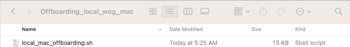

?> **Note**: The file names vary with the organisation.

6. On your **Terminal**, go to the folder where you extracted the files. For example, if they are in the **Downloads** > **Offboarding_local_wog_mac** folder, go to that folder.

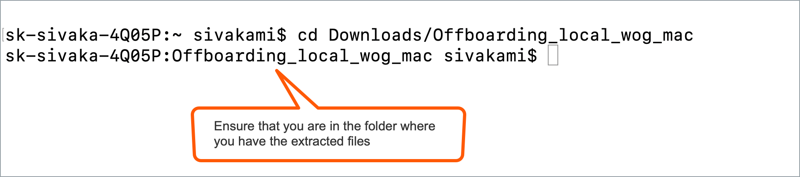

7. Copy the below and run it on the same **Terminal**.

    ```
    sudo chmod +x local_mac_offboarding.sh
    ```

8. When prompted for a **Password**, enter your device password.
9. Copy and run the following command on your **Terminal**.

    ```
    sudo ./local_mac_offboarding.sh
    ```

When you see the following success message on your **Terminal**, you are automatically directed to a form to submit the Intune Device ID.

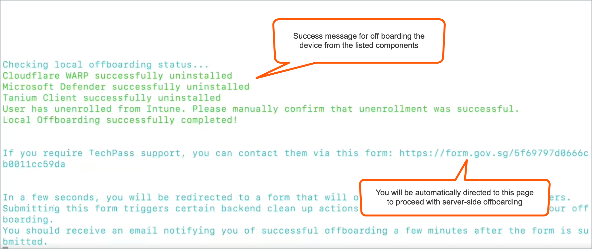

10. Ensure your **Intune Device ID** is displayed on the form. If it is not displayed, provide it. See [Get Intune Device ID](https://docs.developer.tech.gov.sg/docs/security-suite-for-engineering-endpoint-devices/offboard-device/mac-os-using-script?id=get-intune-device-id). 
11. Enter your organisational email address in **Organisational Email Address** and click **Verify**.
12. Enter the OTP you receive at this email address.  
13. Click **Submit**. When this request is processed successfully, we send a notification via email.

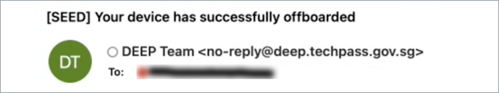

</details>

#### **Windows**

<details>
  <summary style="font-size:18px">a. Remove existing MDM software</summary>

Complete the following steps to find if your device is managed by an MDM solution and remove it.  

  1. Click **Start** icon on the taskbar.
  2. Go to **Settings** > **Accounts**.
  3. From the left menu, choose **Access work or school**.

?> If your device is managed by an MDM, your username in your organisation's domain will be displayed under **Work or school account**.

  4. Click **Work or school account** and then select **Disconnect**.


</details>

<details>
  <summary style="font-size:18px">b. Remove Tanium Client</summary>

Complete the following steps to find if Tanium client is available on your device and remove it.  

  1. Click **Start** icon on the taskbar.
  2. Go to **Settings** > **Apps** and search for **Tanium Client**.
  3. If available, choose it and then click **Uninstall**.

</details>

<details>
  <summary style="font-size:18px">c. Remove Cloudflare WARP Client</summary>

Complete the following steps to find if Cloudflare WARP client is available on your device and remove it.

  1. Click **Start** icon on the taskbar.
  2. Go to **Settings** > **Apps** and search for **Cloudflare WARP**.
  3. If available, choose **Cloudflare WARP** and then click **Uninstall**.

</details>

<details><summary style="font-size:18px">d. Remove current antivirus solution on the device</summary>

If your device is already enrolled with Defender or any other antivirus solution, it has to be completely unenrolled from it before you proceed to onboard the device to SEED.

Complete the following steps to find if Defender is your current antivirus solution and remove it from your device.

1. Go to the **Start** menu and enter **Powershell**.
2. Right-click on the search result for **PowerShell** and select **Run as Administrator**

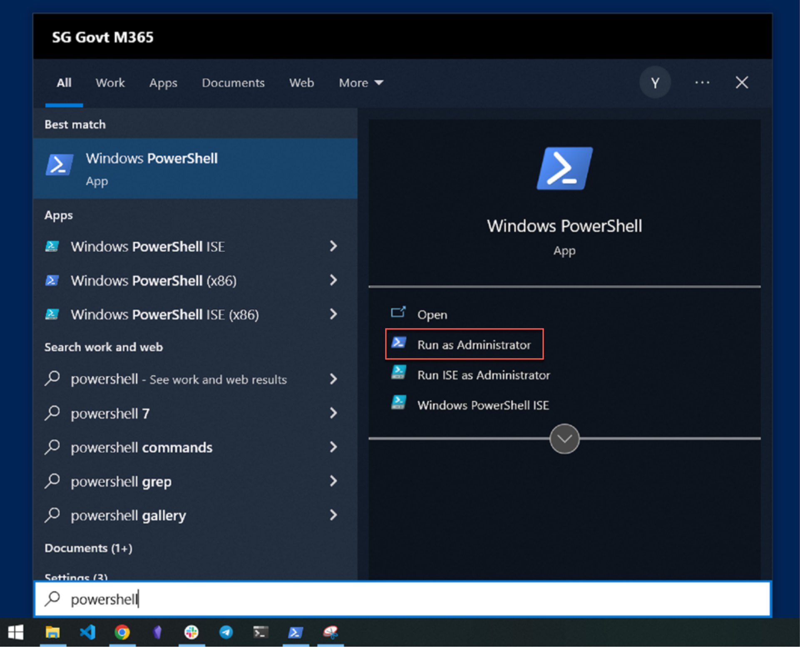

3. On **Powershell**, run the following command.

```
$reg64 = [Microsoft.Win32.RegistryKey]::OpenBaseKey([Microsoft.Win32.RegistryHive]::LocalMachine, [Microsoft.Win32.RegistryView]::Registry64)
$OrgID =  $reg64.OpenSubKey("SOFTWARE\MICROSOFT\Windows Advanced Threat Protection\Status").GetValue("OrgID")
echo $OrgID
```

4. Take note of the value displayed for **OrgID**.

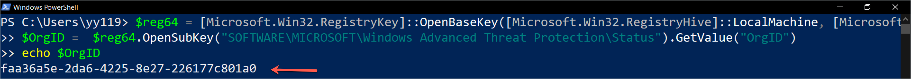

?> Note: If you don't get any response, it means you do not have Defender installed on your device. You can skip the steps in this section.

5. Refer to the following table and identify your **Defender organisation** and download the offboarding package.

  | OrgID | Defender organisation | Offboarding package |
  | ------------- |:-------------:|:-------------:|
  | faa36a5e-2da6-4225-8e27-226177c801a0      | WOG     | [Download offboarding script](https://k3uwa66lu3tj6uxft46666ynhe0uvzor.lambda-url.ap-southeast-1.on.aws/local_wog_windows) |
  | 49237d71-42ac-425a-a803-881b92cc18ce  | TechPass    | [Download offboarding script](https://k3uwa66lu3tj6uxft46666ynhe0uvzor.lambda-url.ap-southeast-1.on.aws/local_tp_windows)    |
  | 6389e966-e334-461d-86ce-0fed12484620 | Hive | Contact [Hive support](mailto:GDS_DEN@hive.gov.sg) to get the offboarding package. |

  !> **Important**<br>- If your **Defender organisation** is **Hive**, please skip the remaining steps in this document. You need to get the offboarding package from the Hive support and unenrol your device from Defender. See the [offboarding FAQs](offboard-device/seed-offboarding-faqs.md) to know how to unenrol your device from Defender using the Hive offboarding package.<br><br>- If your **Defender organisation** is either **WOG** or **TechPass**, it indicates that this device may already have been onboarded to SEED under a different TechPass profile. So you need to [offboard](offboard-device/offboard-device-from-seed) this device first before proceeding further. <br><br>- If your **Defender organisation** is **none of the above**, contact the IT support of the organisation that provided you with the device.

6. Go to the folder where you downloaded the ZIP file and extract the files. You should see the following two files.

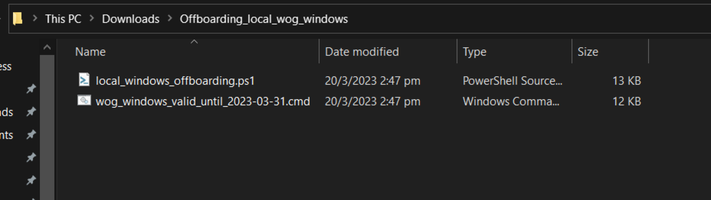

?> **Note**: The file names vary with the organisation.

7. Right-click the unzipped folder to select **Show more options** > **Copy as path**. The folder path is now saved to your clipboard.

8. On **Powershell**, run the following command to go to the folder which has the extracted files:

    ```
    cd {Path from clipboard}
    ```

    For example:

    ```
    cd "C:\Users\testUser\Downloads\Offboarding_local_tp_windows"

    ```

    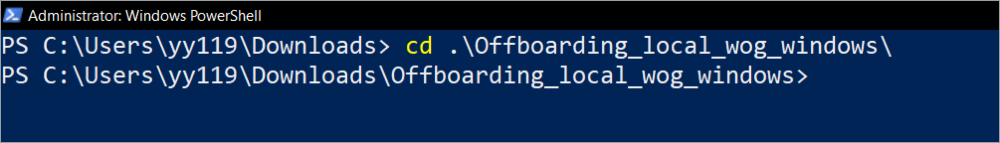

10. To run the script, enter the following command:

    ```
    powershell.exe -ExecutionPolicy Bypass .\local_windows_offboarding.ps1

    ```

When you see the following success message on your **Powershell**, you are automatically directed to a form to submit the Intune Device ID.


11. Ensure your **Intune Device ID** is displayed on the form. If it is not displayed, provide it. See [Get Intune Device ID](https://docs.developer.tech.gov.sg/docs/security-suite-for-engineering-endpoint-devices/offboard-device/mac-os-using-script?id=get-intune-device-id). 
12. Enter your organisational email address in **Organisational Email Address** and click **Verify**.
13. Enter the OTP you receive at this email address.  
14. Click **Submit**. When this request is processed successfully, we send a notification via email.


</details>

<!-- tabs:end -->

## Ensure System Integrity Protection(SIP) is enabled for macOS

1. Open **Terminal** and run the command `csrutil status`.
2. If the result says it is currently disabled, run the command `csrutil enable`.
3. Restart your device.

## Encrypt your hard disk drive to protect your data at rest

<!-- tabs:start -->

#### **macOS**

1. Go to the **Apple** menu > **System Preferences** > **Security & Privacy**.

2. Click the **FileVault** tab.

3. If you see **Turn on FileVault**, click the lock icon and use your Touch ID or enter your password to unlock.

4. Click **Turn on FileVault**.

5. When prompted to specify how you would like to unlock your device if you forget your device password,  select **Create a recovery key and do not use my iCloud account**.

<kbd>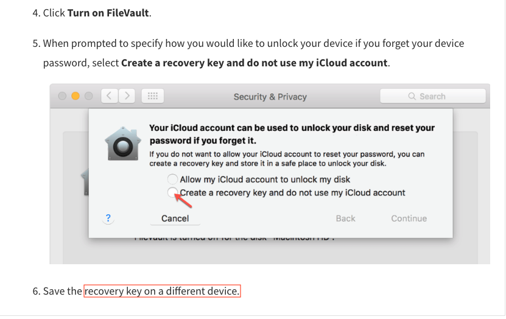</kbd>

6. Save the recovery key on a different device.

#### **Windows**

1. Click the **Start** icon on the taskbar and search for **Manage BitLocker** and choose to open it. Check if BitLocker is turned on for your OSDisk. A padlock on the drive indicates that BitLocker is turned on 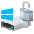.
2. If BitLocker is not turned on, select **Turn on BitLocker**.
3. When asked to choose how to unlock your drive at start up, select **Enter a password**.

<kbd></kbd>

4. To backup the recovery key for your computer, insert a thumb drive or any other form of removable storage device into the USB port of your computer.
5. When asked how you would like to back up your recovery key, select **Save to a file**, save the file in the inserted removable storage device and click **Next**.

?> Remove the external storage device and transfer this file to a safe location other than your computer.

<kbd></kbd>

6. When asked how much of your drive to be encrypted, select **Encrypt entire drive(slower but best for PCs and drives already in use)** and click **Next**.

<kbd></kbd>

7. When asked which encryption mode to use, select **New encryption mode(best for fixed drives on this device)** and click **Next**.

<kbd></kbd>

8. The device encryption page is displayed. <!--Click **Start encrypting**.-->

?> Depending on your system settings, you may be prompted to restart your computer before the encryption can start. If you are prompted to do so, restart your device, then return to the **Manage BitLocker** window to verify if encryption has started. A padlock icon on the hard drives in your Windows File Explorer indicates that the hard drive has been encrypted.

<!-- tabs:end -->


### Next steps

- [Proceed to onboard your device to SEED](onboard-device/onboard-device-to-seed)


<!--
  1. In the search box on the taskbar, type **regedit**.
  2. Choose **Registry Editor** from the results and click **Run as administrator**.
  3. In the **Registry Editor**, go to **Computer** > **HKEY_LOCAL_MACHINE** > **SOFTWARE** > **Microsoft** > **Windows Advanced Threat Protection** > **Status**.

  > **Note**:
  > If you do not see the **Windows Advanced Threat Protection** folder, it indicates your device is not enrolled with any MDM solution. Proceed to onboard your device to SEED.

  4. Take note of the value displayed for **OrgId**.
  5. Identify the organisation corresponding to this **OrgId** from the following table. This is the organisation of the Defender or the antivirus on your device.

  | OrgId  | Organisation |
  | ------------- |:-------------:|
  | faa36a5e-2da6-4225-8e27-226177c801a0      | WOG     |
  | 49237d71-42ac-425a-a803-881b92cc18ce  | TechPass    |
  | 6389e966-e334-461d-86ce-0fed12484620      | Hive     |

  > **Note**:
  > If your organisation id(OrgId) is different from the above three, contact the respective MDM administrator to get the offboarding script.

  6. Based on the organisation, use your internet (which is not a GSIB) device to download the offboarding script from the following:

  | Organisation  | Offboarding script |
  | ------------- |:-------------:|
  | WOG      | [Download offboarding script](https://26mucnez5qtouxu6dtg7bwcpwa0glupx.lambda-url.ap-southeast-1.on.aws/wog_windows)    |
  | TechPass      | [Download offboarding script](https://26mucnez5qtouxu6dtg7bwcpwa0glupx.lambda-url.ap-southeast-1.on.aws/tp_windows)     |
  | Hive      | [Download offboarding script](https://26mucnez5qtouxu6dtg7bwcpwa0glupx.lambda-url.ap-southeast-1.on.aws/hive_windows)     |

  7. When prompted to log in, log in with your TechPass.

  > **Note**: If you have any issues in accessing the link to download the offboarding script,
  >- Make sure that you are using your internet (which is not a GSIB) device to download the offboarding script.
  >- Access the link in incognito mode.
  >- Make sure you are using only the [supported browsers](https://docs.developer.tech.gov.sg/docs/security-suite-for-engineering-endpoint-devices/additional-resources/best-practices?id=supported-browsers).
  >- If you still have issues in downloading the script, create a [support request](https://go.gov.sg/seed-techpass-support).

  8. Save the offboarding script in your **Downloads** folder.

  > **Note**:
  > Check if the script that you received has not yet expired. The expiry date is indicated on the file name. For example, *wog_windows_valid_until_2022-09-07.cmd*.

  9. Go to **Start** and type **cmd**.
  10. Right-click on **Command Prompt** and select **Run as administrator**.
  11. If prompted, enter your Windows password.
  12. Run the following commands:
     ```
     cd "%USERPROFILE%\Downloads\"

     .\<name_of_offboarding_script.cmd>
     ```
> **Note:**
> Name of the .cmd file mentioned in this command is only an example. When you run the command, specify the file name of the offboarding script you downloaded.  

</details>  
-->

