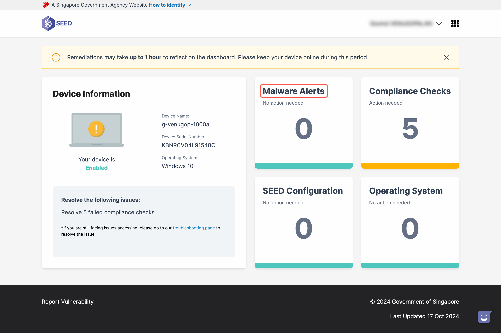
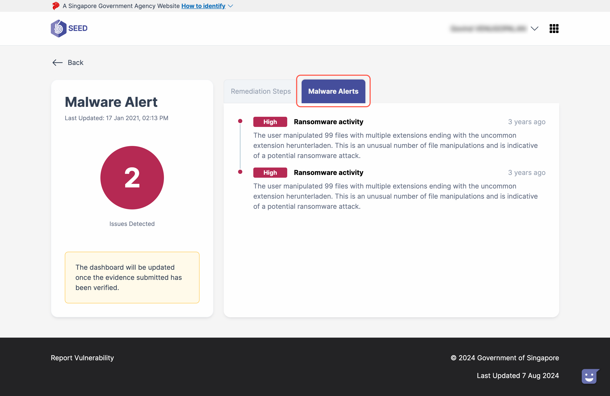
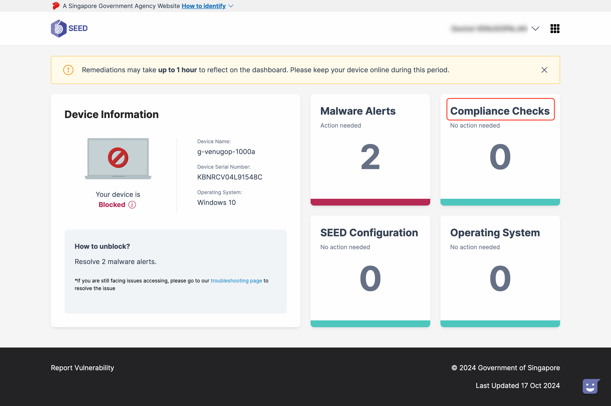
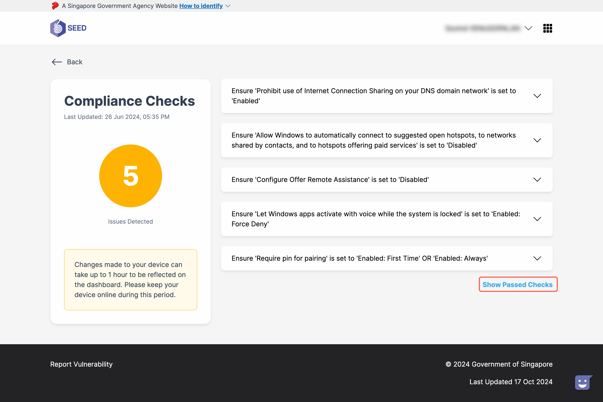

# SEED Dashboard tour

| Legend | Description |
| :--- | :----- |
|  | **Device Information** - This pane displays details of the device onboarded to SEED.  |
|  | **Malware Alerts** - This section displays alerts related to malware detected on the device, categorised as low, medium, or high severity. Click here to view steps for remediation and to understand the nature of the alert. |
|  | **Compliance Checks** -  This section shows detected compliance checks. Click to view the specific compliance requirements that need to be met. |
|  | **SEED configuration** - Indicates whether there are any configuration issues with your device. |
|  | **Operating System** - Indicates whether there are any compatibility issues with your device’s operating system. If the OS is unsupported, guidance on updating will be provided.|
|  | **Device Status** - This section indicates the current status of your device. There are two statuses: blocked and enabled. Hover over the tooltip for explanations of these statuses. |
|  | Issue updates - This area provides real-time updates on your device's status. If no issues are detected, it will display "No known issues detected for your device.". If your device is blocked, it will guide you on how to unblock it. For specific issues, such as malware alerts or compliance check failures, further details are available when you click on the corresponding category. Links to further troubleshooting steps will also be provided on this page.|

## View malware alerts

To view malware alerts detected on your device, follow these steps:

1. Click the section labelled **Malware Alerts** to learn more about the detected malware issues, categorised as low, medium, or high severity.
   

2. Upon clicking, you will find two tabs:
    - **Malware Alerts**: This tab displays detailed information about the detected malware alerts.
    

    - **Remediation Steps**: You can find the necessary steps required to fix the malware issue.
    

## View compliance checks

To review your compliance status and view the necessary compliance checks, follow these steps:

1. Click the section labelled **Compliance Checks** to see the compliance checks you need to complete.
    

2. Within this section, there is a **Show Passed Checks** button which displays the compliance checks you have already completed.
    

## OS upgrade issues

- **Warning**: Devices running unsupported OS versions receive a warning based on requirements outlined [here](https://docs.developer.tech.gov.sg/docs/security-suite-for-engineering-endpoint-devices/). Notifications are sent to users for necessary OS upgrades.
- **Blocked**: After a 7-day notification period, unsupported OS devices will be blocked. Email and in-app notifications are provided, and steps for upgrading are accessible on the details page.

