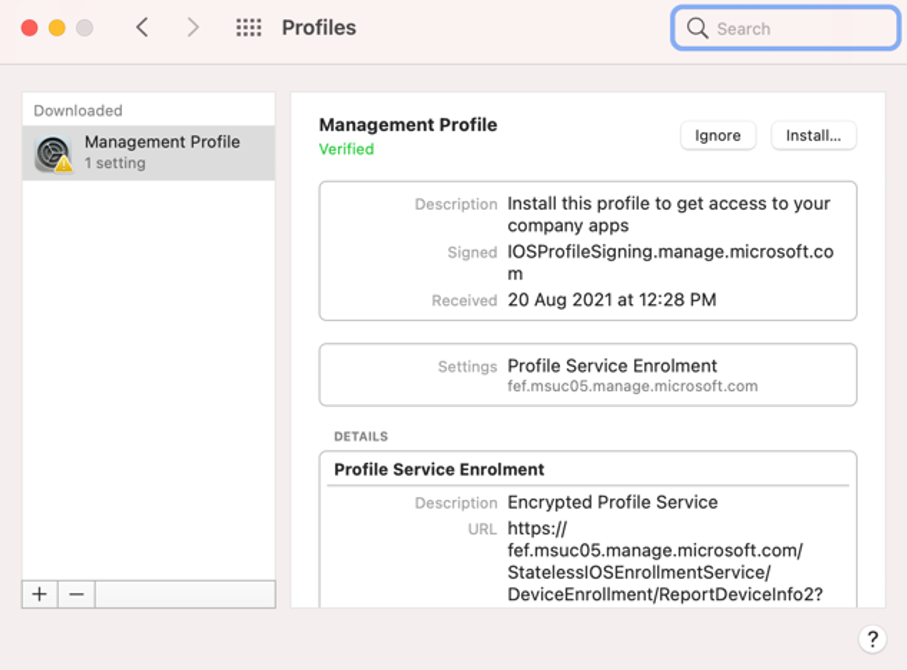
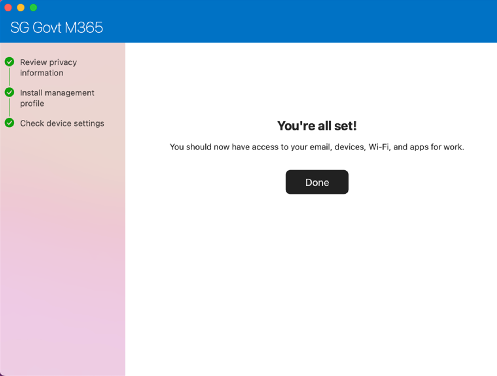
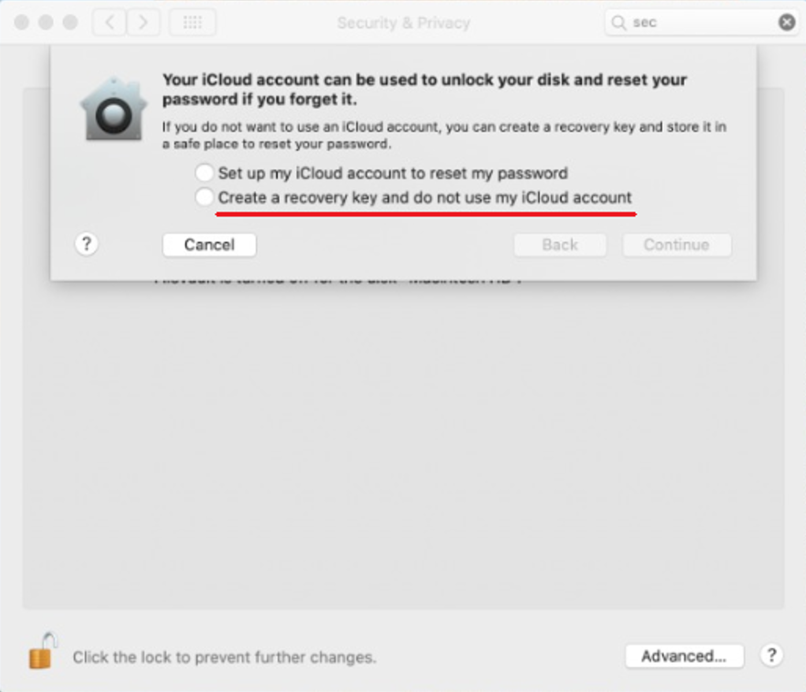
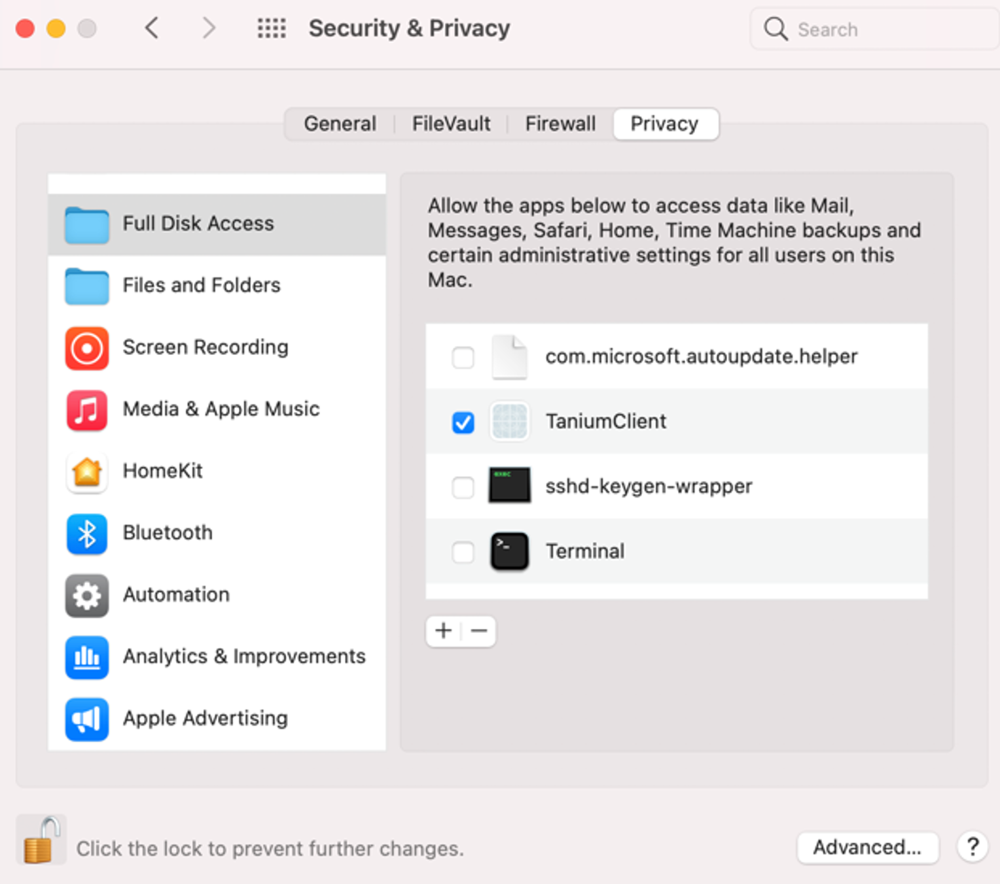
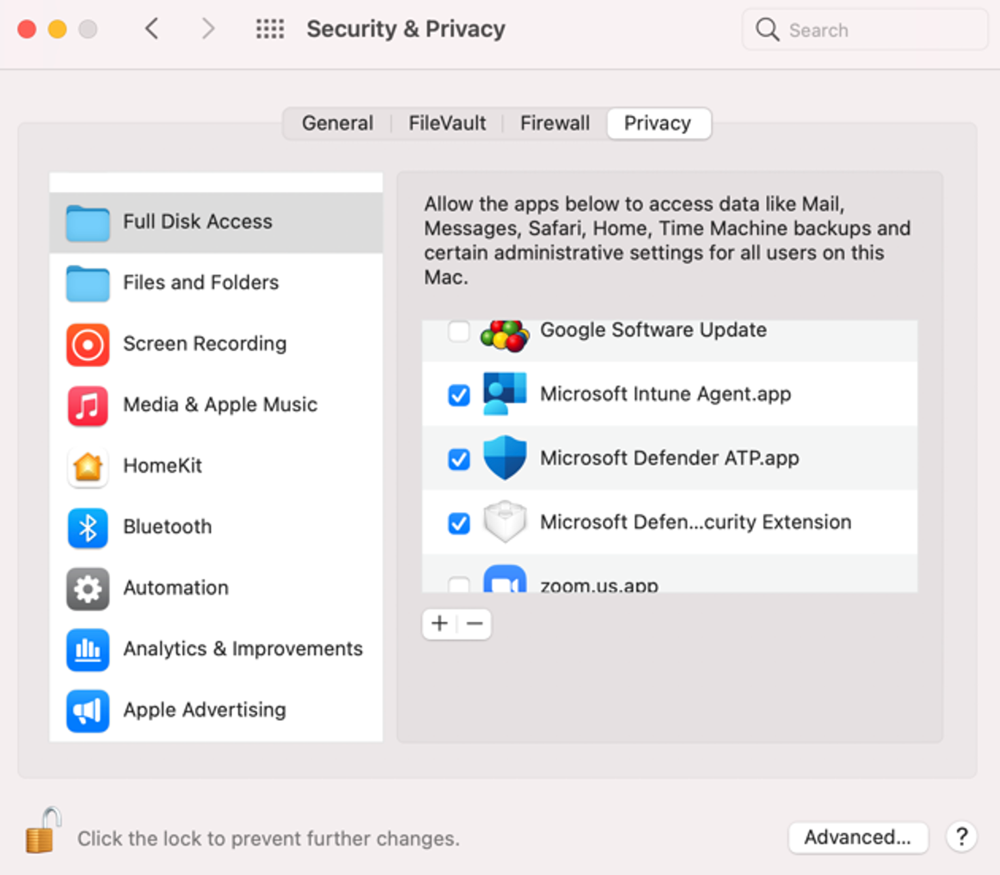

# SEED onboarding instructions for macOS

?> If you encounter any issues while onboarding, refer to [Common issues and resolution](#common-issues-and-resolution) section in the appendix before reaching out to the SEED team for support.

1. Download and install the [**Company Portal**](https://go.microsoft.com/fwlink/?linkid=853070) app.

2. Open the **Company Portal** application and click **Sign in**.


3a. If you are a public officer, sign in using your WOG ID, that is your_name@tech.gov.sg. You will be directed to [complete the 2FA](https://account.activedirectory.windowsazure.com/Proofup.aspx) process.


3b. If you are a vendor, sign in with your TechPass ID (i.e. [your_name@techpass.gov.sg](mailto:your_name@techpass.gov.sg)).

4. Once signed in, you will see the screen below. Click **Begin** to start the set up process. Note: Vendors will see &quot;TECHPASS&quot; instead of &quot;SG Govt M365&quot;.


5. Review the privacy information, then click **Continue**.


6. Click on **Download profile** to download the management profile. This will enable Microsoft Intune to manage your device.


7. The &quot;Profiles&quot; page should pop up automatically. If it does not, go to **System Preferences > Profiles** to access the page. Click **Install** to install the management profile.



8. After around half a minute, all the configuration profiles that Intune needs to deploy should be installed. You should see a list of profiles as shown below.


9. Finally, go back to the Company Portal application. You should see the message &quot;You&#39;re all set!&quot;. Click **Done** to continue. Please note that **the onboarding process is NOT yet complete.**



10. Enable **System Integrity Protection(SIP)**.

- SIP protects your system by preventing execution of unauthorised code.
- To check if SIP is already enabled, open the **Terminal** app and run the following command:

  ```csrutil status```

- If you see the output **System Integrity Protection status: enabled** , you do not have to complete the rest of the steps in this section.
- If not, enable SIP by doing the following:

    a. Restart your Mac in recovery mode by holding down **Command+R**.    
    b. Launch the **Terminal** app from the **Utilities** menu at the top left of your screen.  
    c. Run the command: ```csrutil enable```    
    d. Restart your Mac.

11. Enable **FileVault** by going to **System Preferences** > **Security &amp; Privacy** > **FileVault** > **Turn on FileVault**.

?> Note: FileVault ensures that the hard disk of your device is fully encrypted.

12. When prompted, select **Create a recovery key and do not use my iCloud account**.

?> Note:  Save this key on a different device.



Note:

- Some applications that SEED depends on require Full Disk Access (FDA) in order to function.
- As of Catalina, users may be required to give explicit consent for FDA.


13. To verify this, click the Apple icon > **System Preferences** > **Security &amp; Privacy** > **Privacy**.

14. From the side menu, choose  **Full Disk Access** to ensure that the relevant applications have full disk access.

  i. **Tanium Client**
  - Verify that an entry titled **TaniumClient** exists.
  - Verify that the checkbox is ticked, as shown below. If not, click the lock icon to enable actions, and then tick the checkbox.

  

  ii. **Microsoft Applications**

  - Verify that the following three entries exist: **Microsoft Intune Agent.app**, **Microsoft Defender ATP.app**, **Microsoft Defender ATP Security Extension**.
  - Verify that the checkbox is ticked, as shown below. If not, click the lock icon to enable actions, and then tick the checkbox.

  

15. Cloudflare

- Only upon confirming that you have completed step 14 (Tanium, DATP and Intune), you can follow the steps in in **(5) Cloudflare WARP Client Enrollment (MacOS).docx**to enroll the Cloudflare WARP.

## Post onboarding notes

- If you encounter any issues during onboarding, refer to [Common issues and resolution](#common-issues-and-resolution) before reaching out to the SEED team.
- If onboarding was successful, you will receive an email informing you that your device has been successfully onboarded.
  - Public officers will receive this email in their **GSIB email inbox** while vendors will receive this email at their **work email address used to create their TechPass account**.
  - Due to nature of the verification process, this email can take **up to an hour**. Please contact the SEED team for support if you still have not received the email after an hour.
  - ~~Please follow the instructions in~~~~ **(5) Cloudflare WARP Client Enrollment (MacOS).docx** ~~~~to enroll the Cloudflare WARP client only AFTER you have received this onboarding email.~~
- After you receive the onboarding email, you will receive a desktop notification in around 20 minutes saying that **your device has been renamed and will restart in 5 minutes**. This is expected, and the rename is required for SEED to function properly. **Please do not change your device name thereafter**.

[Common Issues and Resolution](#common-issues-and-resolution)

1. What should I do if Profile installation failed when installing the management profile?


  - Open **System Preferences** > **Profiles** and check if there is already an existing profile titled **Management Profile**.
  - If there is, select the profile and remove it by clicking the minus icon at the bottom left corner of the window.

2. I can't find the &quot;TaniumClient&quot; entry when verifying/giving full disk access.
  - Open the &quot;Terminal&quot; application and enter the command:

**sudo chmod 755 /Library/Tanium/TaniumClient**

- Go to **System Preferences** > **Security and Privacy** > **Privacy** and scroll down on the left side bar to **Full Disk Access**.
- Click the lock icon on the bottom left corner to enable actions.
- Click on the plus icon to add an entry.
- Navigate to the folder &quot;Macintosh HD/Library/Tanium/TaniumClient&quot; and select the application file within also named &quot;TaniumCl­ient&quot;.
- Go back to the &quot;Terminal&quot; application and enter the command:

```sudo chmod 750 /Library/Tanium/TaniumClient```
