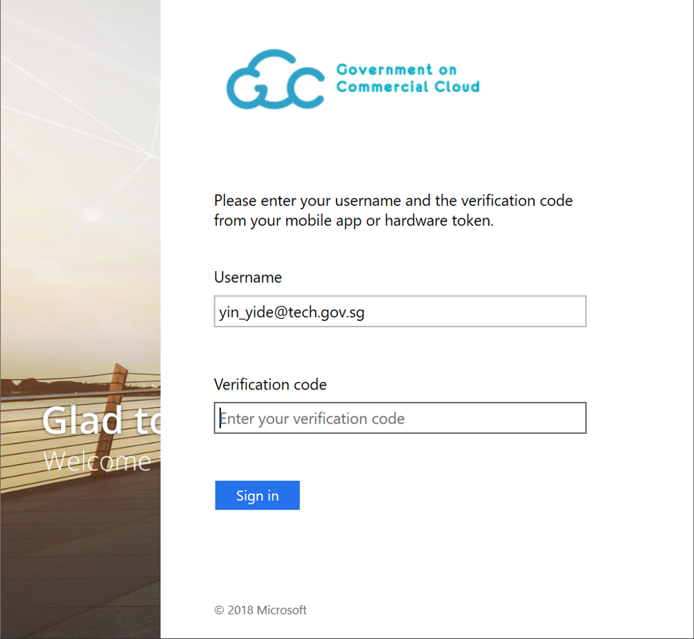
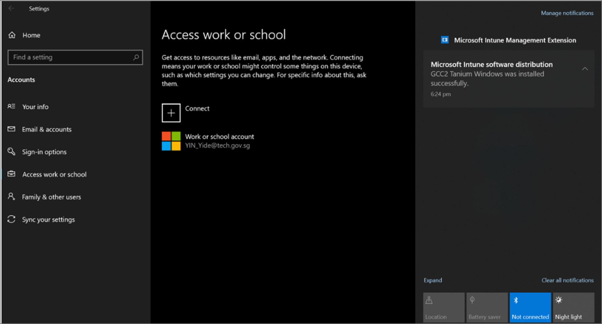

**SEED Onboarding Instructions (Windows)**

1. Go to &quot;Settings \&gt; Accounts \&gt; Access work or school&quot; and click &quot;Connect&quot;.

2a. If you are a public officer, sign in using your WOG ID, that is your_name@tech.gov.sg). You will be directed to the screen below to complete the 2FA process. If you have yet to set up 2FA, please follow the instructions [here](https://account.activedirectory.windowsazure.com/Proofup.aspx).

2b. If you are a vendor, sign in with your TechPass ID, that is your_name@techpass.gov.sg.

3. Within a few minutes, you should receive some desktop notifications from &quot;Microsoft Intune Management Extension&quot; telling you that certain software has been installed onto your device.

4. After around 5 minutes, check the &quot;Access work or school&quot; page again. You should see your account listed with the &quot;Info&quot; and &quot;Disconnect&quot; options as below. Click on the &quot;Info&quot; option and verify that you see something like the following. Note: Vendors will see &quot;TECHPASS&quot; instead of &quot;SG Govt M365&quot;.

5. Once your device has been enrolled, complete the onboarding process by enabling BitLocker.

a. Click the Windows button on your keyboard, or the Windows icon the bottom left corner of your desktop, and search for &quot;Manage BitLocker&quot;.
b. Open the BitLocker management window and select &quot;Turn on BitLocker&quot;. Before you continue, **plug in a thumb drive or any other form of removable storage**.

c. When asked how you would like to unlock your drive at start up, choose **Enter a password**.

d. When asked how you would like to back up your recovery key, select **Save to a file** and save the file in your removable storage medium (e.g. thumb drive). Make sure you transfer this file to a safe location outside of your computer after this process.

e. When asked how much of your drive to encrypt, select **Encrypt entire drive**.

f. When asked which encryption mode to use, select **New encryption mode**.

g. At this point, you might be prompted to restart your device before BitLocker encryption can begin. Restart your device, then return to the **Manage BitLocker** window to verify that encryption has started.

6. Cloudflare

- Only upon confirming that you have completed step 5,you can follow the steps in **(5) Cloudflare WARP Client Enrollment (Windows).docx** to enroll the Cloudflare WARP.

7. Post-Onboarding Notes

- If onboarding was successful, you should receive an email informing you that your device has been successfully onboarded.
  - Public officers will receive this email in their **GSIB email inbox** while vendors will receive this email at their **work email address used to create their TechPass account**.
  - Due to nature of the verification process, this email can take **up to an hour**. Please contact the SEED team for support if you still have not received the email after an hour.
  
- After you receive the onboarding email, you will receive a desktop notification in around 20 minutes saying that **your device has been renamed and will restart in 5 minutes**. This is expected, and the rename is required for SEED to function properly. **Please do not change your device name thereafter**.
