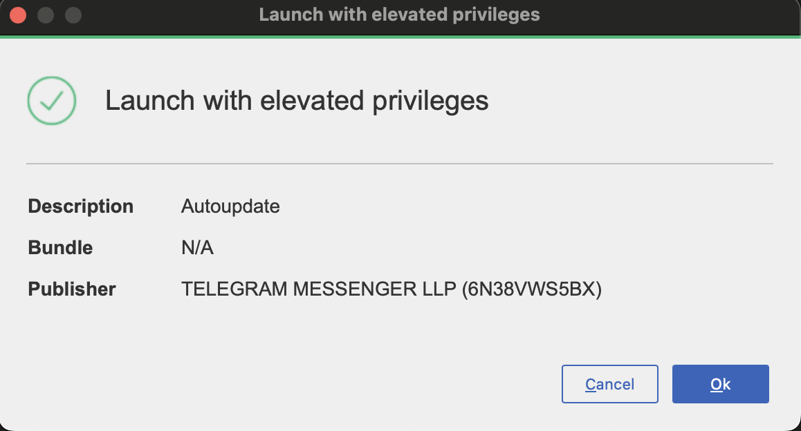
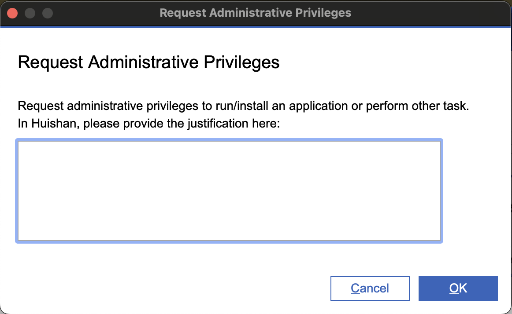

# CyberArk dialogs and permissions

After your device is onboarded to SEED+, CyberArk Endpoint Privilege Manager (EPM) manages actions that require elevated permissions.

You may encounter dialogs when installing software, running certain commands, or using tools that need admin access. These dialogs vary slightly between Windows and macOS. Use the tabs to view the appropriate version for your device.

---

## 1. Application requires administrative privileges

You tried to launch an application that requires administrative privileges.  
For example: installing or uninstalling software.

<!-- tabs:start -->

#### **Windows**

#### **macOS**

<!-- tabs:end -->

---

## 2. Application runs with administrative privileges

The application requires administrative privileges in order to run.  
For example: running PowerShell as administrator.

<!-- tabs:start -->

#### **Windows**

<!-- tabs:end -->

---

## 3. Launch with elevated privileges

The application you launched will be running with elevated privileges automatically.

<!-- tabs:start -->

#### **Windows**

#### **macOS**

<!-- tabs:end -->

---

## 4. Request administrative privileges

You are requesting for Just-In-Time (JIT) elevation to gain administrative privileges temporarily.

<!-- tabs:start -->

#### **Windows**

#### **macOS**

<!-- tabs:end -->

---

## 5. Temporary permissions granted

Your elevation request has been approved. Temporary permissions have been granted.

<!-- tabs:start -->

#### **Windows**

#### **macOS**

<!-- tabs:end -->

---

## 6. Temporary permissions expiration

Your elevated access is expiring or has expired. You will need to submit a new request if admin rights are required again.

<!-- tabs:start -->

#### **Windows**

#### **macOS**

<!-- tabs:end -->
