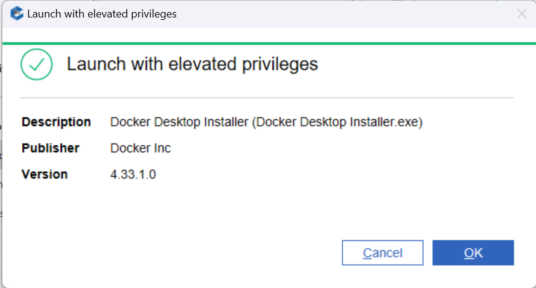

# CyberArk dialogs and permissions

After your device is onboarded to SEED+, CyberArk Endpoint Privilege Manager (EPM) manages actions that require elevated permissions.

You may encounter dialogs when installing software, running certain commands, or using tools that need admin access. These dialogs vary slightly between Windows and macOS. Use the tabs to view the appropriate version for your device.

---

### Application requires administrative privileges

<!-- tabs:start -->

#### Windows

#### macOS

<!-- tabs:end -->

---

### Application runs with administrative privileges

<!-- tabs:start -->

#### Windows

#### macOS

<!-- tabs:end -->

---

### Launch with elevated privileges

<!-- tabs:start -->

#### 🖥️ Windows

#### macOS

<!-- tabs:end -->

---

### Request administrative privileges

<!-- tabs:start -->

#### Windows

#### macOS

<!-- tabs:end -->

---

### Temporary permissions granted

<!-- tabs:start -->

#### Windows

#### macOS

<!-- tabs:end -->

---

### Temporary permissions expiration

<!-- tabs:start -->

#### Windows

#### macOS

<!-- tabs:end -->

test

<!-- tabs:start -->

#### **Windows**

1. The following dialog appears when an application requests administrative rights.  
   

#### **macOS**

1. The following dialog appears when an application requests administrative rights.  
   

<!-- tabs:end -->