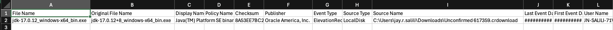
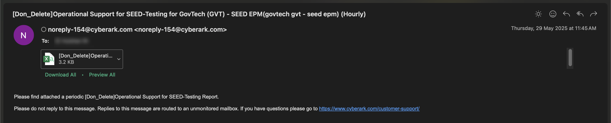
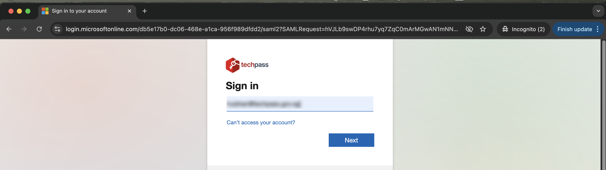
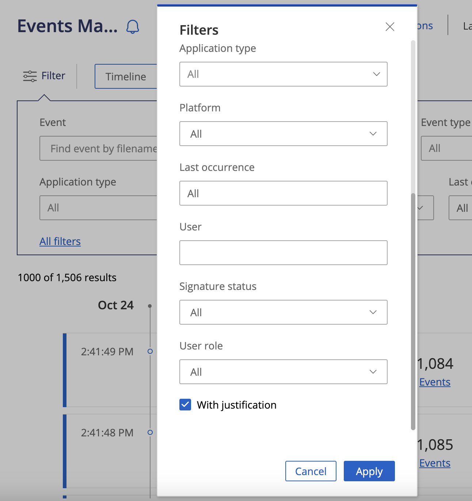
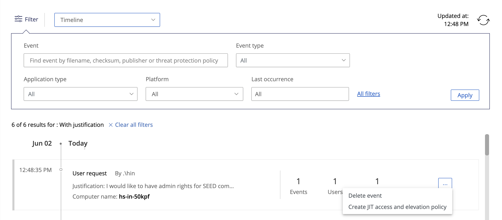
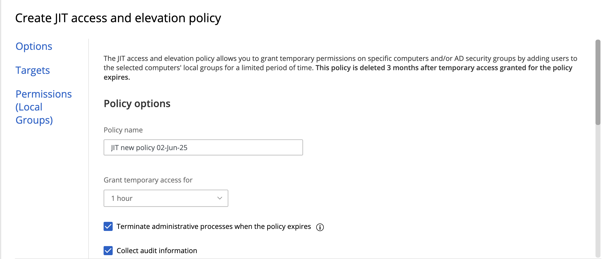
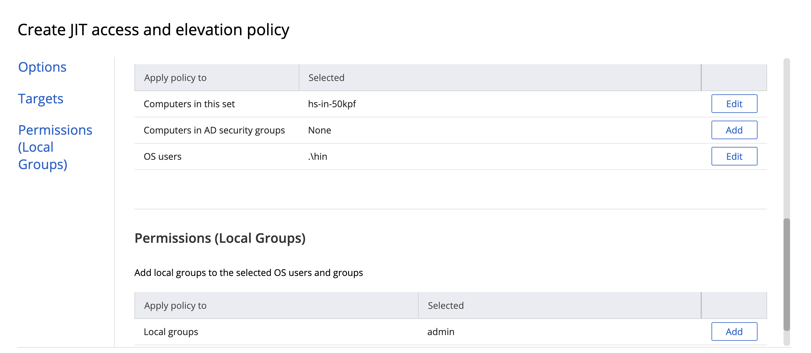
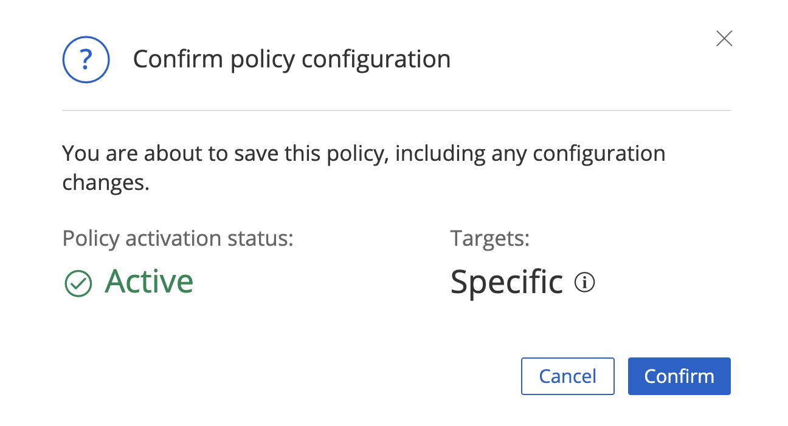
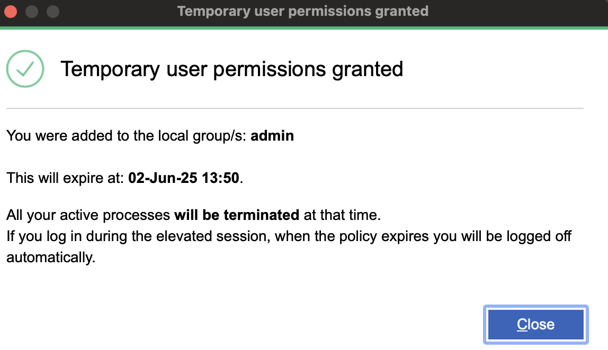

# SEED+ POC approver guide

This guide is for point-of-contact (POC) approvers who manage and approve elevation requests from offshore developers via CyberArk Endpoint Privilege Manager (EPM).

---

## Typical elevation requests

Examples of elevation requests that may require your approval:

- `sudo htop` from macOS Terminal  
    
  

- Software installation on Windows  
    
  

---

## How to approve elevation requests

1. You will receive a periodic email report containing elevation requests.  
   

2. Download or preview the attached Excel sheet.  
   

3. Go to [CyberArk EPM Portal](http://sg.epm.cyberark.com/SAML/GovTech) and log in using your TechPass credentials.  
   

4. Navigate to **Events Management**.

5. Click **All filters**, check **With justification**, then click **Apply**.  
   

6. You will be able to see the justification in the first result.  
   

7. Click the 3 dots (`...`) and select **Approve temporary elevation**.  
   A temporary policy will be automatically created and shown under **Policies**.

---

## Just-in-time (JIT) access elevation

### What is JIT access elevation?

Just-in-time (JIT) access elevation allows temporary administrative rights to be granted to users on a per-request basis. This ensures that elevated privileges are provided only when needed and expire after a set time (24 hours), improving security posture.

---

### JIT policy creation

1. Go to **Events Management** > Click **All filters** > Check **With justification** > Click **Apply**  
   

2. Click **Create JIT access and elevation policy**  
   

   
3. Under **OS users**, add:
   - .\<username> (For example: .\hin)
   

4. Under **Permissions (Local Groups)**, add:
   - `admin` (for macOS)  
   - `Administrators` (for Windows)

6. Click **Create**, then **Confirm**  
   

7. Once approved, the user will receive a confirmation on their endpoint  
   

---

## Reminders for POC approvers

- Always **review the justification** before approving any request
- JIT access is **temporary** and lasts **24 hours**
- **Notify the user** once the request is approved
- Use the correct group name (`admin` for macOS, `Administrators` for Windows)

