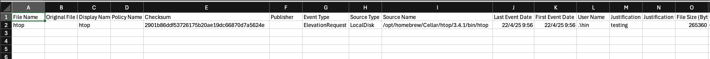

# SEED+ – POC approver guide

This guide is for point-of-contact (POC) approvers who manage and approve elevation requests from offshore developers via CyberArk Endpoint Privilege Manager (EPM).

---

## Typical elevation requests

Examples of elevation requests that may require your approval:

- `sudo htop` from macOS Terminal  
    
  

- Software installation on Windows  
    
  

- Temporary elevation approval  
  

---

## How to approve elevation requests

1. You will receive an email notification.  
   

2. Go to [CyberArk EPM Portal](http://sg.epm.cyberark.com/SAML/GovTech).  
   Login with your TechPass credentials.  
   

3. Go to **Events Management**.

4. Click **All filters**, check **With justification**, and click **Apply**.  
   

5. You will be able to see the justification in the first result.  
   

6. Click on the 3 dots (`...`) and click **Approve temporary elevation**.  
   A policy will be automatically created and visible in the Policies section.

---

## Just-in-time (JIT) access elevation

### What is JIT access elevation?

Just-in-time (JIT) access elevation allows temporary administrative rights to be granted to users on a per-request basis. This ensures that elevated privileges are only provided when needed and for a limited duration, reducing the risk of persistent admin access on SEED+ devices.

---

### JIT approval flow

1. You will receive a JIT email notification.  
   

2. Download or preview the Excel sheet linked in the email.  
   

3. Go to [CyberArk EPM Portal](http://sg.epm.cyberark.com/SAML/GovTech) and log in using your TechPass credentials.  
   

4. Go to **Events Management** > Click **All filters** > Check **With justification** > Click **Apply**.  
   

5. You will be able to see the justification in the first result.

6. Click **Create JIT access and elevation policy**.  
   

7. Under **Permissions (Local Groups)**:
   - Add `admin` for macOS
   - Add `Administrators` for Windows

8. Click **Create**, then **Confirm**.  
   

9. The user will be notified from their endpoint that temporary elevation has been granted.

---

## Reminders for POC approvers

- **Check justification** before approving any request.
- **Elevation is temporary**: Each JIT policy is valid for **24 hours only**.
- **Inform the user** once the request is approved.
- Use **admin** (macOS) or **Administrators** (Windows) when assigning permissions.
