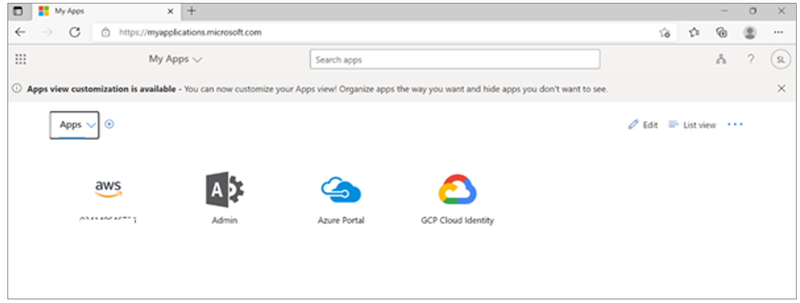
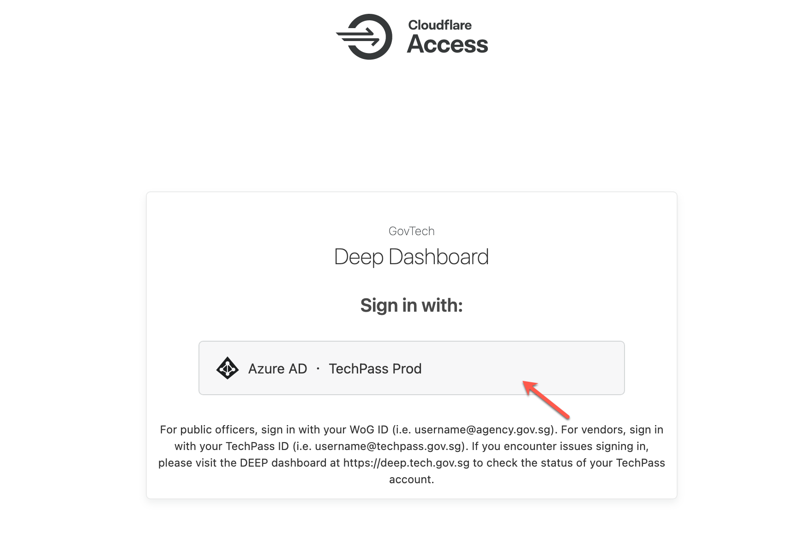
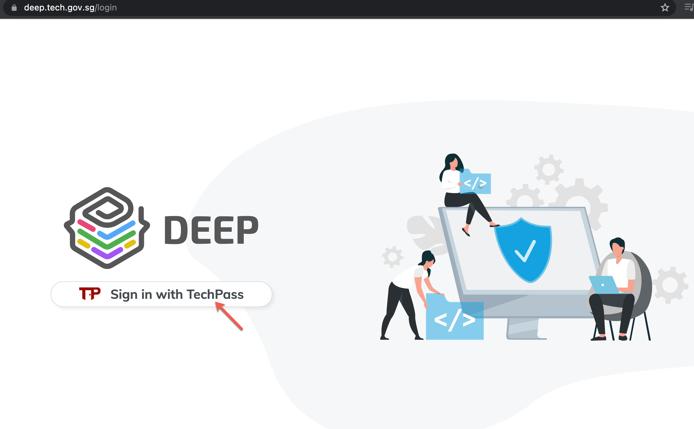
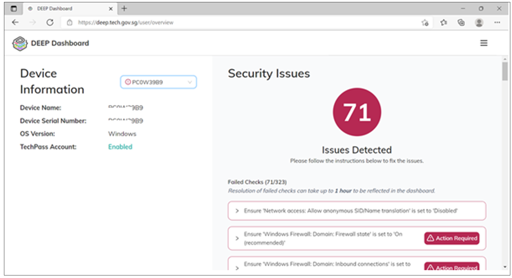

# Post onboarding verification for GCC 1.0

This article is for GCC 1.0 users who have onboarded their Internet Device to SEED. When your device is onboarded to SEED it becomes a Government Managed Device (GMD).

Objective of this document is to explain how to verify if your device onboarding to SEED was successful and if you are still able to access your GCC 1.0 resources.

**To verify SEED onboarding for GCC 1.0 users**

1.	As only one VPN connection can be active at a time, go to the Cloudflare WARP icon on your GMD and toggle the **Connected** switch to **Paused**.

<kbd></kbd>

?> Cloudflare will automatically reconnect after three hours.

2. Launch and connect the GlobalProtect VPN client using your VPN ID and password.
<kbd></kbd>

3. Go to [myapplications.microsoft.com](https://myapplications.microsoft.com/) and log in with your Cloud ID and password.

4. Verify if you are able to access GCC 1.0 resources successfully.

?> The above image is an example and your actual GCC 1.0 resources may vary based on your account.

5. To verify if you are able to access the DEEP dashboard, click **Disconnect** in the GlobalProtect VPN client.

6. Click the Cloudflare WARP icon and toggle the switch from **Paused** to **Connected**. If the Cloudflare WARP for Teams appears as shown below, it indicates that you are connected to Cloudflare WARP and can access the DEEP dashboard using it.

7. Go to the [DEEP dashboard](https://dashboard.deep.tech.gov.sg).

<kbd></kbd>

8. Choose **Azure AD TechPass Prod**.
9. When prompted, log in with your TechPass account.

<kbd></kbd>

?> If you are public officer, you may have to authenticate your WOG account first by using the one-time password code displayed under your SG Govt M365 profile in the Authenticator app.

10. In the **DEEP** login page, click **Sign in with TechPass**.

<kbd></kbd>

You will be directed to your DEEP dashboard.

### Related topics

[Post onboarding instructions](post-onboarding-instructions/post-onboarding-steps-and-verification).
