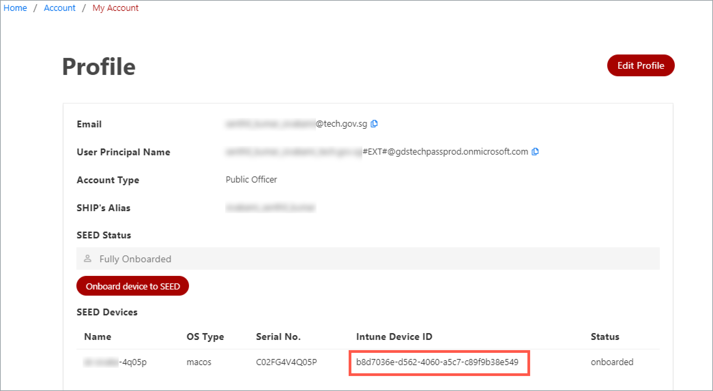

Method 2: Get Intune Device ID from TechPass portal

1. On your non-SE GSIB device, go to the [TechPass portal](https://portal.techpass.gov.sg/secure/account/profile).
2. On the TechPass portal, at the top right, go to your user name and click **My Account**. Your **Profile** details are displayed. 
3. Take note of the **Intune Device ID** from the **Profile** page.

Method 3: Submit an incident request to get Intune Device ID.

?> **Note** Use this method only if you can't log in to your GMD or TechPass portal.

- Submit an [incident request](https://go.gov.sg/seed-techpass-support) to get your Intune Device ID.

