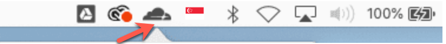
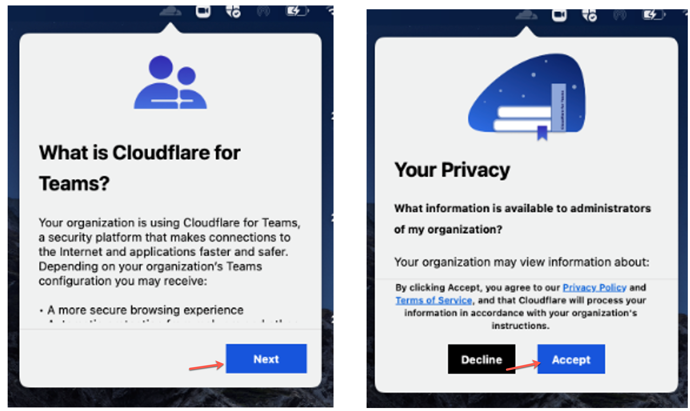

1. Open the Cloudflare WARP client from the menu bar.

 
  
You will see the information page, followed by the privacy policy.

2. Click **Next**, and then **Accept** to agree to Cloudflare’s privacy policy.

3. When prompted to sign in, select **Azure AD – TechPass Prod**.

!>**Note**  If you encounter an error stating that user account does not exist in the respective tenant, open a new tab and go to [https://myaccount.microsoft.com](https://myaccount.microsoft.com/), sign out from your account and then retry.

4. Sign in using your TechPass credentials.

5. After successfully signing in, click **Open Cloudflare WARP.app** to get your WARP connected.

When it is connected, you should see the WARP Zero Trust in the connected state.
  

6. Open Cloudflare WARP **Settings**, and make sure **Gateway with WARP** is selected.

WARP is now running and protecting your Internet connection.
  